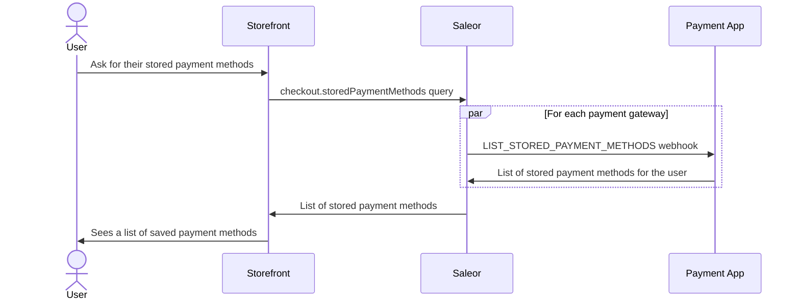
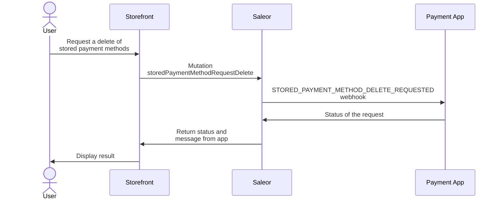
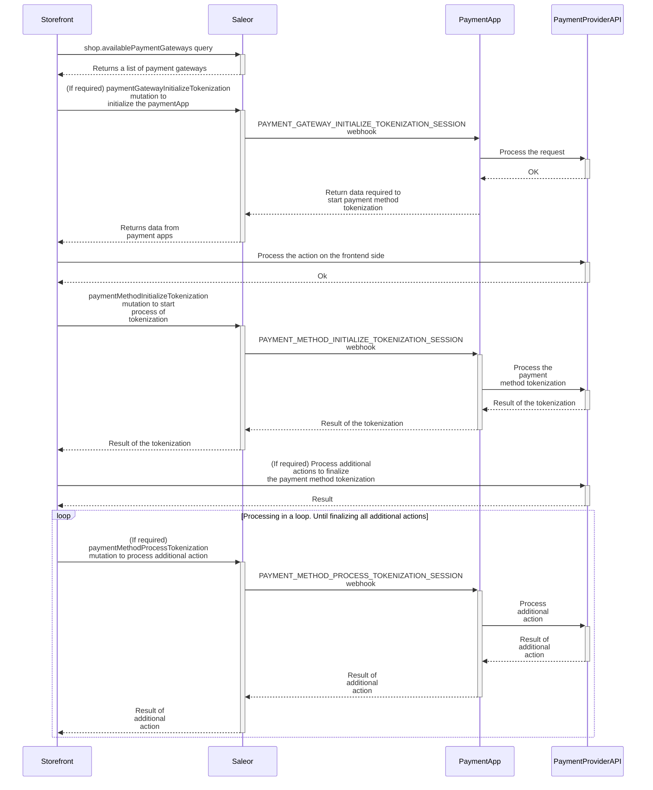

## Stored payment methods

A stored payment method is a payment method saved by a customer for later use. It allows the user to use it without the need to provide all payment details again.
Saleor uses synchronous webhooks to notify the Payment App about actions related to stored payment methods (such as [`LIST_STORED_PAYMENT_METHODS`](developer/extending/webhooks/synchronous-events/stored-payment-method.mdx#list-stored-payment-methods)) requested by the customer.

### Listing user's stored payment methods

:::info

This feature is dedicated to [third-party](api-reference/apps/enums/app-type-enum.mdx#apptypeenumthirdparty) apps.

:::

Requesting [`checkout.storedPaymentMethods`](api-reference/checkout/objects/checkout.mdx#checkoutstoredpaymentmethodsstoredpaymentmethod---) or [`User.storedPaymentMethods`](api-reference/users/objects/user.mdx#userstoredpaymentmethodsstoredpaymentmethod---) field triggers synchronous requests to each app subscribed to [`LIST_STORED_PAYMENT_METHODS`](api-reference/webhooks/enums/webhook-event-type-sync-enum.mdx#webhookeventtypesyncenumlist_stored_payment_methods)
webhook. In response, Saleor returns a list of payment methods from the subscribed apps. Stored payment methods can be used in further steps of payment processing.

All details related to [`LIST_STORED_PAYMENT_METHODS`](api-reference/webhooks/enums/webhook-event-type-sync-enum.mdx#webhookeventtypesyncenumlist_stored_payment_methods)
webhook can be found [in the Stored Payment Methods guide](developer/extending/webhooks/synchronous-events/stored-payment-method.mdx#list-stored-payment-methods).

The diagram below shows the workflow of fetching stored payment methods with a Payment App:



### Requesting deletion of stored payment method

:::info
This feature is dedicated to [third-party](api-reference/apps/enums/app-type-enum.mdx#apptypeenumthirdparty) apps.
:::

The user can request a deletion of their stored payment methods. Saleor doesn't store directly a user's payment methods or transmit payment method details.
It is a part of the responsibility of the payment app. The request deletion will be sent to the payment app which owns the
specific stored payment method.
Saleor will also invalidate the cache of stored-payment-methods. Fetching [checkout.storedPaymentMethods](api-reference/checkout/objects/checkout.mdx#checkoutstoredpaymentmethodsstoredpaymentmethod---)
or [User.storedPaymentMethods](api-reference/users/objects/user.mdx#userstoredpaymentmethodsstoredpaymentmethod---)
will trigger the request to the payment app which was the owner of the
payment method.



The following example shows how to use the [storedPaymentMethodRequestDelete](api-reference/payments/mutations/payment-gateway-initialize.mdx) mutation to request deletion of stored payment method:

```graphql
mutation {
  storedPaymentMethodRequestDelete(
    id: "YXBwOmR1bW15LnBheW1lbnQ6cGF5bWVudC1tZXRob2Qx"
    channel: "default-channel"
  ) {
    result
    message
    errors {
      field
      message
      code
    }
  }
}
```

As a response, the mutation will return a [result](api-reference/payments/enums/stored-payment-method-request-delete-result.mdx) field which determines the status of the requested action.
In case of a failure result, the [errors](api-reference/payments/objects/payment-method-request-delete-error.mdx) list will contain details of the failed action.

The mutation will trigger the [STORED_PAYMENT_METHOD_DELETE_REQUESTED](api-reference/webhooks/enums/webhook-event-type-sync-enum.mdx#webhookeventtypesyncenumstored_payment_method_delete_requested) webhook.
For more details about this webhook, please refer to its [documentation](developer/extending/webhooks/synchronous-events/stored-payment-method.mdx#delete-stored-payment-method-requested).

### Tokenizing a new payment method

:::info
This feature is dedicated to [third-party](api-reference/apps/enums/app-type-enum.mdx#apptypeenumthirdparty) apps.
:::

:::info

Tokenizing a payment method can also be done during the checkout process. Please refer to your payment app's documentation for details.

:::

Customers can request to store their payment method for later use. The tokenization process is handled by the payment app subscribed to synchronous webhooks. The process consists of three steps: initialization of the payment gateway (if required), tokenizing the payment method, and handling additional actions (if required). Each step has its dedicated mutation and webhook, which are described below.

The diagram illustrates the general flow of tokenizing a payment method. The process may vary slightly for specific payment providers; for example, some payment providers may not require the initialization of the payment gateway.



#### Initializing the payment gateway for tokenizing a payment method

The [paymentGatewayInitializeTokenization](api-reference/payments/mutations/payment-gateway-initialize-tokenization.mdx) mutation should be used when the payment gateway needs to be initialized first. For example, when retrieving the data required to initialize the drop-in on the storefront side.

This mutation triggers the synchronous webhook [PAYMENT_GATEWAY_INITIALIZE_TOKENIZATION_SESSION](api-reference/webhooks/enums/webhook-event-type-sync-enum.mdx#webhookeventtypesyncenumpayment_gateway_initialize_tokenization_session). The webhook is sent to the app with the provided [id](api-reference/payments/mutations/payment-gateway-initialize-tokenization.mdx#paymentgatewayinitializetokenizationidstring---).

The `id` is the ID of the payment app received from [checkout.availablePaymentGateways](api-reference/checkout/objects/checkout.mdx#checkoutavailablepaymentgatewayspaymentgateway---) or `shop.availablePaymentGateways`. The JSON `data` is passed to the payment app via the synchronous webhook.

```graphql
mutation PaymentGatewayInitializeTokenization(
  $id: String!
  $channel: String!
  $data: JSON
) {
  paymentGatewayInitializeTokenization(
    id: $id
    channel: $channel
    data: $data
  ) {
    result
    data
    errors {
      field
      code
      message
    }
  }
}
```

In the response, Saleor returns:

- `result`: The enum value of [PaymentGatewayInitializeTokenizationResult](api-reference/payments/enums/payment-gateway-initialize-tokenization-result.mdx).
- `data`: The JSON `data` returned by the payment app.
- `id`: The ID of the payment method.

More details about the triggered webhook [PAYMENT_GATEWAY_INITIALIZE_TOKENIZATION_SESSION](api-reference/webhooks/enums/webhook-event-type-sync-enum.mdx#webhookeventtypesyncenumpayment_gateway_initialize_tokenization_session) can be found [here](developer/extending/webhooks/synchronous-events/stored-payment-method.mdx#initialize-payment-gateway-session).

#### Initializing payment method tokenization

The [paymentMethodInitializeTokenization](api-reference/payments/mutations/payment-method-initialize-tokenization.mdx) mutation starts the process of tokenizing the payment method. This mutation triggers the synchronous webhook [PAYMENT_METHOD_INITIALIZE_TOKENIZATION_SESSION](api-reference/webhooks/enums/webhook-event-type-sync-enum.mdx#webhookeventtypesyncenumpayment_method_initialize_tokenization_session), which is sent to the app with the provided [id](api-reference/payments/mutations/payment-method-initialize-tokenization.mdx#paymentmethodinitializetokenizationidstring---).

The `id` is the ID of the payment app received from [checkout.availablePaymentGateways](api-reference/checkout/objects/checkout.mdx#checkoutavailablepaymentgatewayspaymentgateway---) or [shop.availablePaymentGateways](api-reference/miscellaneous/objects/shop.mdx#shopavailablepaymentgatewayspaymentgateway---). The JSON [data](api-reference/payments/mutations/payment-method-initialize-tokenization.mdx#paymentmethodinitializetokenizationdatajson--) is passed to the payment app via the synchronous webhook. The `paymentFlowToSupport` is a value from the [TokenizedPaymentFlowEnum](api-reference/payments/enums/tokenized-payment-flow-enum.mdx). It represents the requested payment flow that the payment method should follow.

```graphql
mutation {
  paymentMethodInitializeTokenization(
    id: "YXBwOmR1bW15LnBheW1lbnQ="
    channel: "default-channel"
    data: {"foo": "bar"}
    paymentFlowToSupport: INTERACTIVE
  ) {
    result
    data
    id
    errors {
      field
      code
      message
    }
  }
}
```

In the response, Saleor returns:

- `result`: The enum value of [PaymentMethodTokenizationResult](api-reference/payments/enums/payment-method-tokenization-result.mdx), which determines the status of the tokenization.
- `data`: The JSON `data` returned by the payment app.
- `id`: The ID of the payment method.

More details about the triggered [PAYMENT_METHOD_INITIALIZE_TOKENIZATION_SESSION](api-reference/webhooks/enums/webhook-event-type-sync-enum.mdx#webhookeventtypesyncenumpayment_method_initialize_tokenization_session) webhook can be found [here](developer/extending/webhooks/synchronous-events/stored-payment-method.mdx#initialize-payment-method-tokenization).

#### Processing additional actions required to tokenize the payment method

The [paymentMethodProcessTokenization](api-reference/payments/mutations/payment-method-process-tokenization.mdx) mutation should be called when the payment app returns the `result` [PaymentMethodTokenizationResult.ADDITIONAL_ACTION_REQUIRED](api-reference/payments/enums/payment-method-tokenization-result.mdx#paymentmethodtokenizationresultadditional_action_required). This mutation is dedicated to processing additional actions required to finalize the tokenization of the payment method.

This mutation triggers the synchronous webhook [PAYMENT_METHOD_PROCESS_TOKENIZATION_SESSION](api-reference/webhooks/enums/webhook-event-type-sync-enum.mdx#webhookeventtypesyncenumpayment_method_process_tokenization_session).

The `id` is the ID received as a response from [paymentMethodInitializeTokenization](api-reference/payments/mutations/payment-method-initialize-tokenization.mdx) or previous [paymentMethodProcessTokenization](api-reference/payments/mutations/payment-method-process-tokenization.mdx) calls. The JSON `data` is passed to the payment app via the synchronous webhook.

```graphql
mutation PaymentMethodProcessTokenization(
  $id: String!
  $channel: String!
  $data: JSON
) {
  paymentMethodProcessTokenization(id: $id, channel: $channel, data: $data) {
    result
    data
    id
    errors {
      field
      code
      message
    }
  }
}
```

In the response, Saleor returns:

- `result`: The enum value of [PaymentMethodTokenizationResult](api-reference/payments/enums/payment-method-tokenization-result.mdx), which determines the status of the tokenization.
- `data`: The JSON `data` returned by the payment app.
- `id`: The ID of the payment method.

More details about the triggered [PAYMENT_METHOD_PROCESS_TOKENIZATION_SESSION](api-reference/webhooks/enums/webhook-event-type-sync-enum.mdx#webhookeventtypesyncenumpayment_method_process_tokenization_session) webhook can be found [here](developer/extending/webhooks/synchronous-events/stored-payment-method.mdx#process-additional-actions-for-payment-method-tokenization).
