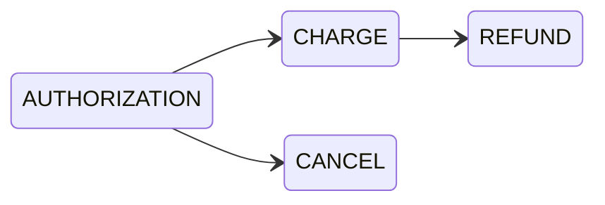
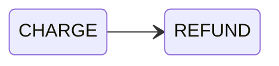

The [`TransactionFlowStrategyEnum`](/api-reference/payments/enums/transaction-flow-strategy-enum.mdx) defines how Saleor requests the initial payment action:

- `AUTHORIZATION`: hold funds first; capture later.
- `CHARGE`: capture funds immediately.

:::info
This strategy applies **only to payment apps**. 

It does not affect manual transactions created with [`transactionCreate`](/api-reference/payments/mutations/transaction-create.mdx) or updated via [`transactionUpdate`](/api-reference/payments/mutations/transaction-update.mdx).  
For manual transactions, you explicitly define the amounts and events yourself.  
:::

## Event Flows by Strategy

- Authorization flow

- Charge flow

### Business Advantages
Choosing the right transaction flow strategy is a crucial business decision. The best choice depends on your product, business model, and fulfillment process.

#### When to use AUTHORIZATION

- **Inventory or stock-sensitive products**: Ensure items are available before capturing funds.  
- **Fraud or risk checks**: Hold the payment while verifying order details.  
- **Partial fulfillment**: Capture only the portion shipped if the full order can’t be fulfilled.  
- **Customer-friendly preorders/backorders**: Customers aren’t fully charged until the product is delivered.  

#### When to use CHARGE

- **Instant delivery products**: Digital goods, subscriptions, or services delivered on purchase.  
- **Fast-moving, low-risk retail**: Simplifies operations by charging right away.  
- **High-volume sales**: Reduces operational overhead from tracking pending authorizations.  
- **Cash flow needs**: Immediate settlement improves liquidity.  

## Configuration
You can set the strategy per channel as a default or override it per payment during transaction initialization.

### Channel Default

- Dashboard: Go to Configuration → Channels → `<your_channel>` → Payment settings, change **Authorize transactions instead of charging**.  

- API: Use the [`channelUpdate`](/api-reference/channels/mutations/channel-update.mdx) mutation and set the `paymentSettings.defaultTransactionFlowStrategy` field.  

### App Override

- When initializing a transaction, pass the `action` argument to [`transactionInitialize`](/api-reference/payments/mutations/transaction-initialize.mdx).  
- If `action` is not provided, Saleor falls back to the channel’s `paymentSettings.defaultTransactionFlowStrategy`.  

## Actions on Transactions

All actions on a transaction - capture, cancel, or refund - can be performed via the Saleor Dashboard or API.

### Performing Actions

- **Dashboard:**  
  Go to **Order details → Transactions**, then choose **Charge**, **Cancel**, or **Refund** whichever is available and appropriate.

- **API:**  
  Use [`transactionRequestAction`](/api-reference/payments/mutations/transaction-request-action.mdx) with the corresponding `action` parameter (`CHARGE`, `CANCEL`, `REFUND`).  

### Action Behavior

- **Charged transactions** → Can be refunded directly.  
- **Authorized transactions** → Can be:  
  - **Cancelled** → Funds are released without charging.  
  - **Captured (charged) first** → Then optionally refunded.

### Authorization Expirations

- Authorizations are temporary and typically expire according to **payment provider** and **card network** rules (often 7–30 days).  
- Expiration happens **on the provider side**; when an authorization expires, funds are automatically released.  
- To continue processing, you must **re-authorize** the transaction.  
- Track events in your payment app and report them to Saleor using [`transactionEventReport`](/api-reference/payments/mutations/transaction-event-report.mdx) as needed.  
