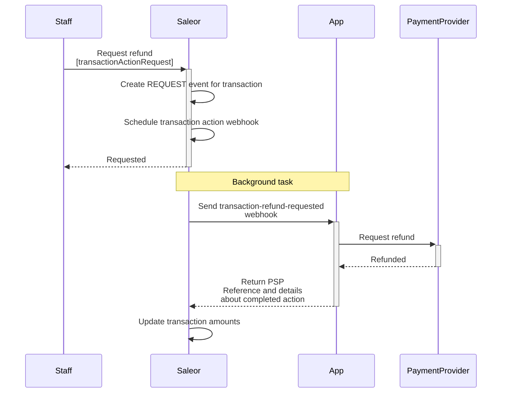
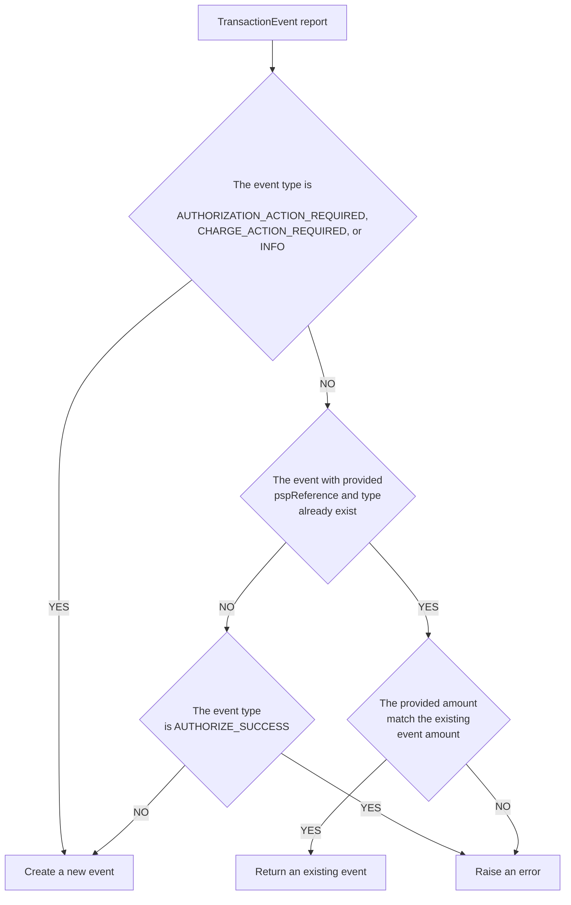

A transaction represents a payment instance created in Order or Checkout. It holds a list of events that make up the payment process. Each event has a type that describes the action taken on the transaction. You can see the complete list of events in the [`TransactionEventTypeEnum`](api-reference/payments/enums/transaction-event-type-enum.mdx).

Besides the events, a transaction also contains other payment information, like the amount or currency.

### Amount rounding

If the provided amount uses more decimal places than used currency, it will be rounded to the nearest value.

For example:

- `19.999 USD` will become `20.00 USD`
- `10.2 JPY` will become `10 JPY`

### Creating transactions

Transaction stores details of a payment transaction attached to an order or a checkout:

The [`transactionCreate`](api-reference/payments/mutations/transaction-create.mdx) mutation takes the following arguments:

- `id`: The ID of the checkout or order.
- `transaction`: Input data required to create a new transaction object.
- `transactionEvent`: Data that defines a transaction event. It can be used to provide more context about the current state of the transaction.

:::info

The [`transactionCreate`](api-reference/payments/mutations/transaction-create.mdx) can only be called by staff users or apps with the [`HANDLE_PAYMENTS`](api-reference/users/enums/permission-enum.mdx#permissionenumhandle_payments) permission.

:::

The following example shows how you can use the [`transactionCreate`](/api-reference/payments/mutations/transaction-create) mutation to create a new transaction.

The transaction was authorized, and the payment was made with a credit card. The actions that can be called from Saleor are: `CANCEL` and `CHARGE`.
The authorized amount is **$99**.

```graphql
mutation {
  transactionCreate(
    id: "Q2hlY2tvdXQ6MWQzNmU5YzctYWEwYS00NzM5LTk0MGQtNzdjNmU4Mjc5YmQ0"
    transaction: {
      name: "Credit card"
      message: "Authorized"
      pspReference: "PSP-ref123"
      availableActions: [CANCEL, CHARGE]
      amountAuthorized: { currency: "USD", amount: 99 }
      externalUrl: "https://saleor.io/payment-id/123"
    }
  ) {
    transaction {
      id
    }
  }
}
```

The response:

```json
{
  "data": {
    "transactionCreate": {
      "transaction": {
        "id": "VHJhbnNhY3Rpb25JdGVtOjE="
      }
    }
  },
  "extensions": {
    "cost": {
      "requestedQueryCost": 0,
      "maximumAvailable": 50000
    }
  }
}
```

:::info

- Transactions attached to the checkout are accessible via the [`checkout.transactions`](/api-reference/checkout/objects/checkout#checkouttransactionstransactionitem---) field.
- Transactions attached to order are accessible via the [`order.transactions`](/api-reference/orders/objects/order#ordertransactionstransactionitem---) field.

:::

### Updating transactions

The [`transactionUpdate`](api-reference/payments/mutations/transaction-update.mdx) mutation allows updating the transaction details.
It takes the following arguments:

- `id`: The ID of the transaction.
- `transaction`: Input data that will be used to update the transaction object.
- `transactionEvent`: Data that defines a transaction event. It can be used to provide more context about the current state of the transaction.

:::info

The [`transactionUpdate`](api-reference/payments/mutations/transaction-update.mdx) can only be called by staff users with the
[HANDLE_PAYMENTS](api-reference/users/enums/permission-enum.mdx#permissionenumhandle_payments) permission
or by the App that created the the transaction and has [`HANDLE_PAYMENTS`](api-reference/users/enums/permission-enum.mdx#permissionenumhandle_payments) permission.

:::

The following example shows how you can use the [`transactionUpdate`](api-reference/payments/mutations/transaction-update.mdx) mutation to update the transaction.

The available action is `REFUND`. The authorized funds are charged, so `amountAuthorized` is **$0** and `amountCharged` is **$99**.

```graphql
mutation {
  transactionUpdate(
    id: "VHJhbnNhY3Rpb25JdGVtOjE="
    transaction: {
      name: "Credit card"
      message: "Authorized"
      pspReference: "PSP-ref123"
      availableActions: [REFUND]
      amountAuthorized: { currency: "USD", amount: 0 }
      amountCharged: { currency: "USD", amount: 99 }
    }
    transactionEvent: {
      message: "Payment charged"
      pspReference: "PSP-ref123.charge"
    }
  ) {
    transaction {
      id
    }
  }
}
```

The response:

```json
{
  "data": {
    "transactionUpdate": {
      "transaction": {
        "id": "VHJhbnNhY3Rpb25JdGVtOjE="
      }
    }
  },
  "extensions": {
    "cost": {
      "requestedQueryCost": 0,
      "maximumAvailable": 50000
    }
  }
}
```

:::note

During the update of transactions, all funds that go to a new state should be subtracted from the previous state.
Assuming we have a transaction with `authorizedAmount` equal to 100 USD. Moving the `authorizedAmount` to `chargedAmount` requires setting the `authorizedAmount` to 0.

This complexity is handled automatically when Payment Apps are used instead of a custom app.

```graphql
mutation {
  transactionUpdate(
    id: "VHJhbnNhY3Rpb25JdGVtOjE="
    transaction: {
      status: "Charged"
      availableActions: [REFUND]
      amountAuthorized: { currency: "USD", amount: 0 }
      amountCharged: { currency: "USD", amount: 100 }
    }
    transactionEvent: {
      status: SUCCESS
      name: "Charged credit card"
      reference: "PSP-ref123.charge"
    }
  ) {
    transaction {
      id
    }
  }
}
```

:::

### Reporting actions for transactions

The [`transactionEventReport`](/api-reference/payments/mutations/transaction-event-report) is used to
report a new transaction event. The newly created event will be used to [recalculate](/developer/payments/lifecycle.mdx#transactions-recalculation-of-amounts) the transaction's amounts.
The mutation should be used for handling [action requests](#handling-action-requests-for-transactions) or reporting any
changes that happened on the payment provider side (eg. asynchronous webhooks for delayed payment methods, chargebacks, disputes etc.).

It takes the following arguments:

- `id`: The id of the transaction.
- `type`: Type of the reported action.
- `amount`: The amount of the reported action. The amount is rounded based on the given currency precision.
It is mandatory for all `REQUEST`, `SUCCESS`, `ACTION_REQUIRED`, and `REQUEST` events. For other events,
if the amount is not provided, it will be calculated based on previous events with the same pspReference.
If the amount cannot be determined, an error will be raised. (Refer to the additional details [below](#amount-calculations-for-reporting-an-action-with-missing-amount-value) ).
- `pspReference`: The reference assigned to the action.
- `time`: The time of the action.
- `externalUrl`: The URL for the staff user to check the details of the action on the payment provider's page. This URL will be available in the Saleor Dashboard.
- `message`: Message related to the action. The maximum length is 512 characters; any text exceeding this limit will be truncated.
- `availableActions`: Current list of actions available for the transaction.

:::info

The [`transactionEventReport`](/api-reference/payments/mutations/transaction-event-report) can only be called by staff users with
[`HANDLE_PAYMENTS`](api-reference/users/enums/permission-enum.mdx#permissionenumhandle_payments) permission
or by the App that created the transaction and has [`HANDLE_PAYMENTS`](api-reference/users/enums/permission-enum.mdx#permissionenumhandle_payments) permission.

:::

The following example shows how the [transactionEventReport](/api-reference/payments/mutations/transaction-event-report) mutation is used to report an event
that happened for a given transaction.
The report is a success charge action, with 20 as an amount. The currency is the same as declared
for the transaction. Available action that can proceed for a transaction is `REFUND`.
The provided data will be used to create a new [TransactionEvent](/api-reference/payments/objects/transaction-event) object that will be included in the recalculation process.

```graphql
mutation TransactionEventReport {
  transactionEventReport(
    id: "VHJhbnNhY3Rpb25JdGVtOjE="
    type: CHARGE_SUCCESS
    amount: 20
    pspReference: "psp-123"
    time: "2022-01-01"
    externalUrl: "https://saleor.io/event-details/123"
    message: "Charge completed"
    availableActions: [REFUND]
  ) {
    errors {
      field
      code
    }
    alreadyProcessed
    transaction {
      id
    }
    transactionEvent {
      id
    }
  }
}
```

In the response, Saleor returns:

- `alreadyProcessed` - Defines if the reported event hasn't been processed earlier.
  If there is an event with the same `pspReference`, `amount`, and `type` as the ones provided in the input
  mutation, Saleor will return it instead of creating a new one, and the flag will be set
  to `true`.

:::danger
Saleor will throw an exception if events cannot be deduplicated in following cases:

- **Other event has the same `pspReference` but different amount**: [`INCORRECT_DETAILS`](/api-reference/payments/enums/transaction-event-report-error-code.mdx#transactioneventreporterrorcodealready_exists) error will be raised
- **`AUTHORZATION_SUCCESS` event already exists with different `amount` or with different `pspReference`**: [`ALREADY_EXISTS`](/api-reference/payments/enums/transaction-event-report-error-code.mdx#transactioneventreporterrorcodealready_exists) error will be raised
:::

- `transaction` - Transaction that has been updated based on the received report.
- `transactionEvent` - [TransactionEvent](/api-reference/payments/objects/transaction-event) that has been created based on the received report.

#### Amount calculations for reporting an action with missing amount value
The `amount` value is required for the following event `type`s:
- [`AUTHORIZATION_SUCCESS`](/api-reference/payments/enums/transaction-event-type-enum#transactioneventtypeenumauthorization_success),
- [`AUTHORIZATION_ADJUSTMENT`](/api-reference/payments/enums/transaction-event-type-enum#transactioneventtypeenumauthorization_adjustment),
- [`AUTHORIZATION_REQUEST`](/api-reference/payments/enums/transaction-event-type-enum#transactioneventtypeenumauthorization_request),
- [`CHARGE_ACTION_REQUIRED`](/api-reference/payments/enums/transaction-event-type-enum#transactioneventtypeenumcharge_action_required),
- [`CHARGE_SUCCESS`](/api-reference/payments/enums/transaction-event-type-enum#transactioneventtypeenumcharge_success),
- [`CHARGE_REQUEST`](/api-reference/payments/enums/transaction-event-type-enum#transactioneventtypeenumcharge_request),
- [`REFUND_SUCCESS`](/api-reference/payments/enums/transaction-event-type-enum#transactioneventtypeenumrefund_success),
- [`REFUND_REQUEST`](/api-reference/payments/enums/transaction-event-type-enum#transactioneventtypeenumrefund_request),
- [`CANCEL_SUCCESS`](/api-reference/payments/enums/transaction-event-type-enum#transactioneventtypeenumcancel_success),
- [`CANCEL_REQUEST`](/api-reference/payments/enums/transaction-event-type-enum#transactioneventtypeenumcancel_request).

It's optional for the rest of the events. In case of missing `amount` value the following rules are used to
calculate the `amount`:
- In case of missing amount for event `INFO`, the 0 is used.
- In case of missing amount for all `*_FAILURE`, the amount is taken from the corresponding `*_SUCCESS` or `*_REQUEST` event with the same `pspReference`.
In case of multiple events, the value from the newest event is taken:
  - for `REFUND_FAILURE` the `amount` is taken from the newest event of one of the following types: `REFUND_SUCCESS`, `REFUND_REQUEST`, `CHARGE_SUCCESS`, `CHARGE_FAILURE`, `CHARGE_REQUEST`;
  - for `CHARGE_FAILURE` the `amount` is taken from the newest event of one of the following types: `CHARGE_SUCCESS`, `CHARGE_REQUEST`, `AUTHORIZATION_SUCCESS`, `AUTHORIZATION_FAILURE`, `AUTHORIZATION_REQUEST`;
  - for `AUTHORIZATION_FAILURE` the `amount` is taken from the newest event of one of the following types: `AUTHORIZATION_SUCCESS`, `AUTHORIZATION_REQUEST`;
  - for `CANCEL_FAILURE` the `amount` is taken from the newest event of one of the following types: `CANCEL_SUCCESS`, `CANCEL_REQUEST`, `AUTHORIZATION_SUCCESS`, `AUTHORIZATION_FAILURE`, `AUTHORIZATION_REQUEST`.
- In case of `REFUND_REVERSE` the `amount` is taken from the `REFUND_SUCCESS` event with the same `pspReference`.
- In case of `CHARGEBACK` the `amount` is taken from the `CHARGE_SUCCESS` event with the same `pspReference`.
- If the specific event for the pspReference doesn't exist, the error will be raised.

#### Events Not Requiring pspReference

The following events do not require a `pspReference`:
- `CHARGE_ACTION_REQUIRED`
- `AUTHORIZATION_ACTION_REQUIRED`
- `CHARGE_FAILURE`
- `AUTHORIZATION_FAILURE`
- `REFUND_FAILURE`
- `CANCEL_FAILURE`

If the `pspReference` is missing, the event will still be created but will be excluded from transaction amount recalculations.
Consequently, it will not impact the `charge`, `refund`, `cancel`, or `authorize` amounts.
Additionally, it will not affect any existing `transactionEvent` of the same type that has a `pspReference` set.


### Handling action requests for transactions

An action request is called when a staff user or an app requests an action for a given transaction.


Two mutations can trigger the action on the app side:

- [`transactionRequestAction`](/api-reference/payments/mutations/transaction-request-action): will also create a new
  [`TransactionEvent`](/api-reference/payments/objects/transaction-event) with one of the request type ([`AUTHORIZATION_REQUEST`](/api-reference/payments/enums/transaction-event-type-enum#transactioneventtypeenumauthorization_request),
  [`CHARGE_REQUEST`](/api-reference/payments/enums/transaction-event-type-enum#transactioneventtypeenumcharge_request),
  [`REFUND_REQUEST`](/api-reference/payments/enums/transaction-event-type-enum#transactioneventtypeenumrefund_request),
  [`CANCEL_REQUEST`](/api-reference/payments/enums/transaction-event-type-enum#transactioneventtypeenumcancel_request)),
  `amount` and the `owner` (User or App). Saleor will send a synchronous webhook dedicated to the action
  [`TRANSACTION_CHARGE_REQUESTED`](/api-reference/webhooks/enums/webhook-event-type-sync-enum.mdx#webhookeventtypesyncenumtransaction_charge_requested),
  [`TRANSACTION_CANCELATION_REQUESTED`](/api-reference/webhooks/enums/webhook-event-type-sync-enum.mdx#webhookeventtypesyncenumtransaction_cancelation_requested),
  [`TRANSACTION_REFUND_REQUESTED`](/api-reference/webhooks/enums/webhook-event-type-sync-enum.mdx#webhookeventtypesyncenumtransaction_refund_requested)

- [`transactionRequestRefundForGrantedRefund`](/api-reference/payments/mutations/transaction-request-refund-for-granted-refund): will create a new [`TransactionEvent`](/api-reference/payments/objects/transaction-event) with
  [`REFUND_REQUEST`](/api-reference/payments/enums/transaction-event-type-enum#transactioneventtypeenumrefund_request) type, `amount` and the `owner` (User or App).
  Saleor will send a synchronous webhook [`TRANSACTION_REFUND_REQUESTED`](/api-reference/webhooks/enums/webhook-event-type-sync-enum.mdx#webhookeventtypesyncenumtransaction_refund_requested).
  [`OrderGrantedRefund`](api-reference/orders/objects/order-granted-refund.mdx) will be included in the webhook payload (if requested in a [subscription query](developer/extending/webhooks/subscription-webhook-payloads.mdx#custom-payloads) for the webhook).
  This mutation is useful when the payment provider requires details about lines that are related to refund action.

The response should contain at least `pspReference` of the action. The `pspReference` will be placed in the previously created event of `…_REQUEST` type.
Optionally the response can contain the details of the completed action.

More information about request webhooks can be found [in the synchronous webhooks for transactions guide](/developer/extending/webhooks/synchronous-events/transaction.mdx).

:::note

The webhook will be sent only to the app that created the transaction.

:::

#### Asynchronously processing actions

When action is processed asynchronously on the payment provider side, the app should call the [`transactionActionRequest`](/api-reference/payments/mutations/transaction-request-action)
mutation once it receives a webhook notification from the payment provider.

The diagram below shows an example of processing asynchronous refund action.


#### Synchronously processing the action

The app immediately receives the status of the requested action. It can provide the details of the action in response to the received Saleor webhook. The following webhook events
can accept action details in the response: [`TRANSACTION_CHARGE_REQUESTED`](/api-reference/webhooks/enums/webhook-event-type-sync-enum.mdx#webhookeventtypesyncenumtransaction_charge_requested),
[`TRANSACTION_CANCELATION_REQUESTED`](/api-reference/webhooks/enums/webhook-event-type-sync-enum.mdx#webhookeventtypesyncenumtransaction_cancelation_requested),
[`TRANSACTION_REFUND_REQUESTED`](/api-reference/webhooks/enums/webhook-event-type-sync-enum.mdx#webhookeventtypesyncenumtransaction_refund_requested).

The below diagram shows an example of processing synchronous refund action.



### TransactionItem and  TransactionEvents pspReference Matching

Both [TransactionItem](/api-reference/payments/objects/transaction-item)
and [TransactionEvent](/api-reference/payments/objects/transaction-event)
contain a `pspReference` field, which refers to the payment service provider reference.
	-	The `pspReference` on `TransactionItem` identifies the overall payment.
	-	The `pspReference` on `TransactionEvent` identifies specific actions that occurred within the `Transaction`.

**Key Assumptions:**
- For a specific `TransactionItem`, only one `TransactionEvent` of a given `type` and `pspReference` may exist, except for the following types:
	- [`AUTHORIZATION_ACTION_REQUIRED`](/developer/payments/lifecycle#authorization_action_required)
	-	[`CHARGE_ACTION_REQUIRED`](/developer/payments/lifecycle#charge_action_required)
	-	[`INFO`](/developer/payments/lifecycle#info)
- Only one `TransactionEvent` of type `AUTHORIZATION_SUCCESS` is allowed to exist.
If an update is needed, the existing `AUTHORIZATION_SUCCESS` event can be modified using
the [`AUTHORIZATION_ADJUSTMENT`](/developer/payments/lifecycle#authorization_adjustment) event.

#### Setting the `pspReference` on the `TransactionItem`

The `pspReference` value in a `TransactionItem` may initially be empty if it is not provided
during the `TransactionCreate` mutation or as a result of the `TransactionInitialize` mutation.

The `transactionItem.pspReference` is updated during payment processing and reflects the `pspReference` from the most recent event received from the payment application.
For example:
	•	If a transaction is successful, the `pspReference` will be set based on the last `SUCCESS` event from the payment provider.
	•	If the event sequence changes or multiple events are received, the `pspReference` always represents the value from the latest processed event.

The `pspReference` can be updated through the `transactionUpdate` mutation if necessary.

#### Events with optional `pspReference` 

Certain event types do not require a pspReference.
For more details, see [Events Not Requiring pspReference](#events-not-requiring-pspreference).

#### Handling TransactionEvent Reports for Existing Types

When a `TransactionEvent` is reported:
	1.	**Event Type Check:** If the event type is `AUTHORIZATION_ACTION_REQUIRED`, `CHARGE_ACTION_REQUIRED`, or `INFO`, a new event is always created.
	2.	**Existing Event Check:** For other types, the system searches for an existing event with the same `type` and `pspReference` assigned to the `TransactionItem` requested in the input.
	    -	**Amount Match:** If an existing event is found, the system compares its amount to the reported event’s amount.
	        - If the amounts match, the existing event is reused, and the `transactionEvent.alreadyProcessed` value is set to `True`.
          For more information about this field, refer to the [Reporting actions for transactions](#reporting-actions-for-transactions).
	        -	If they do not match, an error is raised.
	    -	**No Existing Event:** If no matching event is found, a new one is created, except for `AUTHORIZATION_SUCCESS`, which must be unique, attempting to create a duplicate raises an error.



### Storing payment method details

Saleor allows storing two types of payment method details:

- `CARD`
- `OTHER`

These details are available on the `TransactionItem.paymentMethodDetails` field.

Payment method details can be stored in two ways:
- Via Transaction Webhooks
- Via Transaction Mutations

#### Via transaction webhooks

Apps can return `paymentMethodDetails` while processing payments using the following webhooks:

- `TRANSACTION_INITIALIZE_SESSION`
- `TRANSACTION_PROCESS_SESSION`

[View details about saving via webhook](/developer/extending/webhooks/synchronous-events/transaction.mdx#response-4)

#### Via transaction mutations

The following mutations accept a `paymentMethodDetails` input field:

- `transactionEventReport`
- `transactionCreate`
- `transactionUpdate`


#### Examples

Example: Storing `card` details via `transactionEventReport`:

```graphql {7-16}
mutation TransactionEventReport {
  transactionEventReport(
    id: "VHJhbnNhY3Rpb25JdGVtOjE="
    type: CHARGE_SUCCESS
    amount: 20
    pspReference: "psp-123"
    paymentMethodDetails: {
      card: {
        name: "Payment name", 
        brand: "BRAND", 
        firstDigits: "1234", 
        lastDigits: "4321", 
        expMonth: 11, 
        expYear: 2000
      }
    }
  ) {
    errors {
      field
      code
    }
    alreadyProcessed
    transaction {
      id
    }
    transactionEvent {
      id
    }
  }
}
```

Example: Storing non-card (`other`) details via `transactionEventReport`:

```graphql {7-11}
mutation TransactionEventReport {
  transactionEventReport(
    id: "VHJhbnNhY3Rpb25JdGVtOjE="
    type: CHARGE_SUCCESS
    amount: 20
    pspReference: "psp-123"
    paymentMethodDetails: {
      other: {
        name: "Cash"
      }
    }
  ) {
    errors {
      field
      code
    }
    alreadyProcessed
    transaction {
      id
    }
    transactionEvent {
      id
    }
  }
}
```


### Webhooks

Follow [Transactions Webhook Events](/developer/extending/webhooks/synchronous-events/transaction.mdx) guide.

### Automatic Checkout completion

The `Checkout` can be automatically converted into an [`Order`](/api-reference/orders/objects/order.mdx), once the related [`TransactionItems`](/api-reference/payments/objects/transaction-item.mdx) fully cover `Checkout`.

:::caution
This feature isn't compatible with [legacy Payments API](/developer/extending/plugins/payment-gateways.mdx) that uses [plugins](/developer/extending/plugins/overview.mdx) (instead of apps). For example this setting won't work with [Stripe plugin](/developer/app-store/plugins/stripe).

Payments API uses `checkoutComplete` mutation to pass payment data to a plugin and return payment status, thanks to this `Order` is always created right after such payment is made. **This means that this setting doesn't impact Payments API**.
:::

A checkout is considered fully covered when the [`Checkout.authorizeStatus`](/developer/payments/lifecycle.mdx#authorize-status) 
is set to `FULL`.

This occurs when the total of `authorizedAmount`, `chargedAmount`, `authorizePendingAmount`, and `chargePendingAmount` from all transactions connected to the `Checkout` covers the [`checkout.totalPrice`](/api-reference/checkout/objects/checkout#checkoutsubtotalpricetaxedmoney---).

To enable automatic checkout completion, update the channel checkout settings using the configuration example below:
```graphql
mutation UpdateChannel($id: ID!,$input: ChannelUpdateInput!){
  channelUpdate(id: $id, input: $input){
    channel{
      id
      checkoutSettings {
        automaticallyCompleteFullyPaidCheckouts
      }
    }
    errors{
      field
      code
      message
    }
  }
}
```
Query variables:
```json
{
  "id": "Q2hhbm5lbDox",
  "input": {
    "checkoutSettings": {
      "automaticallyCompleteFullyPaidCheckouts": true
    }
  }
}
```

:::warning
If any issues occur during checkout validation, the checkout will not be completed.
The checkout does not pass the validation when:
  - contains unavailable items:
    - one of the checkout line has missing product or variant channel listing or the price is not set;
    - one of the product is not available for purchase;
    - one of the product is set as not visible to the customers;
  - billing address is not set;
  - attached voucher is not applicable;
  - attached gift card is not valid;
  - shipping method is invalid;
  - channel is inactive.

You can view the specific issues using the `Checkout.problems` query. For more details, please refer to the [Checkout Problems page](/developer/checkout/problems).
:::

:::danger
**Once this setting is enabled, you should verify if your connected services, including storefront, can handle this flow.**

Please remember, that if setting is enabled:
- `Checkout` will be deleted after checkout completion which means that any query or mutation relying on it will no longer work after that
- Running `checkoutComplete` on a `Checkout` that was already completed, will return previously created `Order` object
:::


:::warning
Checkout will be automatically completed even if some Transactions are still pending and waiting for confirmation from payment provider. Checkouts are considered "covered" as long as the total amount is covered (see when `authorizeStatus` is set to `FULL` in [payment lifecycle docs](/developer/payments/lifecycle.mdx#authorize-status)).

Keep in mind that a pending Transaction might be rejected later, which will result in an unpaid order. To clear orders that remain unpaid you can use [Order Expiration feature](/developer/order/order-expiration.mdx)
:::

:::caution
Once `Checkout` is converted to into `Order`, the `authorizeStatus` might change from `FULL` to `NONE` or `PARTIAL`. This happens because [`Order.authorizeStatus`](/api-reference/orders/enums/order-authorize-status-enum.mdx#values) uses different logic to calculate its value.

- **For checkouts**: pending Transactions **are** considered "paid" and are included in the [`Checkout.authorizeStatus`](/api-reference/checkout/enums/checkout-authorize-status-enum.mdx) calculation.
- **For orders**: pending Transactions **are not** considered "paid" and will not be included in the [`Order.authorizeStatus`](/api-reference/orders/enums/order-authorize-status-enum.mdx#values) calculation.
:::

## Related resources

- [Building Payment Apps](/developer/extending/apps/building-payment-app.mdx)
