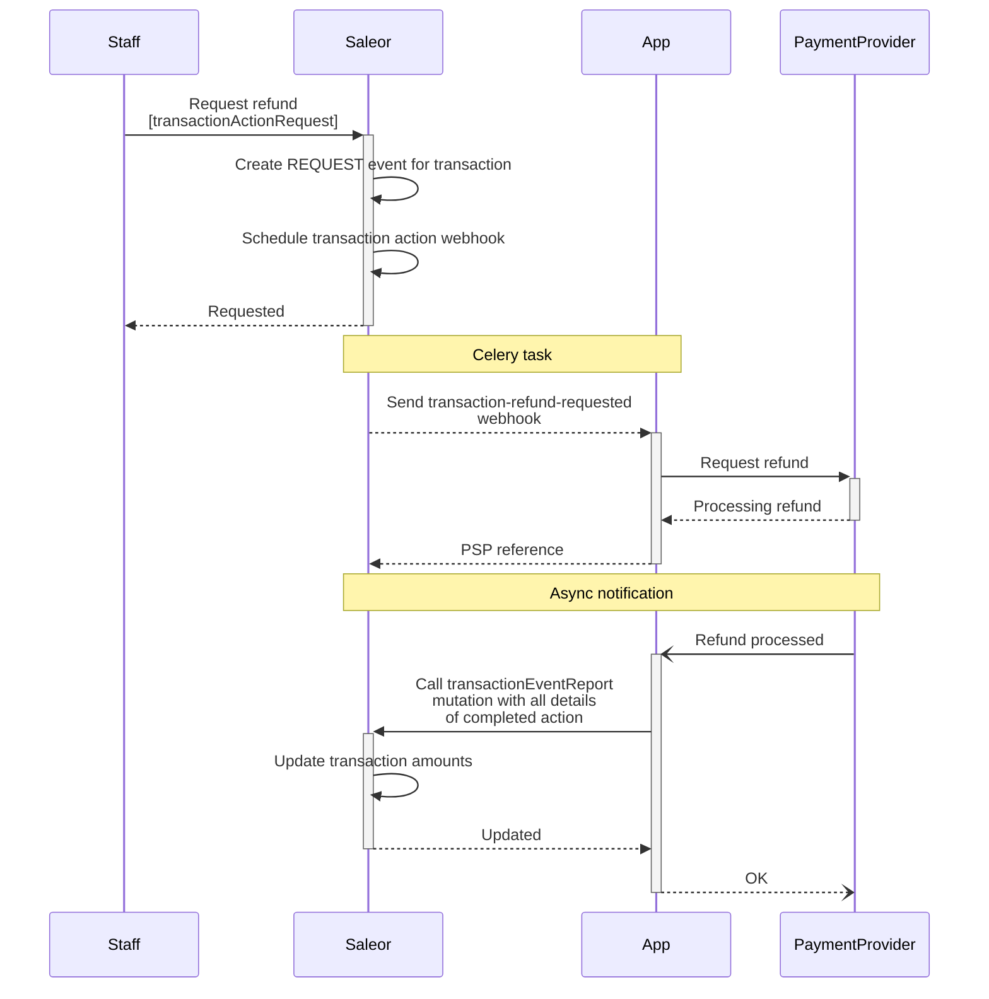
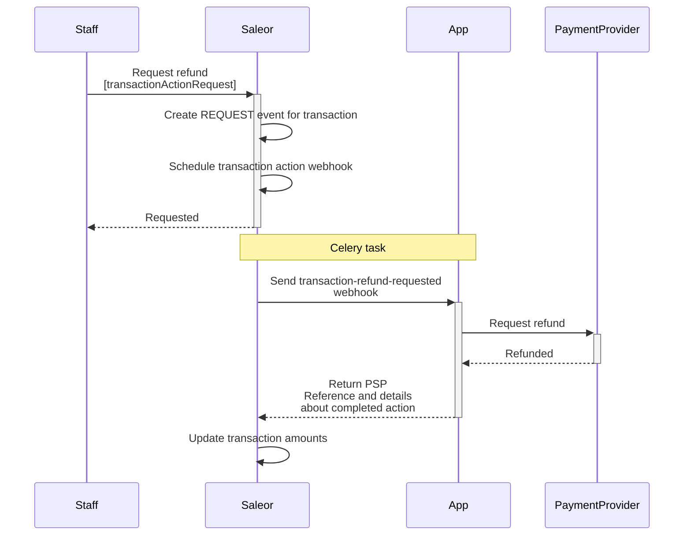

A transaction represents a payment instance created in Order or Checkout. It holds a list of events that make up the payment process. Each event has a type that describes the action taken on the transaction. You can see the complete list of events in the [`TransactionEventTypeEnum`](api-reference/payments/enums/transaction-event-type-enum.mdx).

Besides the events, a transaction also contains other payment information, like the amount or currency.

### Amount rounding

If the provided amount uses more decimal places than used currency, it will be rounded to the nearest value.

For example:

- `19.999 USD` will become `20.00 USD`
- `10.2 JPY` will become `10 JPY`

### Creating transactions

Transaction stores details of a payment transaction attached to an order or a checkout:

The [`transactionCreate`](api-reference/payments/mutations/transaction-create.mdx) mutation takes the following arguments:

- `id`: The ID of the checkout or order.
- `transaction`: Input data required to create a new transaction object.
- `transactionEvent`: Data that defines a transaction event. It can be used to provide more context about the current state of the transaction.

:::info

The [`transactionCreate`](api-reference/payments/mutations/transaction-create.mdx) can only be called by staff users or apps with the [`HANDLE_PAYMENTS`](api-reference/users/enums/permission-enum.mdx#permissionenumhandle_payments) permission.

:::

The following example shows how you can use the [`transactionCreate`](/api-reference/payments/mutations/transaction-create) mutation to create a new transaction.

The transaction was authorized, and the payment was made with a credit card. The actions that can be called from Saleor are: `CANCEL` and `CHARGE`.
The authorized amount is **$99**.

```graphql
mutation {
  transactionCreate(
    id: "Q2hlY2tvdXQ6MWQzNmU5YzctYWEwYS00NzM5LTk0MGQtNzdjNmU4Mjc5YmQ0"
    transaction: {
      name: "Credit card"
      message: "Authorized"
      pspReference: "PSP-ref123"
      availableActions: [CANCEL, CHARGE]
      amountAuthorized: { currency: "USD", amount: 99 }
      externalUrl: "https://saleor.io/payment-id/123"
    }
  ) {
    transaction {
      id
    }
  }
}
```

The response:

```json
{
  "data": {
    "transactionCreate": {
      "transaction": {
        "id": "VHJhbnNhY3Rpb25JdGVtOjE="
      }
    }
  },
  "extensions": {
    "cost": {
      "requestedQueryCost": 0,
      "maximumAvailable": 50000
    }
  }
}
```

:::info

- Transactions attached to the checkout are accessible via the [`checkout.transactions`](/api-reference/checkout/objects/checkout#checkouttransactionstransactionitem---) field.
- Transactions attached to order are accessible via the [`order.transactions`](/api-reference/orders/objects/order#ordertransactionstransactionitem---) field.

:::

### Updating transactions

The [`transactionUpdate`](api-reference/payments/mutations/transaction-update.mdx) mutation allows updating the transaction details.
It takes the following arguments:

- `id`: The ID of the transaction.
- `transaction`: Input data that will be used to update the transaction object.
- `transactionEvent`: Data that defines a transaction event. It can be used to provide more context about the current state of the transaction.

:::info

The [`transactionUpdate`](api-reference/payments/mutations/transaction-update.mdx) can only be called by staff users with the
[HANDLE_PAYMENTS](api-reference/users/enums/permission-enum.mdx#permissionenumhandle_payments) permission
or by the App that created the the transaction and has [`HANDLE_PAYMENTS`](api-reference/users/enums/permission-enum.mdx#permissionenumhandle_payments) permission.

:::

The following example shows how you can use the [`transactionUpdate`](api-reference/payments/mutations/transaction-update.mdx) mutation to update the transaction.

The available action is `REFUND`. The authorized funds are charged, so `amountAuthorized` is **$0** and `amountCharged` is **$99**.

```graphql
mutation {
  transactionUpdate(
    id: "VHJhbnNhY3Rpb25JdGVtOjE="
    transaction: {
      name: "Credit card"
      message: "Authorized"
      pspReference: "PSP-ref123"
      availableActions: [REFUND]
      amountAuthorized: { currency: "USD", amount: 0 }
      amountCharged: { currency: "USD", amount: 99 }
    }
    transactionEvent: {
      message: "Payment charged"
      pspReference: "PSP-ref123.charge"
    }
  ) {
    transaction {
      id
    }
  }
}
```

The response:

```json
{
  "data": {
    "transactionUpdate": {
      "transaction": {
        "id": "VHJhbnNhY3Rpb25JdGVtOjE="
      }
    }
  },
  "extensions": {
    "cost": {
      "requestedQueryCost": 0,
      "maximumAvailable": 50000
    }
  }
}
```

:::note

During the update of transactions, all funds that go to a new state should be subtracted from the previous state.
Assuming we have a transaction with `authorizedAmount` equal to 100 USD. Moving the `authorizedAmount` to `chargedAmount` requires setting the `authorizedAmount` to 0.

This complexity is handled automatically when Payment Apps are used instead of a custom app.

```graphql
mutation {
  transactionUpdate(
    id: "VHJhbnNhY3Rpb25JdGVtOjE="
    transaction: {
      status: "Charged"
      availableActions: [REFUND]
      amountAuthorized: { currency: "USD", amount: 0 }
      amountCharged: { currency: "USD", amount: 100 }
    }
    transactionEvent: {
      status: SUCCESS
      name: "Charged credit card"
      reference: "PSP-ref123.charge"
    }
  ) {
    transaction {
      id
    }
  }
}
```

:::

### Reporting actions for transactions

The [`transactionEventReport`](/api-reference/payments/mutations/transaction-event-report) is used to
report a new transaction event. The newly created event will be used to [recalculate](/developer/payments/lifecycle.mdx#transactions-recalculation-of-amounts) the transaction's amounts.
The mutation should be used for handling [action requests](#handling-action-requests-for-transactions) or reporting any
changes that happened on the payment provider side (eg. asynchronous webhooks for delayed payment methods, chargebacks, disputes etc.).

It takes the following arguments:

- `id`: The id of the transaction.
- `type`: Type of the reported action.
- `amount`: The amount of the reported action. The amount is rounded based on the given currency precision.
It is mandatory for all `REQUEST`, `SUCCESS`, `ACTION_REQUIRED`, and `REQUEST` events. For other events,
if the amount is not provided, it will be calculated based on previous events with the same pspReference.
If the amount cannot be determined, an error will be raised. (Refer to the additional details [below](#amount-calculations-for-reporting-an-action-with-missing-amount-value) ).
- `pspReference`: The reference assigned to the action.
- `time`: The time of the action.
- `externalUrl`: The URL for the staff user to check the details of the action on the payment provider's page. This URL will be available in the Saleor Dashboard.
- `message`: Message related to the action.
- `availableActions`: Current list of actions available for the transaction.

:::info

The [`transactionEventReport`](/api-reference/payments/mutations/transaction-event-report) can only be called by staff users with
[`HANDLE_PAYMENTS`](api-reference/users/enums/permission-enum.mdx#permissionenumhandle_payments) permission
or by the App that created the transaction and has [`HANDLE_PAYMENTS`](api-reference/users/enums/permission-enum.mdx#permissionenumhandle_payments) permission.

:::

The following example shows how the [transactionEventReport](/api-reference/payments/mutations/transaction-event-report) mutation is used to report an event
that happened for a given transaction.
The report is a success charge action, with 20 as an amount. The currency is the same as declared
for the transaction. Available action that can proceed for a transaction is `REFUND`.
The provided data will be used to create a new [TransactionEvent](/api-reference/payments/objects/transaction-event) object that will be included in the recalculation process.

```graphql
mutation TransactionEventReport {
  transactionEventReport(
    id: "VHJhbnNhY3Rpb25JdGVtOjE="
    type: CHARGE_SUCCESS
    amount: 20
    pspReference: "psp-123"
    time: "2022-01-01"
    externalUrl: "https://saleor.io/event-details/123"
    message: "Charge completed"
    availableActions: [REFUND]
  ) {
    errors {
      field
      code
    }
    alreadyProcessed
    transaction {
      id
    }
    transactionEvent {
      id
    }
  }
}
```

In the response, Saleor returns:

- `alreadyProcessed` - Defines if the reported event hasn't been processed earlier.
  If there is an event with the same `pspReference`, `amount`, and `type` as the ones provided in the input
  mutation, Saleor will return it instead of creating a new one, and the flag will be set
  to `true`. If the event with provided `pspReference` and `type` was already reported but with a
  different amount, the error with code [INCORRECT_DETAILS](/api-reference/payments/enums/transaction-event-report-error-code#transactioneventreporterrorcodeincorrect_details)
  will be raised.
- `transaction` - Transaction that has been updated based on the received report.
- `transactionEvent` - [TransactionEvent](/api-reference/payments/objects/transaction-event) that has been created based on the received report.

#### Amount calculations for reporting an action with missing amount value
The `amount` value is required for the following event `type`s:
- [`AUTHORIZATION_SUCCESS`](/api-reference/payments/enums/transaction-event-type-enum#transactioneventtypeenumauthorization_success),
- [`AUTHORIZATION_ADJUSTMENT`](/api-reference/payments/enums/transaction-event-type-enum#transactioneventtypeenumauthorization_adjustment),
- [`AUTHORIZATION_REQUEST`](/api-reference/payments/enums/transaction-event-type-enum#transactioneventtypeenumauthorization_request),
- [`CHARGE_ACTION_REQUIRED`](/api-reference/payments/enums/transaction-event-type-enum#transactioneventtypeenumcharge_action_required),
- [`CHARGE_SUCCESS`](/api-reference/payments/enums/transaction-event-type-enum#transactioneventtypeenumcharge_success),
- [`CHARGE_REQUEST`](/api-reference/payments/enums/transaction-event-type-enum#transactioneventtypeenumcharge_request),
- [`REFUND_SUCCESS`](/api-reference/payments/enums/transaction-event-type-enum#transactioneventtypeenumrefund_success),
- [`REFUND_REQUEST`](/api-reference/payments/enums/transaction-event-type-enum#transactioneventtypeenumrefund_request),
- [`CANCEL_SUCCESS`](/api-reference/payments/enums/transaction-event-type-enum#transactioneventtypeenumcancel_success),
- [`CANCEL_REQUEST`](/api-reference/payments/enums/transaction-event-type-enum#transactioneventtypeenumcancel_request).

It's optional for the rest of the events. In case of missing `amount` value the following rules are used to
calculate the `amount`:
- In case of missing amount for event `INFO`, the 0 is used.
- In case of missing amount for all `*_FAILURE`, the amount is taken from the corresponding `*_SUCCESS` or `*_REQUEST` event with the same `pspReference`.
In case of multiple events, the value from the newest event is taken:
  - for `REFUND_FAILURE` the `amount` is taken from the newest event of one of the following types: `REFUND_SUCCESS`, `REFUND_REQUEST`, `CHARGE_SUCCESS`, `CHARGE_FAILURE`, `CHARGE_REQUEST`;
  - for `CHARGE_FAILURE` the `amount` is taken from the newest event of one of the following types: `CHARGE_SUCCESS`, `CHARGE_REQUEST`, `AUTHORIZATION_SUCCESS`, `AUTHORIZATION_FAILURE`, `AUTHORIZATION_REQUEST`;
  - for `AUTHORIZATION_FAILURE` the `amount` is taken from the newest event of one of the following types: `AUTHORIZATION_SUCCESS`, `AUTHORIZATION_REQUEST`;
  - for `CANCEL_FAILURE` the `amount` is taken from the newest event of one of the following types: `CANCEL_SUCCESS`, `CANCEL_REQUEST`, `AUTHORIZATION_SUCCESS`, `AUTHORIZATION_FAILURE`, `AUTHORIZATION_REQUEST`.
- In case of `REFUND_REVERSE` the `amount` is taken from the `REFUND_SUCCESS` event with the same `pspReference`.
- In case of `CHARGEBACK` the `amount` is taken from the `CHARGE_SUCCESS` event with the same `pspReference`.
- If the specific event for the pspReference doesn't exist, the error will be raised.


### Handling action requests for transactions

An action request is called when a staff user or an app requests an action for a given transaction.


Two mutations can trigger the action on the app side:

- [`transactionRequestAction`](/api-reference/payments/mutations/transaction-request-action): will also create a new
  [`TransactionEvent`](/api-reference/payments/objects/transaction-event) with one of the request type ([`AUTHORIZATION_REQUEST`](/api-reference/payments/enums/transaction-event-type-enum#transactioneventtypeenumauthorization_request),
  [`CHARGE_REQUEST`](/api-reference/payments/enums/transaction-event-type-enum#transactioneventtypeenumcharge_request),
  [`REFUND_REQUEST`](/api-reference/payments/enums/transaction-event-type-enum#transactioneventtypeenumrefund_request),
  [`CANCEL_REQUEST`](/api-reference/payments/enums/transaction-event-type-enum#transactioneventtypeenumcancel_request)),
  `amount` and the `owner` (User or App). Saleor will send a synchronous webhook dedicated to the action
  [`TRANSACTION_CHARGE_REQUESTED`](/api-reference/webhooks/enums/webhook-event-type-sync-enum.mdx#webhookeventtypesyncenumtransaction_charge_requested),
  [`TRANSACTION_CANCELATION_REQUESTED`](/api-reference/webhooks/enums/webhook-event-type-sync-enum.mdx#webhookeventtypesyncenumtransaction_cancelation_requested),
  [`TRANSACTION_REFUND_REQUESTED`](/api-reference/webhooks/enums/webhook-event-type-sync-enum.mdx#webhookeventtypesyncenumtransaction_refund_requested)

- [`transactionRequestRefundForGrantedRefund`](/api-reference/payments/mutations/transaction-request-refund-for-granted-refund): will create a new [`TransactionEvent`](/api-reference/payments/objects/transaction-event) with
  [`REFUND_REQUEST`](/api-reference/payments/enums/transaction-event-type-enum#transactioneventtypeenumrefund_request) type, `amount` and the `owner` (User or App).
  Saleor will send a synchronous webhook [`TRANSACTION_REFUND_REQUESTED`](/api-reference/webhooks/enums/webhook-event-type-sync-enum.mdx#webhookeventtypesyncenumtransaction_refund_requested).
  [`OrderGrantedRefund`](api-reference/orders/objects/order-granted-refund.mdx) will be included in the webhook payload (if requested in a [subscription query](developer/extending/webhooks/subscription-webhook-payloads.mdx#custom-payloads) for the webhook).
  This mutation is useful when the payment provider requires details about lines that are related to refund action.

The response should contain at least `pspReference` of the action. The `pspReference` will be placed in the previously created event of `…_REQUEST` type.
Optionally the response can contain the details of the completed action.

More information about request webhooks can be found [in the synchronous webhooks for transactions guide](/developer/extending/webhooks/synchronous-events/transaction.mdx).

:::note

The webhook will be sent only to the app that created the transaction.

:::

#### Asynchronously processing actions

When action is processed asynchronously on the payment provider side, the app should call the [`transactionActionRequest`](/api-reference/payments/mutations/transaction-request-action)
mutation once it receives a webhook notification from the payment provider.

The diagram below shows an example of processing asynchronous refund action.



#### Synchronously processing the action

The app immediately receives the status of the requested action. It can provide the details of the action in response to the received Saleor webhook. The following webhook events
can accept action details in the response: [`TRANSACTION_CHARGE_REQUESTED`](/api-reference/webhooks/enums/webhook-event-type-sync-enum.mdx#webhookeventtypesyncenumtransaction_charge_requested),
[`TRANSACTION_CANCELATION_REQUESTED`](/api-reference/webhooks/enums/webhook-event-type-sync-enum.mdx#webhookeventtypesyncenumtransaction_cancelation_requested),
[`TRANSACTION_REFUND_REQUESTED`](/api-reference/webhooks/enums/webhook-event-type-sync-enum.mdx#webhookeventtypesyncenumtransaction_refund_requested).

The below diagram shows an example of processing synchronous refund action.



### Webhooks

Follow [Transactions Webhook Events](/developer/extending/webhooks/synchronous-events/transaction.mdx) guide.

### Automatic checkout completion

The checkout process can be automatically completed based on the transaction events, once the full payment is made.

A checkout is considered fully paid when the [`Checkout.authorizeStatus`](/api-reference/checkout/objects/checkout#checkoutchargestatuscheckoutchargestatusenum---) 
is set to `FULL`.
This occurs when the total of the [`chargedAmount`](/api-reference/payments/objects/transaction-item#transactionitemchargedamountmoney---) 
and [`chargePendingAmount`](/api-reference/payments/objects/transaction-item#transactionitemchargependingamountmoney---)
from all transactions covers the [`checkout.totalPrice`](/api-reference/checkout/objects/checkout#checkoutsubtotalpricetaxedmoney---).

To enable automatic checkout completion, update the channel checkout settings using the configuration example below:
```graphql
mutation UpdateChannel($id: ID!,$input: ChannelUpdateInput!){
  channelUpdate(id: $id, input: $input){
    channel{
      id
      checkoutSettings {
        automaticallyCompleteFullyPaidCheckouts
      }
    }
    errors{
      field
      code
      message
    }
  }
}
```
Query variables:
```json
{
  "id": "Q2hhbm5lbDox",
  "input": {
    "checkoutSettings": {
      "automaticallyCompleteFullyPaidCheckouts": true
    }
  }
}
```

:::info
Enabling automatic checkout completion will not disrupt storefront functionality.
If `checkoutComplete` is called for a `Checkout` that has already been converted to an `Order`,
the corresponding `Order` instance will be return.
:::

:::warning
Checkout will be automatically completed even if some authorized or charged amounts are still pending,
as long as the total amount is covered (`authorizeStatus` will be `FULL`).
However, once the checkout is converted to an `Order`, the `authorizeStatus` will be `NONE`
because pending amounts are not considered in the order status calculation.


Keep in mind that a pending Transaction might be rejected later.

Read more about payment statuses [here](/developer/payments/lifecycle#payment-status).
:::

## Related resources

- [Building Payment Apps](/developer/extending/apps/building-payment-app.mdx)
