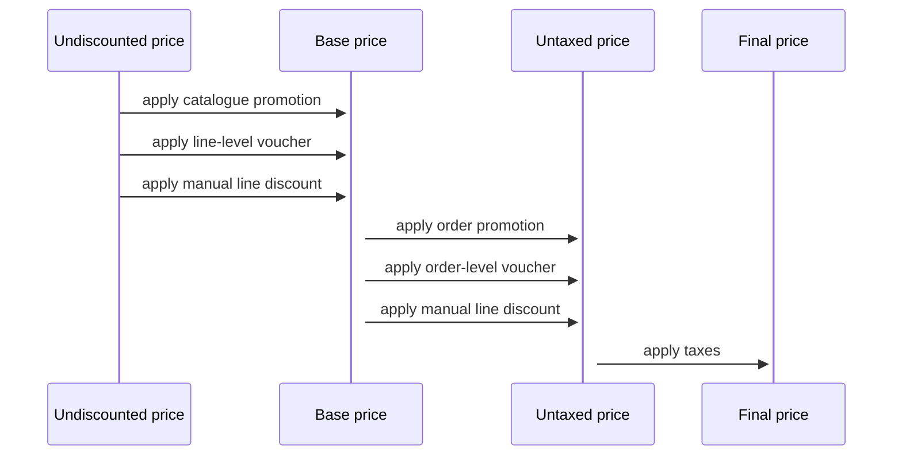

:::note
The calculations described in this section are aplicable both to checkout and order. 
:::

## Introduction

There are multiple factors affecting the final price of an order.
In a nutshell, Saleor first seeks the variant price and shipping cost for a specific channel,
then applies all discounts, and finally calculates taxes.

## Undiscounted price

​​Firstly, Saleor is looking for a variant price and shipping cost for a specific channel.
There is an option to override the prices by providing a `price` argument in
[orderLineCreateInput](api-reference/orders/inputs/order-line-create-input.mdx),
[checkoutLineInput](api-reference/checkout/inputs/checkout-line-input.mdx)
or [checkoutLineUpdateInput](api-reference/checkout/inputs/checkout-line-update-input.mdx).
In case of checkout mutations, overriding prices can be done only by app with `HANDLE_CHECKOUTS` permission.
Whether the price was taken directly from the channel or overridden, it is reflected as an undiscounted price.

## Discount application

### Base price

We first apply [`line-level discounts`](developer/discounts/overview.mdx#level) which decrease unit prices, resulting in the so-called `base price`. The application is done in the following order:

`base_unit_price` = `undiscounted_price` - ((`catalogue_promotion` + `line-level_voucher`) or `manual_line_discount`)

`base_shipping_price` = `undiscounted_shipping_price` - `shipping_voucher`

Some of the line discounts are mutually exclusive:

* manual line discount can't be combined and overrides all other line discounts
* only one voucher can be applied

### Untaxed price

Having line-level discounts applied, we can sum up all the lines and calculate the base subtotal, which will be the basis for applying [`order-level discounts`](developer/discounts/overview.mdx#level):

`untaxed_subtotal` = `base_subtotal` - (`entire_order_voucher` or `order_promotion` or `manual_discount`)

`untaxed_shipping` = `base_shipping_price` - `manual_discount`

All order-level discounts are mutually exclusive and can't be combined.

* The entire order voucher decreases the subtotal price and doesn't affect the shipping price.
* The order promotion can either decrease the subtotal or grant a gift, which will be added to the order as an extra order line with zero price.
* The manual discount decreases both subtotal and shipping prices. If the fixed value is provided, Saleor proportionally computes the subtotal and shipping portion.

After the application, when using flat rates or Avatx plugin tax strategies, the discounts are proportionally propagated to the order lines.
When a custom tax app is used to calculate taxes, this is done by the app itself.

## Tax calculation

After handling the discounts, Saleor calculates taxes to reflect gross prices (or net if [pricesEnteredWithTax](developer/taxes.mdx#tax-configuration) is set to True).
Tax calculation can be omitted by [chargeTaxes](developer/taxes.mdx#tax-configuration) setting or [tax exemption API](developer/taxes.mdx#tax-exemption).
Saleor offers three tax calculation strategies.

### Flat rates

When using [`flat rates`](developer/taxes.mdx#flat-rates), all the calculations are done by Saleor itself.
It applies static tax rates, defined by the user, associated with products, product types, shipping methods or countries.

### Tax app

Over [CHECKOUT_CALCULATE_TAXES](developer/extending/webhooks/synchronous-events/tax.mdx#checkout-taxes) 
and [ORDER_CALCULATE_TAXES](developer/extending/webhooks/synchronous-events/tax.mdx#order-taxes) sync webhooks,
Saleor serves [`TaxableObject`](api-reference/taxes/objects/taxable-object.mdx), which can be used as a payload for [`custom tax apps`](developer/extending/webhooks/synchronous-events/tax.mdx).
In return, Saleor expects final line prices and shipping price, with all discounts included and tax rates applied.
The prices obtained from the tax app are considered final and take precedence over both net and gross prices.
The only thing Saleor calculates are undiscounted gross prices based on received tax rates.

### Avatax plugin

Avatax plugin is a built-in integration with Avalara. Similar to custom tax apps, final data relies on extrenal tax service,
but in this case Saleor is responsible for handling Avalara response data and applying it to the prices.

:::warning
The Avatax plugin will be deprecated in Saleor 4.0.
:::
