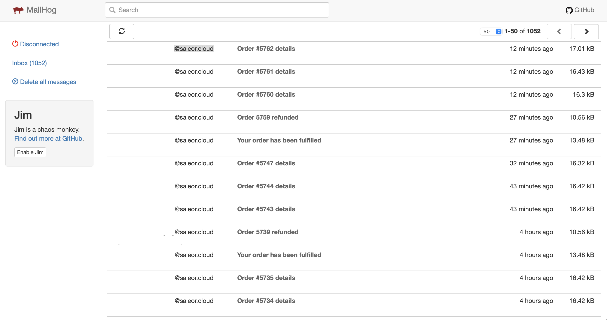

[Saleor platform](https://github.com/mirumee/saleor-platform) uses [Mailhog](https://github.com/mailhog/MailHog) for catching all the emails sent by the Saleor. 

Pros of using Mailhog during development:
- Live preview of rendered emails.
- No need to send emails to external services.
- Test emails will be caught in the local environment, so there is no possibility of sending test data to actual customers.
- Eliminates possibility of sending emails to non existing address, which can hurt email reputation.

## Configuration

### Saleor Platform

There is no need for additional configuration. Everything works out of the box.

### Local development environment

1. Follow [the installation guide](https://github.com/mailhog/MailHog#installation).
2. Set Mailhog SMTP server address (`smtp://localhost:1025`) at plugins configuration page for [AdminEmails](developer/available-plugins/admin-emails.mdx) and [UserEmails](developer/available-plugins/user-emails.mdx) 

## Access to the interface

Visit [http://localhost:8025](http://localhost:8025).
