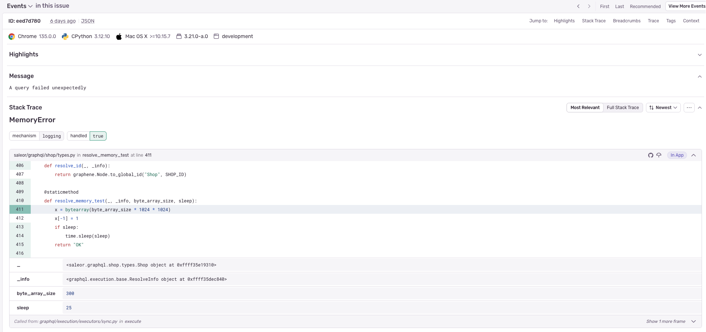

## Problem description

You may encounter memory limit issues when running Python code. This can happen when a process consumes too much memory. In such cases, the operating system may terminate the process, resulting in unexpected behavior or crashes with no error messages.


## Solution

We use environment variables to set memory limits for the Saleor process. This allows us to control how much memory the process can use and prevent it from consuming excessive amounts.  If the process attempts to allocate more memory than is allowed by the limit, a 'MemoryError' exception will be raised. This exception can be caught and logged, enabling you to debug memory problems. [You can find more information about memory limits in Python here.](https://docs.python.org/3/library/resource.html#resource-limits).

## Usage

To set memory limits for the Saleor process, you can use the following environment variables:
- `SOFT_MEMORY_LIMIT_IN_MB` - The soft memory limit in megabytes.
- `HARD_MEMORY_LIMIT_IN_MB` - The hard memory limit in megabytes.

Saleor will set [`resource.RLIMIT_DATA`](https://docs.python.org/3/library/resource.html#resource.RLIMIT_DATA) for limits from `SOFT_MEMORY_LIMIT_IN_MB` and `HARD_MEMORY_LIMIT_IN_MB` environment variables.

When the process tries to allocate more memory than the limit, it will raise an [`MemoryError`](https://docs.python.org/3/library/exceptions.html#MemoryError) exception. You can catch this exception and log it to help you debug the memory problem.

### Example MemoryError



### How to test memory limits
To test memory limits, you can use the following code snippet in any part of the Saleor codebase. This code allocates memory until it reaches the limit set by the environment variables. You can adjust the size variable to control how much memory is allocated.

```python
size = 1000 # variable size in MB
x = bytearray(size * 1000 * 1000) # Allocate memory
```

When the `size` variable is set to a value that exceeds the memory limit, the process will raise a `MemoryError` exception when execution this code.

### What next
If you encounter a 'MemoryError' exception, it means that the process has exceeded the memory limit. If the error occurs in the Saleor codebase, please create an issue on GitHub or reach out to us via Discord, providing details about the error and the code that caused it. This will help us to identify and resolve the issue.