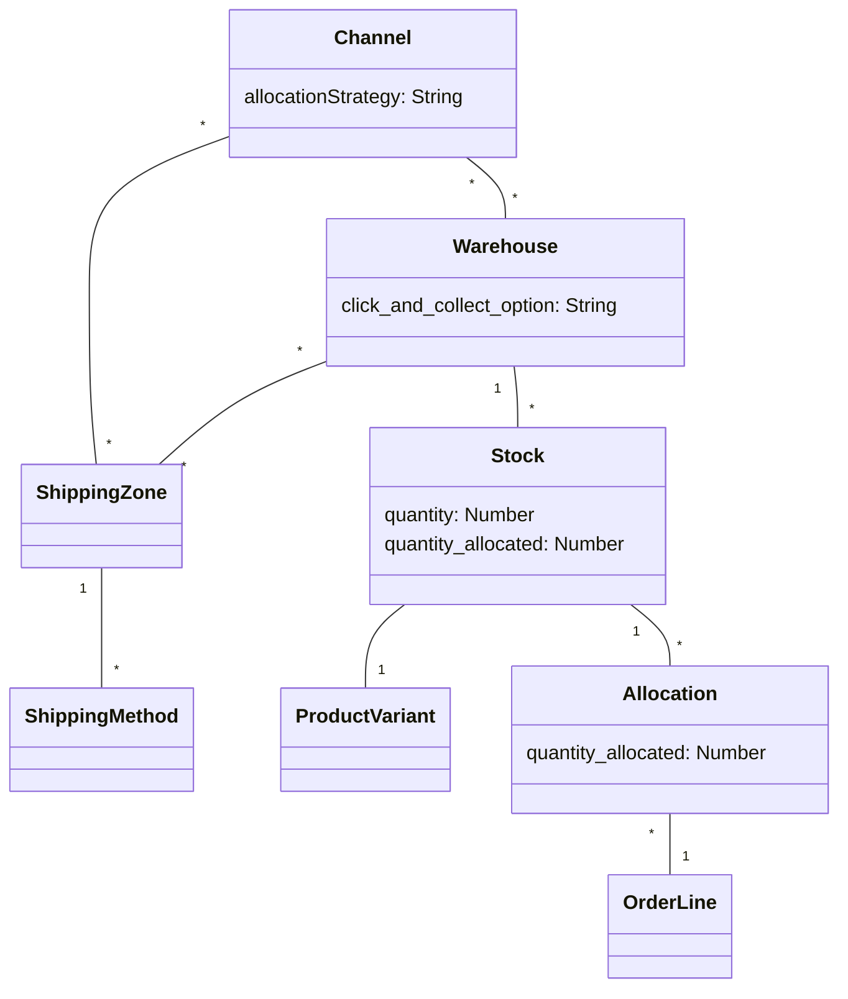

## Introduction

This guide explains how the allocations are handled in Saleor.

## Glossary

The warehouses, shipping zones, and channels must be linked
to provide the expected allocation. Below you can find the explanation of the terms that will be required to understand this guide properly:

- channel - allows configuring your shop differently for different currencies. Go [here](./channels.mdx) for more information.
- shipping zone - allows for defining the cost of shipping in different areas of the world
  with the use of shipping methods
- warehouse - contains stocks of specific products, assigned to a given channel and shipping zone,
  can be defined as the collection point
- stock - corresponds to resources of specific product variant in the given warehouse
- allocation - corresponds to the currently allocated stocks for a given order line
- allocation strategy - defines the preferences of warehouses for stock allocation
  and reservations

The relations between the mentioned entities are shown in the chart below:



### Allocation strategies

The allocation strategies allow defining the rule that is used during the stock
allocation. At this moment two possible options are available:

- Prioritize warehouses by sorting order (`PRIORITIZE_SORTING_ORDER`) - allocate stocks
  according to the warehouses' order within the channel. If stock is insufficient,
  the remaining quantity is allocated in the next warehouse on the list
  and repeated if necessary.
  To change the warehouses' order within the channel, use `channelReorderWarehouses` mutation.
- Prioritize warehouses with highest stock (`PRIORITIZE_HIGH_STOCK`) - allocate stock
  in a warehouse with the most stock. If not enough stock is available in a single
  warehouse, the remaining quantity is allocated in the next warehouse on the list
  and repeated if necessary.
  In this scenario, the warehouses' order within the channel is ignored.

## Allocation flow

Stocks are allocated in the checkout completion process, for all lines
that have track inventory turned on. The allocation is made for every line
according to the allocation strategy in the given channel.
Multiple allocations are created when there is insufficient available quantity in one stock.
Insufficient quantity in all product stocks raises the `InsufficientStock` error.

The line can be allocated only in the stocks that fulfill the following conditions:

- the stock's warehouse is available in the channel in which the order is created
- the stock's warehouse has a shipping zone that includes the shipping address
  (or billing address if the shipping address is not set) country code
  and this shipping zone is available in the channel in which the order is created
- the stock has available quantities

## Warehouse configuration

### Warehouse creation

Firstly we need to create the warehouse with the use of
[`createWarehouse`](developer/api-reference/mutations/create-warehouse.mdx) mutation.
In the following example, we are specifying `name`, `slug`, `email` and `address` of a warehouse.

```graphql
mutation {
  createWarehouse(input: {
    name: "Example warehouse",
    slug: "example-warehouse",
    email: "example-warehouse@example.com",
    address: {
      streetAddress1: "Teczowa 8",
      city: "Wroclaw",
      country: PL,
      postalCode: "53-601",
      companyName: "Amazing Company Inc",
    }
  }){
    warehouse {
      id
      name
      slug
      email
      address {
        id
        companyName
      }
    }
    errors {
      message
      field
      code
    }
  }
```

As a response we get the newly created warehouse:

```json
{
  "data": {
    "createWarehouse": {
      "warehouse": {
        "id": "V2FyZWhvdXNlOmJjMjZiNjMzLTg0ZmItNDUxZC1hNTRjLTU1NDc1YjU5NTAzYQ==",
        "name": "Example warehouse",
        "slug": "example-warehouse",
        "email": "example-warehouse@example.com",
        "address": {
          "id": "QWRkcmVzczo2NA==",
          "companyName": "Amazing Company Inc"
        }
      },
      "errors": []
    }
  }
}
```

After the warehouse is created it can be changed with the use of
the [`updateWarehouse`](developer/api-reference/mutations/update-warehouse.mdx) mutation.
There is an option to change the following warehouse fields: `name`, `slug`, `email`, `address` and
also define privacy and `click and collect` options.

We can define warehouse as public or private. Public warehouse allows you to query the stock information publicly in the API. Private warehouse requires permission.

### Click-and-collect warehouses

You can define warehouse as a collection point with the `click and collect` option.
There are three options you can use:

- `local stock` - the stock from the current warehouse is used during the fulfillment process.
  This option is only available for public warehouses.
- `all warehouses` - the total stock of a given product from all warehouses is used
  during the fulfillment process. The available quantity is not restricted by the quantity
  of this warehouse, and ordered products can be shipped from any other warehouse that
  is available in the channel.
- `disabled` - the current warehouse cannot be used as the collection point.

In the case of click-and-collect, the warehouse availability does not depend on the shipping zones.
It is limited only by the given channel.
The warehouse is available as a collection point for the given order under two conditions:

- there is a stock with available quantity for a given product,
- the warehouse is available in the channel in which the order is created.

#### Allocation

In the case of the checkout with the local collection point, the stock allocation can be made
only from the current warehouse. Insufficient quantity raises the `InsufficientStock` error. In the case of the checkout with the global collection point, the stocks
are allocated from the chosen warehouse first. If there is insufficient quantity,
the stocks are allocated from the next warehouse with the highest available quantity value.

### Assign warehouses to the channels

To allow assigning the warehouse to the shipping zone we need to have at least one common
channel with this zone. So firstly, we need to assign warehouses to channels with the use of
[`channelUpdate`](developer/api-reference/mutations/channel-update.mdx) mutation.
See the example below:

```graphql
  mutation {
    channelUpdate(
      id: "Q2hhbm5lbDoxMQ==",
      input: {
        "addWarehouses": ["V2FyZWhvdXNlOjA4N2I2MzhlLWIxYzYtNDk5Mi1hMWQ1LTZiOWI5N2FjODU1Zg=="]
      }
    ){
      channel{
        id
        warehouses {
          slug
        }
      }
      errors{
        field
        code
        message
        shippingZones
        warehouses
      }
    }
  }
```

As a response, we get the updated channel:

```json
{
  "data": {
    "channelUpdate": {
      "channel": {
        "id": "Q2hhbm5lbDoxMQ==",
        "warehouses": [
          {
            "slug": "example-warehouse"
          }
        ]
      },
      "channelErrors": []
    }
  }
}
```

## Shipping zone configuration

Shipping zones allow defining the cost of shipping in different areas of the world.
Shipping zones contain shipping methods that are available in given countries and
channels.

Shipping zones are required to sell physical products to given countries.

### Shipping zone creation and update

To create the shipping zone use [`shippingZoneCreate`](developer/api-reference/mutations/shipping-zone-create.mdx) mutation.
You can specify such fields as `name`, `description`, `countries`, `warehouses`, `channels` and
decide if you want to use it as the default one for all countries
that are not covered by other zones.

### Assigning warehouses to the shipping zone

Warehouses that are assignable to shipping zones are the subset of warehouses assigned to the channel.
So, to assign a warehouse to the shipping zone, the warehouse must be available in at least one channel to which the zone is assigned.
Thus, you must first specify the channels to assign warehouses to the shipping zone. You can do this by providing the channels and warehouses together during shipping zone creation.

Below is the example for shipping zone creation with channels and warehouses.
In this case, the defined warehouse is available in the channel specified in `addChannels` field, so it can be added to this shipping zone.

```graphql {2-12}
mutation {
  shippingZoneCreate(
    input: {
      name: "Zone A"
      description: "Description for shipping zone A."
      countries: ["US"]
      default: False
      addWarehouses: [
        "V2FyZWhvdXNlOjA4N2I2MzhlLWIxYzYtNDk5Mi1hMWQ1LTZiOWI5N2FjODU1Zg=="
      ]
      addChannels: ["Q2hhbm5lbDoxMA=="]
    }
  ) {
    shippingZone {
      id
      name
      description
      countries {
        code
      }
      default
      warehouses {
        name
      }
      channels {
        id
      }
    }
    errors {
      field
      code
      message
      channels
      warehouses
    }
  }
}
```

:::note
When adding warehouses to the shipping zone, make sure that all warehouses will have
the common channel with the shipping zone, otherwise you will get an error.
:::

As a result, we get the newly created shipping zone.

```json
"data": {
  "shippingZoneCreate": {
    "errors": [],
    "shippingZone": {
      "id": "U2hpcHBpbmdab25lOjEx",
      "name": "Zone A",
      "description": "Description for shipping zone A.",
      "countries": [
        {
          "code": "USD"
        }
      ],
      "default": False,
      "warehouses": [
        {
          "name": "ExampleWarehouse"
        }
      ],
      "channels": [
        {
          "id": "Q2hhbm5lbDoxMg=="
        }
      ]
    }
  }
}
```

To update the shipping zone use [`shippingZoneUpdate`](developer/api-reference/mutations/shipping-zone-update.mdx) mutation.
You can change all fields you defined during the creation process and unlink the channels and warehouses. Be aware that removing the channel may cause unlinking warehouses if it was the only common channel between zone and warehouse.
As before, adding warehouses must have a common channel with the shipping zone.

:::warning
Keep in mind that when the only common channel of warehouse and shipping zone is deleted (for example, after channel deletion or unlinking the warehouse or shipping zone from the channel),
the connection between the warehouse and shipping zone is deleted.
The common channel condition is mandatory.
:::
