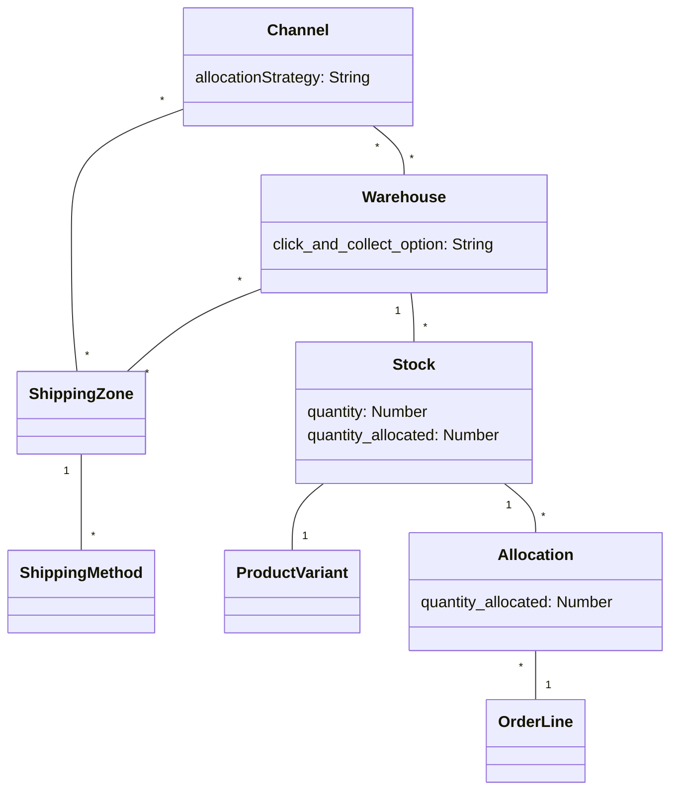

This guide explains how the allocations are handled in Saleor.

## Glossary

The warehouses, shipping zones, and channels must be linked
to provide the expected allocation. Below you can find the explanation of the terms that will be required to understand this guide properly:

- channel - allows configuring your shop differently for different currencies. See the [channel documentation](developer/channels/overview.mdx) for details.
- shipping zone - allows for defining the cost of shipping in different areas of the world
  with the use of shipping methods
- warehouse - contains stocks of specific products, assigned to a given channel and shipping zone,
  can be defined as the collection point
- stock - corresponds to resources of specific product variant in the given warehouse
- allocation - corresponds to the currently allocated stocks for a given order line
- allocation strategy - defines the preferences of warehouses for stock allocation
  and reservations

The relations between the mentioned entities are shown in the chart below:

## Allocation flow

Stocks are allocated in the checkout completion process for all lines
with track inventory turned on. Each line is allocated according to the
[allocation strategy](#allocation-strategies) in the given channel.
Multiple allocations are created when there is insufficient available quantity in one stock.
Insufficient quantity in all product stocks raises the `InsufficientStock` error.

The line can be allocated only in the stocks that fulfill the following conditions:

- the stock's warehouse is available in the channel in which the order is created
- the stock's warehouse has a shipping zone that includes the shipping address
  (or billing address if the shipping address is not set) country code
  and this shipping zone is available in the channel in which the order is created
- the stock has available quantities

### Allocation strategies

The allocation strategies allow defining the rule that is used during the stock
allocation. At this moment, two possible options are available:

- Prioritize warehouses by sorting order (`PRIORITIZE_SORTING_ORDER`) - allocate stocks
  according to the warehouses' order within the channel. If stock is insufficient,
  the remaining quantity is allocated in the next warehouse on the list
  and repeated if necessary.
  To change the warehouses' order within the channel, use
  [`channelReorderWarehouses`](api-reference/channels/mutations/channel-reorder-warehouses.mdx) mutation.
- Prioritize warehouses with the highest stock (`PRIORITIZE_HIGH_STOCK`) - allocate stock
  in a warehouse with the most stock. If not enough stock is available in a single
  warehouse, the remaining quantity is allocated in the next warehouse on the list
  and continues to the next one if necessary.
  In this scenario, the warehouses' order within the channel is ignored.

#### Allocation

In the case of the checkout with the local collection point, the stock allocation can be made
only from the current warehouse. Insufficient quantity raises the `InsufficientStock` error. In the case of the checkout with the global collection point, the stocks
are allocated from the chosen warehouse first. If there is insufficient quantity,
the stocks are allocated from the next warehouse with the highest available quantity value.

