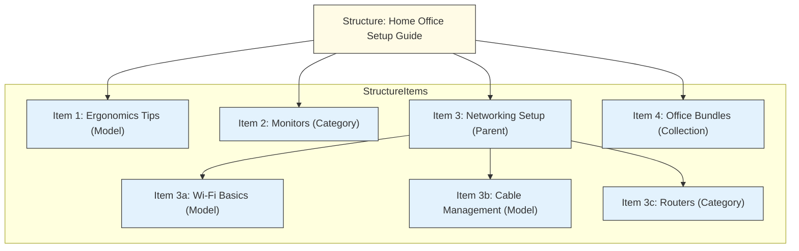

# Structures

import Tabs from "@theme/Tabs";
import TabItem from "@theme/TabItem";

:::info API Compatibility Notice

While we've updated the terminology in the documentation to use "Structures", the API endpoints and GraphQL schema still use "menus" and "menu items". This is temporary, and we plan to update the API to match the new terminology soon.

:::

## Overview

Structures are assembly mechanisms that group and organize entities in your store. They create hierarchical relationships between categories, collections, and models. The most common use case is storefront navigation.

You can create structures in the Saleor Dashboard in the _Configuration_ → _Navigation_ page.

## Example Use Case

**Modeling Curated Guides in Online Electronics Store**

Consider an online electronics store that wants to create guided content helping customers choose and set up products for specific needs, like a "Home Office Setup Guide". This guide needs to link specific setup advice Models, relevant Product Categories, and perhaps a key Collection.

Structures can model this curated, hierarchical organization:



- **Structure:** A Structure is created with the name "Home Office Setup Guide" and slug `home-office-guide`. This Structure itself represents the organized guide.
- **Structure Items:**
  - An item links directly to a `Model` titled "Ergonomics Tips" (perhaps a custom Model modeled for guides).
    - Another item links to the existing `Category` "Monitors".
    - A parent item "Networking Setup" (linking perhaps to a generic URL or another Model) has child items:
      - A child item linking to a "Wi-Fi Basics" `Model`.
      - A child item linking to a "Cable Management" `Model`.
      - A child item linking to the "Routers" `Category`.
    - A final item links to a curated `Collection` named "Office Bundles".


Instead of just being top-level navigation, this Structure (`home-office-guide`) **models a specific, curated relationship** between different types of content and commerce entities (Models, Categories, Collections). It defines a specific organization for the "Home Office Setup" topic that isn't captured by standard product categorization alone.

By querying this specific structure slug, an application can retrieve this curated organization and present the guide content in the intended order and hierarchy, demonstrating how Structures can assemble entities into a structured whole for purposes beyond simple site navigation.

## Lifecycle

:::info

Structure operations require the [`MANAGE_MENUS`](/developer/permissions.mdx#available-permissions) permission.

:::

### Creating a Structure

A structure requires a name and can optionally have a slug. 

You can create a structure with or without items with the [`menuCreate`](/api-reference/menu/mutations/menu-create) mutation.
A structure item can link to one of the following entities:

- Category
- Collection
- Model
- URL

<Tabs>
<TabItem value="Mutation">
```graphql
mutation CreateMenu($input: MenuCreateInput!) {
  menuCreate(input: $input) {
    menu {
      id
      name
      slug
      items {
        id
        name
        level
      }
    }
    errors {
      field
      message
      code
    }
  }
}
```
</TabItem>

<TabItem value={"Variables"}>
```json
{
  "input": {
    "name": "Example Structure Item",
    "slug": "example-structure-item",
    "items": [
      {
        "name": "Category Structure Item",
        "category": "Q2F0ZWdvcnk6MjY="
      },
      {
        "name": "Collection Structure Item",
        "collection": "Q29sbGVjdGlvbjozMjA="
      },
      {
        "name": "Model Structure Item",
        "page": "UGFnZToxMjM="
      },
      {
        "name": "URL Structure Item",
        "url": "https://www.saleor.io"
      }
    ]
  }
}
```
</TabItem>
</Tabs>

You can also create the structure item itself through the [`menuItemCreate`](/api-reference/menu/mutations/menu-item-create) mutation.

Structure items can be nested to create a hierarchy. For example, the following input creates a structure item as a child of another structure item:

<Tabs>
<TabItem value="Mutation">
```graphql
mutation CreateMenuItem($input: MenuItemCreateInput!) {
  menuItemCreate(input: $input) {
    menuItem {
      id
      name
      level
      children {
        id
        name
        level
      }
    }
  }
}
```
</TabItem>

<TabItem value={"Variables"}>
```json
{
  "input": {
    "menu": "TWVudToy",
    "name": "Parent Structure Item",
    "url": "https://www.saleor.io",
    "parent": "Q2F0ZWdvcnk6MjY="
  }
}
```
</TabItem>
</Tabs>

### Getting Structures

To retrieve all structures, use the [`menus`](/api-reference/menu/queries/menus) query:


<Tabs>
<TabItem value="Query">
```graphql
query Menus($first: Int) {
  menus(first: $first) {
    edges {
      node {
        id
        name
        slug
        items {
          id
          name
          level
          category {
            id
            name
          }
          collection {
            id
            name
          }
          page {
            id
            title
          }
          children {
            id
            name
            level
          }
        }
      }
    }
  }
}
```
</TabItem>

<TabItem value={"Variables"}>
```json
{
"first": 2
}
```
</TabItem>
</Tabs>

To get a specific structure by ID, name, or slug, use the [`menu`](/api-reference/menu/queries/menu) query:

<Tabs>
<TabItem value="Query">
```graphql
query GetMenuBySlug($slug: String, $channel: String) {
  menu(slug: $slug, channel:$channel) {
    id
    name
    slug
    items {
      id
      name
      level
      category {
        id
        name
      }
      collection {
        id
        name
      }
      page {
        id
        title
      }
    }
  }
}
```
</TabItem>

<TabItem value={"Variables"}>
```json
{
  "slug": "footer",
  "channel": "default-channel"
}
```
</TabItem>
</Tabs>

### Deleting a Structure

To remove a structure and all its items, use the [`menuDelete`](/api-reference/menu/mutations/menu-delete) mutation:

<Tabs>
<TabItem value="Mutation">
```graphql
mutation DeleteMenu($id: ID!) {
  menuDelete(id: $id) {
    menu {
      id
      name
      slug
    }
    errors {
      field
      message
      code
    }
  }
}
```
</TabItem>

<TabItem value={"Variables"}>
```json
{
  "id": "TWVudToy"
}
```
</TabItem>
</Tabs>


## Webhooks

Here are the webhooks that are available for structures:

- [`MENU_CREATED`](/api-reference/menu/objects/menu-created)
- [`MENU_UPDATED`](/api-reference/menu/objects/menu-updated)
- [`MENU_DELETED`](/api-reference/menu/objects/menu-deleted)
- [`MENU_ITEM_CREATED`](/api-reference/menu/objects/menu-item-created)
- [`MENU_ITEM_UPDATED`](/api-reference/menu/objects/menu-item-updated)
- [`MENU_ITEM_DELETED`](/api-reference/menu/objects/menu-item-deleted)
