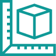

## Developer's Guide

[home-grid]
[ **Getting Started** Installing Saleor and creating an Administrator account.](getting-started/intro.md)
[ **Customizing Saleor** Customizing Saleor to your chosen technology stack. Working with Python.](customization/intro.md)
[/home-grid]
[home-grid]
[ **Supported Payment Gateways** How to use Braintree, Razorpay and Stripe with Saleor.](payment-gateways/intro.md)
[ **Architecture** Understanding the Saleor system architecture.](architecture/intro.md)
[/home-grid]
[home-grid]
[ **Integrations** Adding SEO, Google, mailing and other integrations to the platform.](integrations/intro.md)
[ **Contribute** Connected to our GitHub and Spectrum communities for more support.](contributing/intro.md)
[/home-grid]

## Saleor Dashboard Guide

[home-grid]
[ **Before You Start** Find out more about Saleor and how to get a version to use for your e-commerce.](dashboard/before-you-start.md)
[ **Using Saleor** Find out more about Saleor and how to get a version to use for your e-commerce.](dashboard/using-saleor.md)
[/home-grid]
[home-grid]
[ **Home** Understanding the front page of your Saleor Dashboard.](dashboard/home.md)
[ **Catalogue** How to add and manage products individually or in groups, and in categories or collections.](dashboard/catalog/intro.md)
[/home-grid]
[home-grid]
[ **Orders** Viewing and editing all current and past orders in your e-commerce.](dashboard/orders.md)
[ **Customers** Managing your customer database and viewing specific details for each buyer.](dashboard/customers.md)
[/home-grid]
[home-grid]
[ **Discounts** How to create and effectively utilize sales and vouchers in your store.](dashboard/discounts/sales.md)
[ **Configure** Manage all the administration elements of your dashboard and processes like tax automation and shipping.](dashboard/configuration/intro.md)
[/home-grid]
