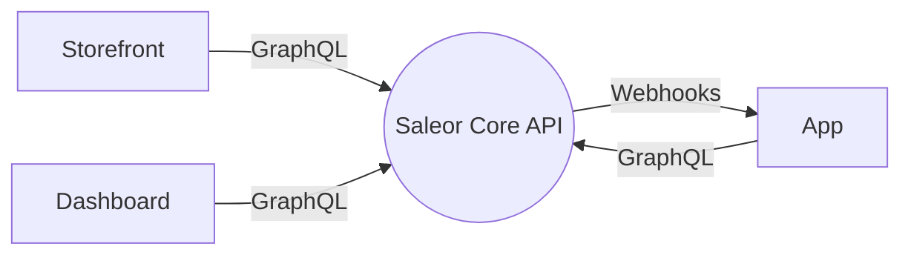

Saleor consists of three distinctive components:

1. First is the **Saleor Core**, the backend server that exposes the [GraphQL API](api-usage/overview.mdx). The core is written in Python and does not have a user interface. It maintains its state in a PostgreSQL database and caches some information in Redis where available.
2. Then, there's the **Saleor Dashboard**, which implements the user interface that staff members can use to operate a store. The dashboard is a React application that runs in the browser and talks to the core server. It's a static website, so it does not have any backend code.
3. To connect Saleor with external services, best way will be to use **Apps**. They can react on Saleor Events via Webhooks and call Saleor via GraphQL API. Saleor provides official App Store with first-party Apps by the Saleor Team. Learn more about [extending Saleor](developer/extending/overview.mdx)
4. Lastly, there's a **Storefront**, usually custom frontend dedicated for every business. It's connected with Saleor via GraphQL API, other technologies can be chosen individually. Saleor provides example Storefront that can be used of forked.

All three components communicate using GraphQL over HTTPS.

## Saleor Core Architecture

Saleor Core contains several components

TODO Diagram with Saleor internal components: Python Service, Postgres, Redis, queue, workers, tracing...