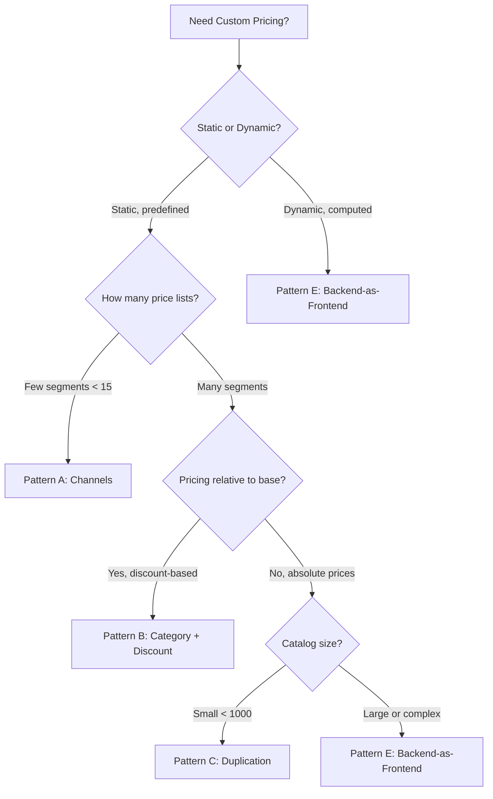
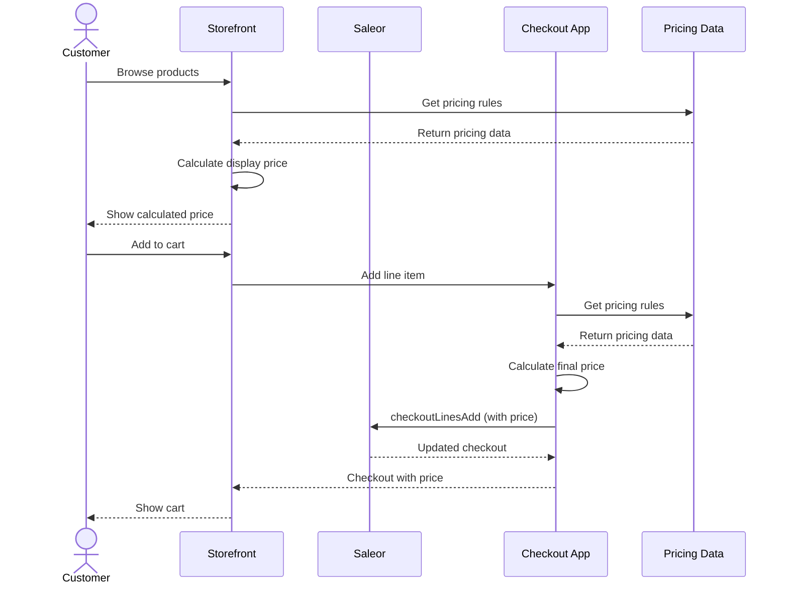
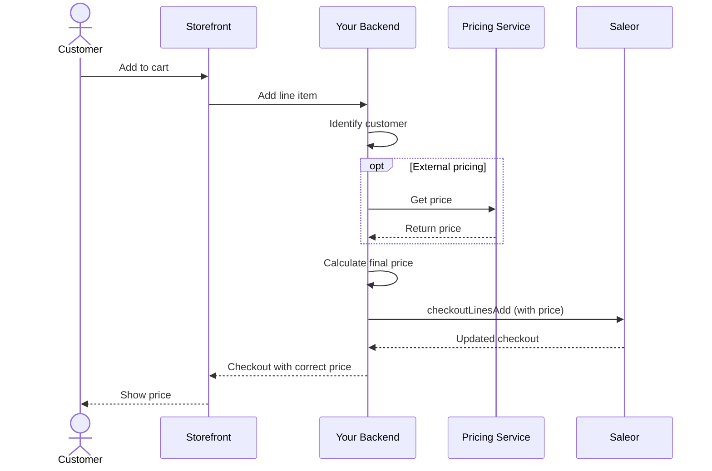

import CompactCard from "@site/components/CompactCard";
import RecipeResourceGrid from "@site/components/RecipeResourceGrid"

# Custom Pricing Recipe

Saleor's built-in [channel-based pricing](/developer/products/configuration#pricing) and [promotions](/developer/discounts/promotions) handle most pricing scenarios. But if you need per-customer pricing, contract pricing, volume discounts, or integration with external pricing systems, you'll need a custom approach.

This guide covers five architectural patterns. The key difference between them is where pricing logic lives: in the catalog (channels, categories), in promotions, or calculated at checkout time.

## Decision Framework

Static vs dynamic pricing determines your starting point. Static pricing means prices are predetermined and stored somewhere (channels, metadata, duplicated products). Dynamic pricing means prices are calculated when customers check out based on context or business rules.

Multi-currency requirements affect every pattern differently. Channels handle it natively, but other approaches require custom logic or exponential duplication.

## Pricing Patterns

### Pattern A: Channels as Price Lists

Channels can represent pricing contexts like wholesale vs retail or regional pricing. Each channel has its own currency and variant prices. Configure prices using [productVariantChannelListingUpdate](/api-reference/products/mutations/product-variant-channel-listing-update) and assign customers to channels based on their segment.

**Pros:**
- Admin-friendly, no custom code required
- Native multi-currency support (one currency per channel)
- Works well for small numbers of clearly defined price lists (under 10-15)

**Cons:**
- Not designed for customer segmentation at scale
- Managing more than 15 channels becomes operationally complex
- Each checkout locked to one channel (can't mix prices from multiple contexts)
- Customer-to-channel assignment requires custom logic

<RecipeResourceGrid>
    <CompactCard
        name="Channel Configuration"
        description="Learn how to configure channels in Saleor."
        link="/developer/channels/configuration"
    />
    <CompactCard
        name="Product Variant Channel Listing"
        description="Set variant prices per channel."
        link="/api-reference/products/mutations/product-variant-channel-listing-update"
    />
</RecipeResourceGrid>

---

### Pattern B: Category + Discount Pattern

Assign products to categories representing customer segments, then apply [catalogue promotions](/developer/discounts/promotions) with category predicates. Customers see different prices based on which categories they can access.

**Pros:**
- Easy to configure in the dashboard
- Works well for discount-based pricing (percentage or fixed amount off base)
- Shows promotional aspect to customers

**Cons:**
- Promotions don't stack at the same level
- Categories become pricing mechanism rather than taxonomy
- Categories visible across catalog, requires custom storefront logic to prevent access
- Doesn't scale beyond simple discount scenarios or many customer-specific prices

<RecipeResourceGrid>
    <CompactCard
        name="Promotions Overview"
        description="Understanding Saleor's promotion system."
        link="/developer/discounts/promotions"
    />
    <CompactCard
        name="Categories"
        description="Learn about product categories."
        link="/developer/products/overview#categories"
    />
</RecipeResourceGrid>

---

### Pattern C: Product Duplication

Create separate product entries for each pricing context with different prices on each copy. Show customers only their relevant products through storefront filtering.

**Pros:**
- Complete independence per segment (prices, inventory, metadata)
- No custom pricing logic required
- Easy to understand

**Cons:**
- Catalog size multiplies by segments (500 products × 3 segments = 1,500 entries)
- Updates to descriptions, images, specs must be synchronized across copies
- Inventory tracking complex if duplicates share physical stock
- Multi-currency requires duplicating per currency (exponential growth)

:::warning Data Management

Product duplication requires careful synchronization across copies. Consider this approach only for catalogs smaller than 1,000 products with infrequent pricing changes and a small number of segments.

:::

Only viable for very small catalogs with few segments where operational overhead is manageable.

<RecipeResourceGrid>
    <CompactCard
        name="Products Overview"
        description="Understanding Saleor's product model."
        link="/developer/products/overview"
    />
    <CompactCard
        name="Collections"
        description="Use collections for filtering duplicated products."
        link="/developer/products/overview#collections"
    />
</RecipeResourceGrid>

---

### Pattern D: Offer Pattern

Store pricing data outside the standard variant price—in [product metadata](/api-usage/metadata), [Saleor Models](/developer/models), or your own database—and calculate display prices in the storefront based on customer context. Set final prices using [custom checkout line prices](/developer/checkout/api-guide#setting-custom-line-prices) when customers add items to cart. Requires an app with `HANDLE_CHECKOUTS` permission.

**Pros:**
- Pricing data lives outside catalog structure (metadata, models, or external database)
- Good for complex logic that changes frequently
- No catalog duplication or channel proliferation
- Flexible storage options

**Cons:**
- Metadata not indexed (can't filter or search products by price)
- Pricing rules scattered between storefront and checkout app
- No built-in price history or audit trail
- Works best in single-currency scenarios

:::info Metadata Limitations

Product metadata is not indexed for search or filtering. If you need to query products by price ranges or filter by pricing tiers, consider alternative patterns.

:::

<RecipeResourceGrid>
    <CompactCard
        name="Metadata"
        description="Store custom data on Saleor objects."
        link="/api-usage/metadata"
    />
    <CompactCard
        name="Models"
        description="Create custom structured data entities."
        link="/developer/models"
    />
    <CompactCard
        name="Custom Checkout Line Prices"
        description="Override prices during checkout."
        link="/developer/checkout/api-guide#setting-custom-line-prices"
    />
</RecipeResourceGrid>

---

### Pattern E: Backend-as-Frontend

Build a backend service between your storefront and Saleor. The storefront calls your backend, which calculates prices based on customer context, business rules, or external systems, then proxies requests to Saleor with prices already set using the `price` parameter in [checkoutLinesAdd](/api-reference/checkout/mutations/checkout-lines-add) or [checkoutLinesUpdate](/api-reference/checkout/mutations/checkout-lines-update). Requires an app token with `HANDLE_CHECKOUTS` permission.

**Pros:**
- Centralizes all pricing logic in one service
- Can integrate with any external system (ERPs, CPQ tools, contract databases)
- Pricing decisions happen before Saleor (no checkout webhook patching)
- Supports audit trails, price history, and approval workflows
- Handles multi-currency naturally
- Customers see correct prices immediately (if backend handles product listing)
- Scales to hundreds or thousands of customer-specific price lists

**Cons:**
- Requires building and maintaining a backend service
- Infrastructure and operational complexity

:::tip

Backend-as-frontend is the only pattern that scales to hundreds or thousands of customer-specific price lists without operational overhead. Good for per-customer pricing, dynamic rules, or external system integration.

:::

<RecipeResourceGrid>
    <CompactCard
        name="Checkout API Guide"
        description="Learn about custom line prices in checkout."
        link="/developer/checkout/api-guide"
    />
    <CompactCard
        name="Building Apps Quickstart"
        description="Get started building Saleor apps."
        link="/developer/extending/apps/quickstart"
    />
    <CompactCard
        name="Example: Checkout Prices App"
        description="Reference implementation for custom pricing."
        link="/developer/extending/apps/developing-apps/app-examples#checkout-prices"
    />
</RecipeResourceGrid>

---

## Choosing the Right Pattern

| Pattern | Catalog Size | Customer Segments | Pricing Complexity | Maintenance | Multi-currency |
|---------|-------------|-------------------|-------------------|-------------|----------------|
| **A: Channels** | Any | < 15 | Low | Low | Native |
| **B: Category + Discount** | < 10k products | Unlimited | Low-Medium | Medium | Via channels |
| **C: Duplication** | < 1k products | < 10 | Low | High | Via duplication |
| **D: Offer Pattern** | Any | Unlimited | Medium-High | Medium | Custom logic |
| **E: Backend-as-Frontend** | Any | Unlimited | Any | Medium | Built-in |

**Pattern A:** Stable price lists when admin configuration matters more than flexibility.

**Pattern B:** Discount-based pricing where the promotional aspect is part of the experience.

**Pattern C:** Very small catalogs only.

**Pattern D:** Middle ground when you need flexibility without building a separate backend.

**Pattern E:** Per-customer pricing, complex calculations, external system integration, or high scale.
