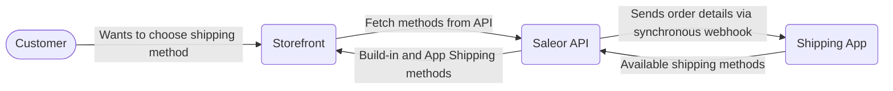

import CompactCard from "@site/components/CompactCard";
import RecipeResourceGrid from "@site/components/RecipeResourceGrid"

# Custom Shipping Recipe 

Saleor embraces the complexities of modern e-commerce and solutions beyond standard configurations. When your business requires unique rate calculations, specific carrier integrations, dynamic rules based on cart contents, or location-specific logic, the ability to implement custom shipping methods becomes essential. This guide will walk you through the process of extending Saleor's capabilities, leveraging its flexible architecture to create bespoke shipping solutions tailored precisely to your operational needs and customer expectations.

## Built-in Shipping Methods

Saleor provides tools for defining shipping options directly within the dashboard, often eliminating the need for custom code or external integrations. These built-in methods allow you to flexibly control where you ship, how much you charge, and the conditions under which specific options are available.

The configuration process starts with creating Shipping Zones. These zones group together relevant warehouses, destination countries, and sales channels. Within each zone, you can then define multiple Shipping Methods, specifying details such as the carrier and applicable order weight ranges. For finer control, you can further restrict methods to specific postal code ranges or exclude certain products from being eligible for a particular shipping method.

    <CompactCard
        name="Shipping Zone Documentation"
        description="Learn how to configure shipping zones."
        link="/developer/shipping/shipping-zone"
    />

    <CompactCard
        name="Shipping Method Documentation"
        description="Learn how to configure shipping methods."
        link="/developer/shipping/shipping-method"
    />

## Custom Logic with Apps

Saleor Apps provide granular control over all shipping logic. Through synchronous subscriptions, they offer a unified interface that enables you to offload business logic to a separate application. Saleor remains the coordinating API, simplifying testing and development by decoupling these components.

Follow the quickstart guide to create a boilerplate App from the template.

<RecipeResourceGrid>
    <CompactCard
        name="Apps Quickstart"
        description="Learn how to create Saleor Apps."
        link="/developer/extending/apps/quickstart"
    />
   <CompactCard
        name="Shipping Events"
        description="Learn about synchronous shipping events."
        link="/developer/extending/webhooks/synchronous-events/shipping"
    />
</RecipeResourceGrid>

### Filtering Methods

To dynamically change the availability of built-in shipping methods, leverage Saleor Apps with the `CHECKOUT_FILTER_SHIPPING_METHODS` and `ORDER_FILTER_SHIPPING_METHODS` synchronous webhooks (events). When a customer requests shipping options, Saleor triggers these webhooks, sending a request to your App. Your App's response then determines which methods are available or excluded for that specific checkout or order.

Write a subscription targeting the desired webhook (`CHECKOUT_FILTER_SHIPPING_METHODS` or `ORDER_FILTER_SHIPPING_METHODS`). Specify the data needed for your business logic within the subscription's payload (e.g., cart contents, customer details). The GraphQL Code Generator included in the App Template will automatically generate TypeScript types for this payload.

Set up a dedicated API route (Webhook Handler) in your App that will receive the webhook requests from Saleor. Use helpers from the Saleor App SDK to validate incoming requests, ensuring they originate from your Saleor instance.
This handler must process the payload data and return a formatted JSON response. The response should contain a list of shipping method IDs that you want to exclude or disable for this specific request. You can optionally include a reason for each exclusion, which Saleor can potentially display to the customer.

Add the webhook subscription details to your app's manifest. This ensures Saleor registers the webhook when the app is installed.

<RecipeResourceGrid>
    <CompactCard
        name="App SDK Webhook Helpers"
        description="Learn about webhook utilities."
        link="/developer/extending/apps/developing-apps/app-sdk/saleor-webhook"
    />
   <CompactCard
        name="Shipping Events"
        description="Learn about the synchronous shipping webhooks."
        link="/developer/extending/webhooks/synchronous-events/shipping"
    />
</RecipeResourceGrid>

### Dynamic Shipping Methods

When your App needs to generate the shipping methods list itself (e.g., for per-order calculations or external integrations like Shippo), use the `SHIPPING_LIST_METHODS_FOR_CHECKOUT` and `SHIPPING_LIST_METHODS_FOR_ORDER` webhooks.

The setup process mirrors the filtering webhook implementation (subscription, handler, manifest). The main distinction is that your handler's response must provide the full list of available shipping methods and their details for the specific request, rather than just excluding built-in ones.

## Synchronizing Fulfillment Status

Update customer shipping statuses by creating Order Fulfillments in Saleor, which represent individual shipments.

Manual Creation: Use the Saleor Dashboard to create fulfillments. Go to the order, select the lines being shipped, optionally add a tracking code, and confirm. Fulfillment creation triggers the `FULFILLMENT_CREATED` event. Apps can use this for tasks like updating external services, printing shipping labels, or sending notifications.

Automated Creation: Apps can also automate the creation of fulfillments, typically triggered by data from external shipping or warehouse systems.

<RecipeResourceGrid>
   <CompactCard
        name="Fulfillment Lifecycle"
        description="Learn how fulfillments change over time."
        link="/developer/order/order-fulfillment"
    />
   <CompactCard
        name="App Communication"
        description="Learn about synchronizing status between services."
        link="/developer/extending/apps/architecture/communication-between-app-and-saleor#app-to-saleor-api"
    />
    <CompactCard
        name="External Webhooks"
        description="Learn about handling webhooks in multi-tenant environments."
        link="/developer/extending/apps/developing-apps/apps-patterns/handling-external-webhooks"
    />
</RecipeResourceGrid>
