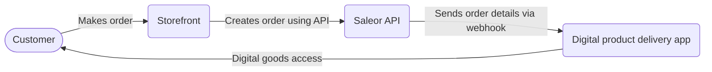

import CompactCard from "@site/components/CompactCard";
import RecipeResourceGrid from "@site/components/RecipeResourceGrid"

# Digital Products Recipe 

Learn how to set up and manage digital products (like software, e-books, or services) in Saleor with this guide. Since these items don't require shipping, the focus is on configuring specific product types and setting up automated asset delivery after purchase.

## Create Product Type for Digital Goods

A Product Type acts as a template for creating products. It defines the structure, including whether items require shipping and what attributes they have.

Set up a new Product Type. Make sure to disable the "Requires Shipping" setting for this type, so the shipping step is skipped during checkout if the cart only contains these digital products.

<RecipeResourceGrid>
    <CompactCard
        name="Product Types"
        description="Read more about structuring and organizing product data."
        link="/developer/products/overview"
    />
    <CompactCard
        name="Product Configuration"
        description="Learn how to configure products."
        link="/developer/products/configuration"
    />
</RecipeResourceGrid>

## Create Your Products

Create products using your new product type. Fill in the product details, such as name, description, category and add variants. 

For each variant, you need to create stock entries. Products without stock won't be available for purchase. If your product has unlimited stock, disable the "track inventory" setting.

<RecipeResourceGrid>
    <CompactCard
        name="Stock Tracking"
        description="Learn how to track inventory in Saleor."
        link="/developer/stock/stock-tracking"
    />
</RecipeResourceGrid>

## Make Changes in Your Storefront

Your storefront needs to adapt its checkout flow based on whether shipping is required.

When a cart contains *only* digital products (where `isShippingRequired` is false), the checkout process should skip shipping address collection and shipping method selection.

<RecipeResourceGrid>
    <CompactCard
        name="Storefront Quickstart"
        description="Get started with the NextJS example storefront."
        link="/quickstart/storefront"
    />

    <CompactCard
        name="Checkout Shipping"
        description="Learn about shipping and checkout APIs."
        link="/developer/checkout/address"
    />
</RecipeResourceGrid>

## Asset Delivery

When an order is paid, you need to make the digital content accessible to the customer. Use webhooks to integrate with your business backend.

Create a webhook in the dashboard. Choose `Order fully paid` event, define the subscription query, and target URL. When an order is paid, Saleor will send data defined by subscription query to the provided address. Now recipient application will be able to perform necessary operations like updating subscription details or sending an email with a download link.

<RecipeResourceGrid>
    <CompactCard
        name="Apps Overview"
        description="Learn how to build Saleor Apps."
        link="/developer/extending/apps/overview"
    />

    <CompactCard
        name="Webhook Payloads"
        description="Learn how to create custom event subscriptions."
        link="/developer/extending/webhooks/subscription-webhook-payloads"
    />
</RecipeResourceGrid>

