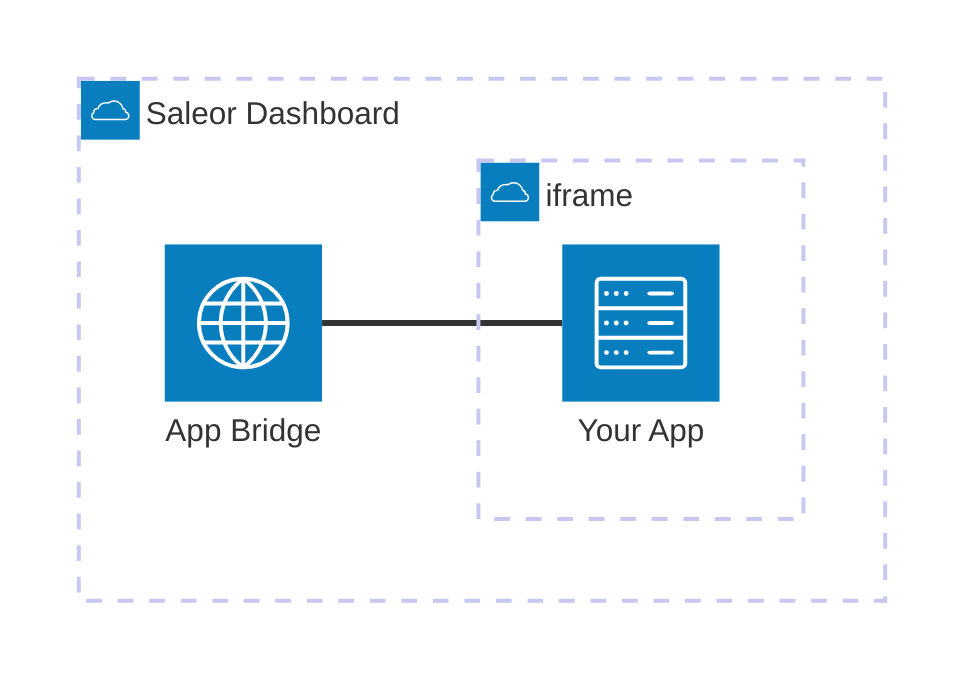

import CompactCard from "@site/components/CompactCard";
import RecipeResourceGrid from "@site/components/RecipeResourceGrid"

# Extending Dashboard Recipe

Saleor Apps are not limited to backend logic; they can also directly extend the functionality and user interface of the Saleor Dashboard. By mounting custom views within designated areas of the Dashboard, Apps can provide tailored experiences for administrators.

## How Saleor Apps Integrate with the Dashboard

App integration with Saleor, particularly the Dashboard, is configured by the Manifest. This JSON file defines the App's required permissions, webhook subscriptions, and Mounting Points, which specify where your App's interface will appear.

To prevent XSS attacts, the App's interface is rendered inside an iframe sandbox. Communication between this embedded App view and the Dashboard itself is handled by the App Bridge (from the App SDK package). App Bridge provides essential context, such as authentication tokens, and allows your App to trigger Dashboard actions like displaying notifications.

## Create a New App

Follow the quickstart to create a new application using our template. 

You can also check the source code of our community examples for reference.

<RecipeResourceGrid>
    <CompactCard
        name="Apps Quickstart"
        description="Learn how to create Saleor Apps."
        link="/developer/extending/apps/quickstart"
    />

    <CompactCard
        name="Community Examples"
        description="Browse open source apps and examples."
        link="/developer/extending/apps/developing-apps/app-examples"
    />
</RecipeResourceGrid>

## Building UI

Use the MacawUI library to maintain a consistent look and feel with the Saleor Dashboard. It provides components that match the Dashboard's design system.

<RecipeResourceGrid>
    <CompactCard
        name="MacawUI"
        description="Learn about the React components library."
        link="/developer/extending/apps/developing-apps/macaw-ui"
    />

    <CompactCard
        name="MacawUI Storybook"
        description="Explore available components."
        link="https://macaw-ui.vercel.app/"
    />
</RecipeResourceGrid>

## Security Considerations

Client-side calls to the Saleor API should use the token provided by the AppBridge - it has permission which are common part of the App and user permissions. App tokens obtained during the registration should never be sent to the client.

Use `createProtectedHandler` from App SDK to ensure proper permissions and headers of the requests.

<RecipeResourceGrid>
    <CompactCard
        name="App Authentication"
        description="Learn about secure app communication."
        link="/developer/extending/apps/architecture/server-and-client-side-calls"
    />
    <CompactCard
        name="App Bridge"
        description="Learn about the Dashboard integration layer."
        link="/developer/extending/apps/developing-apps/app-sdk/app-bridge"
    />
    <CompactCard
        name="Protected Handlers"
        description="Learn how to use App SDK helpers."
        link="/developer/extending/apps/developing-apps/app-sdk/protected-handlers"
    />
</RecipeResourceGrid>

## Data Storage with Metadata

Additional database for your application data might not be required. Metadata fields available in many Saleor entities can be used to store it. Additionally other parts of your stack can use them too. For example - custom SEO app can store data in the product metadata and storefront use it during the page render. Each installed app has its own metadata fields which can be used to store its configuration.

<RecipeResourceGrid>
    <CompactCard
        name="Metadata"
        description="Learn about the Metadata interface."
        link="/api-usage/metadata"
    />

    <CompactCard
        name="Settings Manager"
        description="Learn how to store configuration in metadata."
        link="/developer/extending/apps/developing-apps/app-sdk/settings-manager"
    />
</RecipeResourceGrid>

## App Configuration View

Every Saleor App requires a dedicated Configuration View. You must implement this view and provide its URL in the App's Manifest file under the `configurationUrl` key. Dashboard users will access this view when they select your App from the main Extensions list.

We strongly recommend implementing this configuration interface early in the development cycle, rather than relying solely on environment variables for setup. Having a UI to dynamically adjust settings significantly speeds up testing processes and makes collaboration among developers easier.

Depending on your App's complexity, this configuration view might encompass the primary interface for managing its settings and operations. For examples of effective UI patterns and design approaches for configuration views, we encourage you to review Saleor's official and community example applications.

<RecipeResourceGrid>
    <CompactCard
        name="Apps Quickstart"
        description="Learn how to create Saleor Apps."
        link="/developer/extending/apps/quickstart"
    />

    <CompactCard
        name="Community Examples"
        description="Browse open source apps and examples."
        link="/developer/extending/apps/developing-apps/app-examples"
    />
</RecipeResourceGrid>

## Adding New Views

Create a new route dedicated to the view you are working on.

To make it available in the Dashboard, add a new entry to the `extensions` list in the app manifest. You can choose one of the available locations:

- `NAVIGATION_*`: Main menu under a chosen category
- `*_DETAILS_MORE_ACTIONS`: Context menu in entity details view
- `*_OVERVIEW_MORE_ACTIONS`: Context menu in entity list view
- `*_OVERVIEW_CREATE`: New option under the "Create" button it entity list view

Choose which permissions are required from staff users to access the view and choose if view should be displayed as full page view or modal window.

<RecipeResourceGrid>
    <CompactCard
        name="Dashboard Extensions"
        description="Learn about dashboard extension options."
        link="/developer/extending/apps/extending-dashboard-with-apps"
    />

    <CompactCard
        name="App Manifest"
        description="Learn about the app manifest."
        link="/developer/extending/apps/architecture/manifest"
    />
</RecipeResourceGrid>

## Forking the Dashboard

For projects requiring complete control over the whole Dashboard, there's one more solution available - making a fork, which is a copy of the official repository. The source code of the Saleor Dashboard is available publicly and can be modified and hosted in your infrastructure.

Such approach should be taken with consideration of effort needed to maintain compability with new versions of the API and synchronizing changes from the Dashboard repository. 

<RecipeResourceGrid>
    <CompactCard
        name="Dashboard Repository"
        description="Access the Dashboard source code."
        link="/developer/extending/apps/quickstart"
    />
</RecipeResourceGrid>
