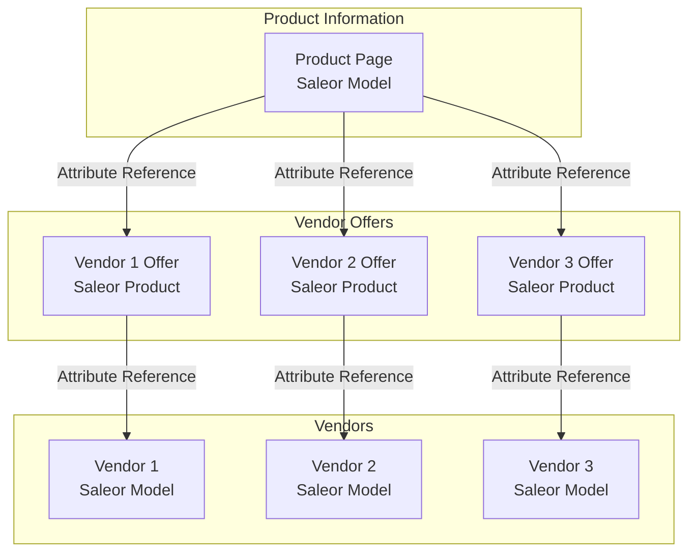
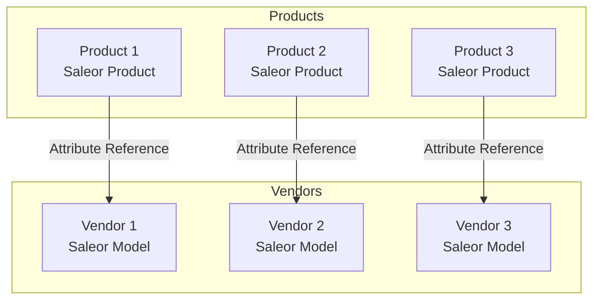
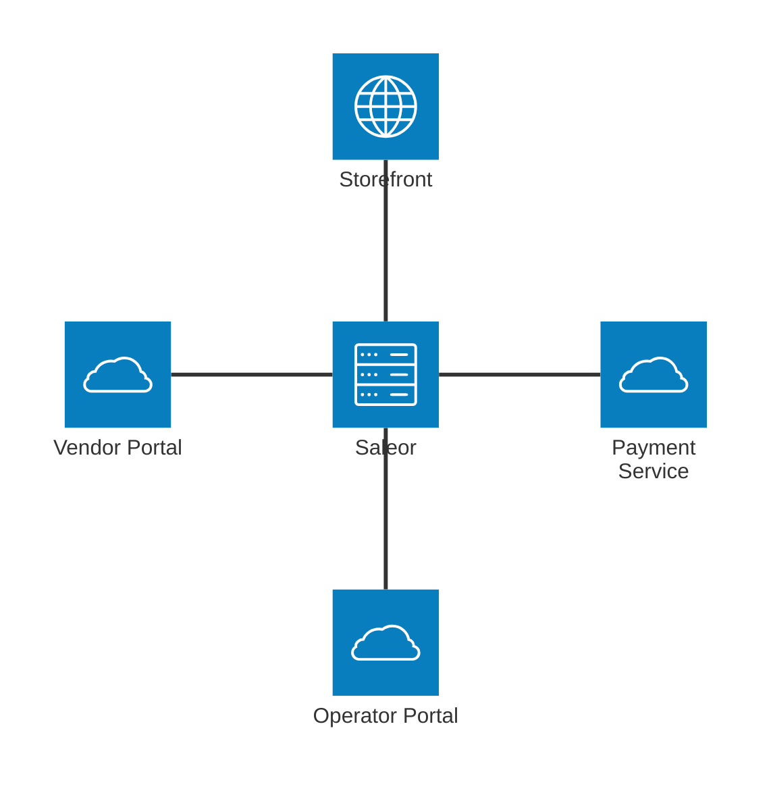

import CompactCard from "@site/components/CompactCard";
import RecipeResourceGrid from "@site/components/RecipeResourceGrid"

# Marketplace Recipe

This guide shows you how to build a marketplace platform where multiple sellers can list their products for sale. You'll learn how to model products and vendors, handle fulfillment, process payments, and manage vendor relationships.

## Product and Vendor Model

Saleor's marketplace architecture is built around the concept of linking products to vendors through attribute references. Each product can have a "Vendor" attribute reference that links to vendor models, which can contain descriptive information like photos and bios.

<RecipeResourceGrid>
    <CompactCard
        name="Modeling Overview"
        description="Learn more about modeling in Saleor."
        link="/developer/modeling"
    />
    <CompactCard
        name="Attributes Overview"
        description="Learn more about attributes in Saleor."
        link="/developer/attributes"
    />
</RecipeResourceGrid>

Based on our experience with marketplace modeling, we distinguish two main approaches:

### Commodity Marketplace
A commodity marketplace, similar to Amazon's model, is designed for scenarios where multiple vendors sell the same product.

In this approach, you create a top-level "product model" that serves as the main product listing. This model contains all the descriptive information about the product, while individual vendor offers contain specific details like pricing and availability.

:::tip

When building a commodity marketplace, keep in mind that you'll need to use model-based organization instead of traditional categories or collections, as the top-level products are models rather than standard Saleor products.

:::

In this architecture:
- **Product Page**: Model entity that contains the main product information (description, images, specifications)
- **Vendor Offer**: Product entity that contains vendor-specific details (price, stock, shipping)
- **Vendor**: Model entity that contains vendor information (profile, bio, contact details)



### Boutique Marketplace
A boutique marketplace, exemplified by platforms like Etsy, is simpler in structure.

In this approach, each product is unique and directly linked to its vendor without the need for a top-level product model:
- **Product**: A Saleor Product entity that contains both product information and vendor-specific details
- **Vendor**: A Saleor Model entity that contains vendor information (profile, bio, contact details)




## Vendor Authorization

Since Saleor doesn't have a built-in vendor entity or vendor-based permissions, you need to implement a custom authorization system. The typical approach is to:

1. Create vendors as regular staff users in Saleor with no permissions
2. Build a separate [vendor portal](#vendor-portal) that implements its own permission system

This approach means that while vendors exist in Saleor as staff users, you will need to handle vendor-specific access control outside of Saleor.

<RecipeResourceGrid>
    <CompactCard
        name="Authentication"
        description="Learn about authentication in Saleor."
        link="/api-usage/authentication"
    />
</RecipeResourceGrid>

## Fulfillment

The marketplace fulfillment process is based on the vendor-product relationship. Since each product is linked to its vendor, order lines contain all necessary information for vendor-specific fulfillment. This structure enables each vendor to handle their own shipping independently.

### Example 

1. Get attributes from the order lines

```graphql
query GetOrderLines($id: ID!) {
  order(id: $id) {
    id
    lines {
      variant {
        attributes {
          values {
            name
            inputType
            reference
          }
        }
      }
    }
  }
}
```

2. Get the vendor id from the attribute reference

```javascript
const vendor = order.lines.variant.attributes.values.find(
  (attribute) => attribute.name === "Vendor"
);
```

3. Fetch the vendor details

```graphql
query GetVendor($id: ID!) {
  page(id: $id) {
    id
    title
  }
}
```

4. Fulfill the order by vendor 

The final fulfillment step depends on your marketplace's policy. With the vendor details, you can implement any fulfillment strategy that fits your business needs, e.g., fulfilling from the vendor's warehouse or using a central warehouse.

<RecipeResourceGrid>
    <CompactCard
        name="Warehouses"
        description="Learn about warehouse management."
        link="/developer/stock/overview#warehouse-creation"
    />
    <CompactCard
        name="Fulfillment Overview"
        description="Learn more about fulfillment in Saleor."
        link="/developer/order/order-fulfillment"
    />
</RecipeResourceGrid>

## Shipping

If each vendor ships their products separately, you can implement a shipping app that handles the complexity of multiple vendor shipments.

The app would sum shipping methods (including their prices) for each vendor while providing detailed shipping price breakdowns through metafields.

<RecipeResourceGrid>
    <CompactCard
        name="Custom Shipping Recipe"
        description="Learn how to implement custom shipping solutions."
        link="/recipes/custom-shipping"
    />
</RecipeResourceGrid>

## Payments

Marketplace payments require a two-step process: handling customer payments and managing vendor payouts. Ideally, you would use an existing payment solution like the [Stripe App](/developer/app-store/apps/stripe/overview.mdx) for the customer-facing payment process. Once the customer payment is processed, you'll need to implement an asynchronous payout system to distribute funds to the relevant vendors, taking into account any commission fees or marketplace charges. 

Feasability of this approach depends on the marketplace's business model and the payment provider you choose. It may be necessary to implement a custom payment solution to handle the specific requirements of the marketplace.

<RecipeResourceGrid>
    <CompactCard
        name="How to Build a Payment App"
        description="Learn how to create custom payment solutions."
        link="/developer/extending/apps/building-payment-app"
    />    
</RecipeResourceGrid>

## Taxes

Tax management in a marketplace requires handling vendor-specific tax rules. Different vendors may be subject to different tax rates based on their location or business type. To handle this complexity, you can implement a custom tax app that calculates tax rates specific to each vendor. This is particularly important for marketplaces operating across multiple regions or jurisdictions.

<RecipeResourceGrid>
    <CompactCard
        name="Taxes Overview"
        description="Learn about tax configuration in Saleor."
        link="/developer/taxes"
    />    
</RecipeResourceGrid>

## Vendor Portal

Saleor Dashboard cannot be used for vendor management as it lacks vendor-specific access control. You must build a custom vendor portal from scratch as a separate application. This portal will need to:

1. Interface with the Saleor API to fetch and modify data
2. Implement custom authentication and authorization for vendors
3. Filter and display only the vendor's own products and orders
4. Provide vendor-specific views for:
   - Profile management
   - Product creation and updates
   - Order tracking
   - Sales analytics
   - Discount management

The portal requires custom development because Saleor's core doesn't include a vendor entity or vendor-specific access control. You'll need to build the entire interface and implement the business logic for vendor-specific operations.

## Operator Portal

The marketplace operator portal is a separate application that marketplace administrators use to manage the marketplace. Unlike the vendor portal which is for individual sellers, the operator portal provides tools for overseeing all marketplace operations. This application must:

1. Integrate with the Saleor API
2. Implement custom authentication for marketplace operators
3. Provide vendor management features:
   - Vendor onboarding workflow
   - Policy management
   - Commission fee configuration
   - Marketplace health monitoring
   - Vendor performance tracking

The operator portal is essential for marketplace governance and cannot be implemented using the standard Saleor dashboard. It requires custom development to handle the complex requirements of marketplace administration and oversight.

Operator Portal can be a Dashboard Extension or a separate application.

<RecipeResourceGrid>
    <CompactCard
        name="Extending Dashboard"
        description="Learn how to extend the Saleor dashboard."
        link="/recipes/extending-dashboard"
    />    
</RecipeResourceGrid>

## Architecture Overview

Here is a high-level overview of the essential services for a Saleor-based marketplace:




**Service Descriptions:**

- **Storefront:** The customer-facing shop interface.
- **Vendor Portal:** For vendors to manage their profiles, publish products, configure shipping, and view their own sales data.
- **Saleor:** The core platform, handling products, orders, and API logic.
- **Payment Service:** Handles payment processing, refunds, integration with providers (e.g., Stripe), and payouts to vendors after sales.
- **Operator Portal:** For marketplace operators to onboard/manage vendors and oversee the marketplace.