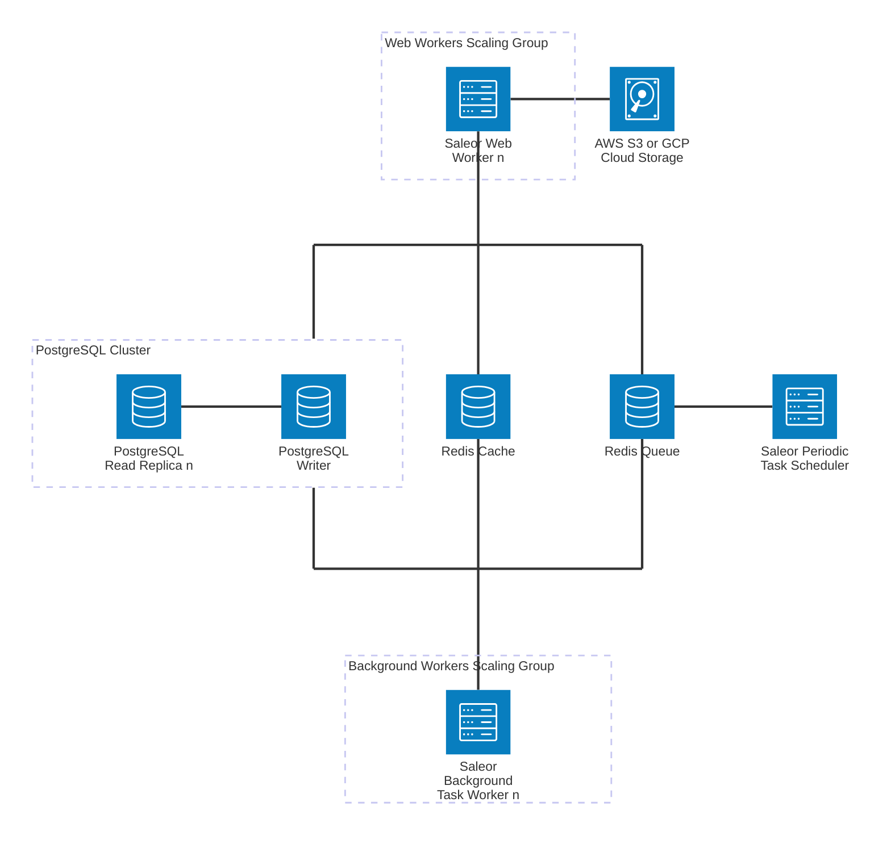

Saleor leverages a service-oriented architecture and horizontal scaling to improve performance and availability.

A simplified network diagram of Saleor's architecture is shown below. Please note that the diagram is a high-level representation and may not include all services or components.

Outlined scaling groups are designed to be horizontally scalable, and the number of instances can be adjusted based on the load.

