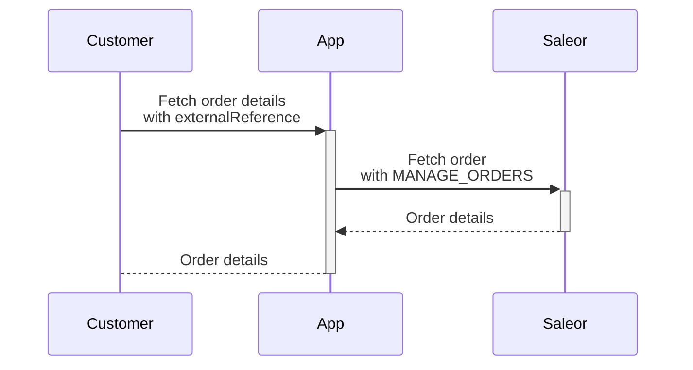

:::info
To follow the zero-downtime strategy when upgrading to 3.19, **It is recommended to first migrate to latest 3.18.X** and turn on the Celery worker to process all data migrations asynchronously.
Otherwise, you will need to downtime your solution to ensure correct data migration.
:::

## Promotions

When multiple promotions apply to one product, only the discount from the promotion rule that provides the maximum savings for the customer is applied. Previously the discounts from rules within the single promotion were summed up.
In the case of having multiple promotion rules within the single promotion applicable to the same product, the promotion rules should be converted into one.

The below example shows the promotion with multiple rules applicable to the same variants:

```json
{
  "data": {
    "promotion": {
      "rules": [
        {
          "id": "UHJvbW90aW9uUnVsZTo2NGFhYjYxOC02YmVlLTQxOTgtYWQ0YS1jNmEzZThkNzY5NWI=",
          "cataloguePredicate": {
            "variantPredicate": {
              "ids": ["UHJvZHVjdFZhcmlhbnQ6MzQ4", "UHJvZHVjdFZhcmlhbnQ6MzQ5"]
            }
          },
          "rewardValue": 1.0,
          "rewardValueType": "FIXED"
        },
        {
          "id": "UHJvbW90aW9uUnVsZTo4MDkwNzc3OC03OGQyLTRkYjUtYjliNS1hMmU4ZDc5MmRjZTg=",
          "cataloguePredicate": {
            "variantPredicate": {
              "ids": ["UHJvZHVjdFZhcmlhbnQ6MzQ4", "UHJvZHVjdFZhcmlhbnQ6MzQ5"]
            }
          },
          "rewardValue": 1.0,
          "rewardValueType": "FIXED"
        }
      ]
    }
  },
  "extensions": {
    "cost": {
      "requestedQueryCost": 0,
      "maximumAvailable": 50000
    }
  }
}
```

To achieve the same discount, the multiple rules should be converted into one rule:

```json
{
  "data": {
    "promotion": {
      "rules": [
        {
          "id": "UHJvbW90aW9uUnVsZToxZjhiMWY1MC0yMjdiLTRmOGQtODBmOS04ZmM1YmJiNzU3OWE=",
          "cataloguePredicate": {
            "variantPredicate": {
              "ids": ["UHJvZHVjdFZhcmlhbnQ6MzQ4", "UHJvZHVjdFZhcmlhbnQ6MzQ5"]
            }
          },
          "rewardValue": 2.0,
          "rewardValueType": "FIXED"
        }
      ]
    }
  },
  "extensions": {
    "cost": {
      "requestedQueryCost": 0,
      "maximumAvailable": 50000
    }
  }
}
```

## External Reference

To retrieve order details using the `order` query with `externalReference` as input, you need the `MANAGE_ORDERS` permission:

- Ensure that apps or staff users, who utilize the `order` query with `externalReference` as input, have the `MANAGE_ORDERS` permission assigned.
- If customers use the `query` with `externalReference`, the GraphQL query must be processed via the custom app that
  has the appropriate permissions.

The chart below provides an example of fetching an order with `externalReference` as a user without any permissions.



## Taxes Configuration

In previous versions (legacy tax flow), users could select to use the Tax app or flat rates. This means that if there are multiple tax applications or plugins enabled in your environment, Saleor will attempt to use one of them and if that fails use another one, which can result in taxes not being properly configured. Because of that, we added an option to select a specific method of tax calculation. To change it:

1. Login to your dashboard.
2. Go to `Configuration -> Taxes` setting page.
3. If you have legacy flow, dashboard will display warning message under select component for tax calculation method. Warning message will be displayed for a given channel or for country exception as well.
4. To migrate to new tax flow, select one of options from the dropdown below the warning:
   - `Use flat tax rate` - it uses Saleor build-in [tax flow](/developer/taxes#flat-rates)
   - `Use Avalara plugin` - it uses deprecated Avalara plugin. If you want to select this option make sure you have plugin configured first
   - `Use app: AvaTax` - if you have installed [AvaTax app](/developer/app-store/apps/avatax/overview) in Saleor dashboard
