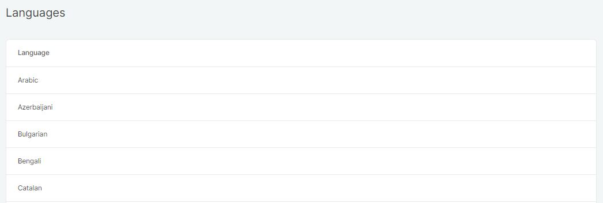
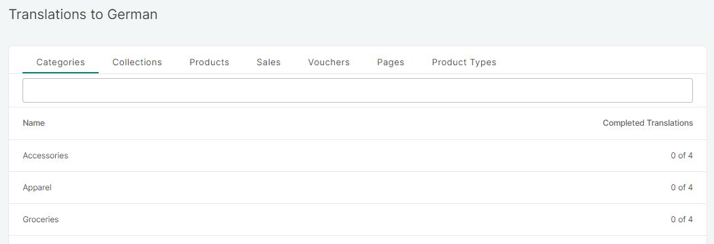
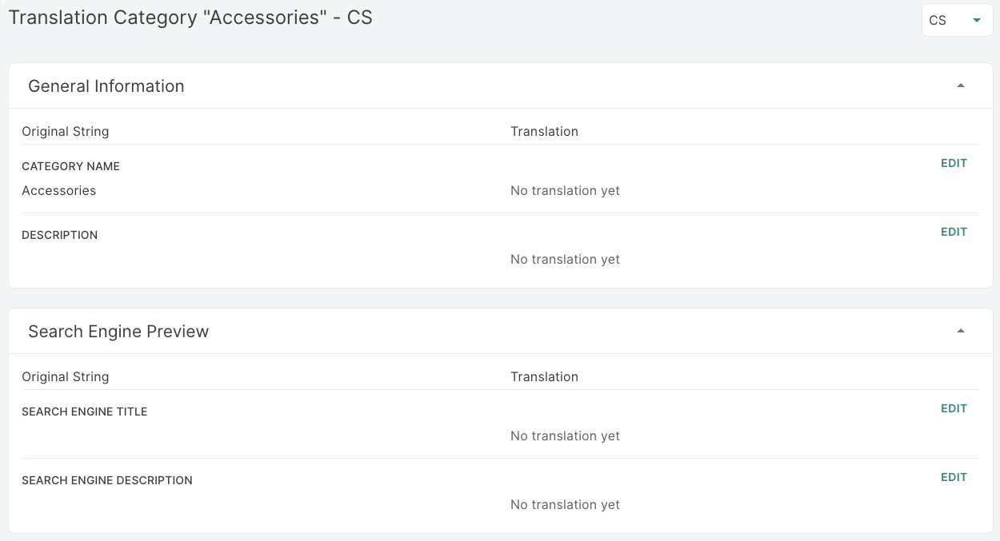
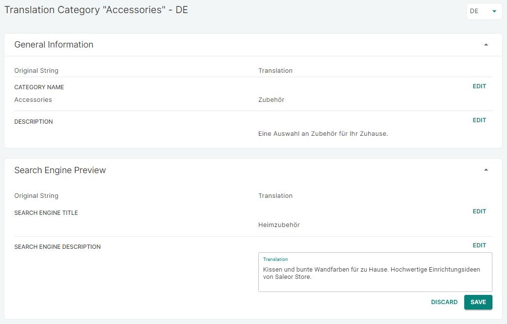

## Introduction

The Saleor dashboard is in English as a default language but all elements can be translated to local languages. Your developer or a subcontractor can localize language strings of general or static elements, such as the menus and system information, on the Saleor page on [Transifex](https://www.transifex.com/saleorcommerce/saleor-1/).

For all dynamic content, such as categories, products, and descriptions, you can make changes directly in the Translations section of the dashboard.

## How to translate content

1. Choose the language into which you plan to translate content:

2. Select the information you wish to edit. The information is divided into Categories, Collections, Products, Sales, Vouchers, Pages, and Products Types:

3. Your existing content will be displayed on the right. Click _Edit_ in the left column for each string you want to translate and input the information in the target language:

4. _Save_ or _Discard_ your changes.

:::tip Easily manage multiple languages
If you have a store in several languages and want to make changes to a single product or element, you can easily edit all languages by entering into one language and making changes, then selecting following languages from the drop down menu on the right, above the General Information card.

:::
