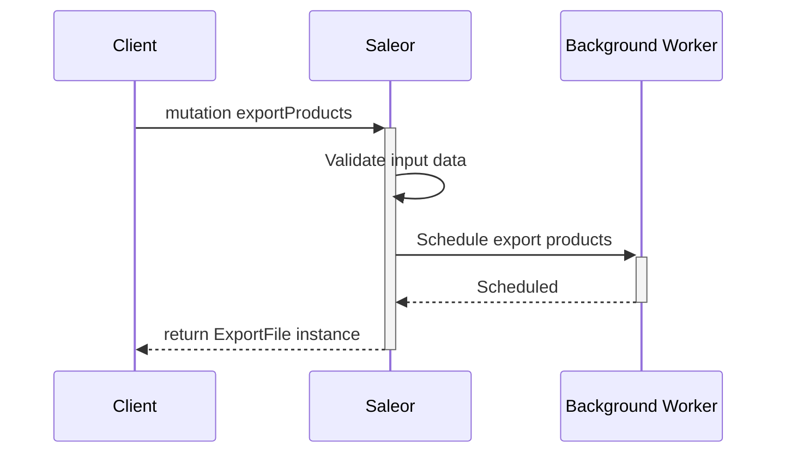
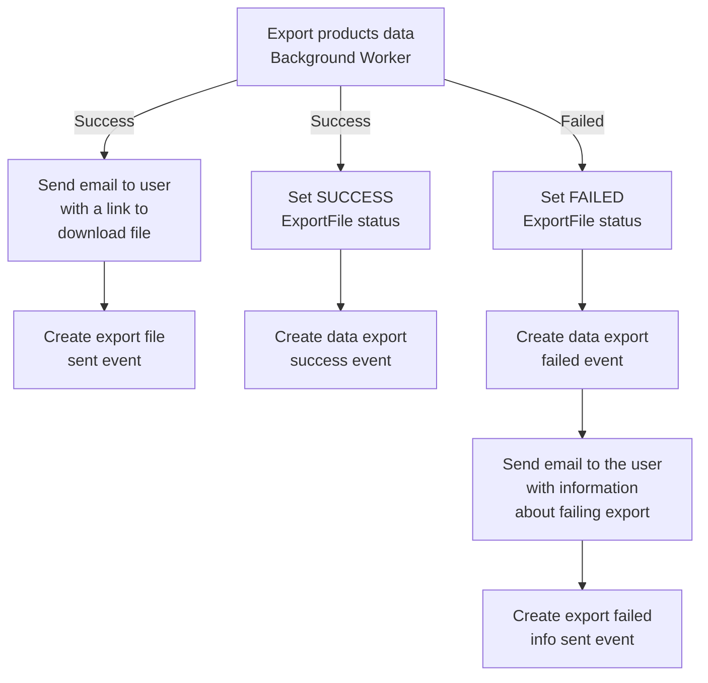

## Introduction
This guide describes how to export products from the Saleor GraphQL API.
Exporting products can be useful for creating backups of your data or for easy
and quick bulk editing.

You can export all products, filtered products, or products with specific IDs. 
Products data can be exported to CSV or XLSX file, but CSV file is recommended because
it is much less time-consuming to generate. You can also define which fields will be exported.
If any product variants fields are specified then products and variants data are exported.
Link to download file is sent by email to the requestor. If any error occurs then
email with information about problems is sent.

:::note
When the export is made by the `App` email is not sent. You can get the file by query the
`ExportFile` with ID returned from `exportProducts` mutation.
:::

### Export file structure
Each row in the exported file represents a single product variant, but it also contains
general product fields.
For example, if a product has three variants, there will be three lines in total.
Each line will contain common product fields such as name or description,
and fields specific to given variant:

| id | name         | description                    | variant sku | variant weight |
|----|--------------|--------------------------------|-------------|----------------|
| 61 | Orange Juice | No additives, no preservatives | 12345       | 500 g          |
| 61 | Orange Juice | No additives, no preservatives | 32145       | 1000 g         |
| 61 | Orange Juice | No additives, no preservatives | 45123       | 1500 g         |

The exact shape of the file depends on the fields selected for export
(see the `exportInfo` input fields). If no variant fields are provided,
each row will contain only product fields:

| id  | name         | description                    | category    | product weight |
|-----|--------------|--------------------------------|-------------|----------------|
| 61  | Orange Juice | No additives, no preservatives | juices      | 500 g          |
| 65  | Apple Juice  | No additives, great taste      | juices      | 1000 g         |
| 101 | Polo Shirt   | Nice and comfortable           | polo-shirts | 200 g          |

### Workflow

The charts below explains workflow of the exporting products:

#### Schedule export products



#### Handling background worker result



## Exporting products
:::note
Products can be exported only by logged users with `MANAGE_PRODUCTS` permission.
:::

To export products, use `exportProducts` mutation.

This mutation takes the following input:
- `scope`: determine which products should be exported. You can choose between exporting
all products (`ALL`), filtered products (`FILTER`) or selected IDs (`IDS`).
You can find more details in the next sections.
- `filter`: defines filtering option. This field is optional but must be specified if your
choose `FILTER` scope option.
- `ids`: a list of products IDs to export. This field is optional but must be specified
if `IDS` in `scope` is chosen.
- `fileType`: defines exported file type. You can choose between `CSV` and `XLSX` file.
- `exportInfo`: determine exported fields. It takes the following input:
    - `attributes`: list of attribute IDs to export (optional).
    - `warehouses`: list of warehouse IDs to export (optional).
    - `fields`: list of product and variants fields to export
    (optional, `ID` field is exported by default).

As a result, this mutation returns `ExportFile` object which is a `Job` instance.
It corresponds to running export background worker, keeps task status, and created file.
`ExportFile` object contains the following fields:
- `id`: a unique export file ID. Could be use to check export status.
- `status`: status of running job.
- `user`: instance of `User` who requested exporting products.
Set to `null` if export requested by `App`.
- `app`: instance of `App` which requested exporting products.
Set to `null` if export requested by `User`.
- `createdAt`: the date and time when the export was started.
- `updatedAt`: the date and time when the job was last time updated.
- `url`: URL to the exported file. Set to `null` when the file doesn't exist yet.
- `events`: a list of events associated with the export.

In addition the following field is available on the mutation results:
- `exportErrors`: a list of errors that occurred during mutation execution.

### Exporting all products
The following example shows how to export all products with all available fields
to CSV file. (For exporting to XLSX just replace `CSV` with `XLSX` in `fileType` field.)

:::note
Fields order defines order of headers in exported file. Exporting any of `price` fields
adds a `currency` field by default.
:::


```graphql {2-26}
mutation {
  exportProducts(
    input: {
        scope: ALL,
        fileType: CSV,
        exportInfo: {
            fields: [
                NAME
                DESCRIPTION
                PRODUCT_TYPE
                CATEGORY
                VISIBLE
                COLLECTIONS
                CHARGE_TAXES
                PRODUCT_IMAGES
                VARIANT_SKU
                VARIANT_PRICE
                COST_PRICE
                VARIANT_IMAGES
                PRODUCT_WEIGHT
                VARIANT_WEIGHT
            ]
        }
    }
 ){
    exportFile {
      id
      status
      createdAt
      updatedAt
      url
    }
    exportErrors {
      field
      code
      message
    }
  }
}
```

In response we get workers information:
```json
{
  "data": {
    "exportProducts": {
      "exportFile": {
        "id": "RXhwb3J0RmlsZToxMA==",
        "status": "PENDING",
        "createdAt": "2020-06-05T09:15:42.924676+00:00",
        "updatedAt": "2020-06-05T09:16:27.691838+00:00",
        "url": ""
      },
      "exportErrors": []
    }
  }
}
```

Once the task is finished, the `url` field will contain the URL address of the
exported file. If export was triggered by `User` the link to the file will be sent by email
to the requestor.
To check if URL is ready you can just fetch `ExportFile` by `ID` with use of `exportFile` query:
```graphql {2}
  query {
    exportFile(id: "RXhwb3J0RmlsZToxMA==") {
      id
      status
      createdAt
      updatedAt
      url
    }
  }
```

Example response with URL address to the file.
```json
{
  "data": {
    "exportProducts": {
      "exportFile": {
        "id": "RXhwb3J0RmlsZToxMA==",
        "status": "SUCCESS",
        "createdAt": "2020-06-05T09:15:42.924676+00:00",
        "updatedAt": "2020-06-05T09:16:27.691838+00:00",
        "url": "http://localhost:8000/media/export_files/product_data_05_06_2020.csv"
      },
      "exportErrors": []
    }
  }
}
```

### Exporting filtered products
To export only filtered products you need to define `FILTER` `scope` and `filter`
field. Lets see an example for exporting only published products from two specific
categories:

```graphql {2-19}
mutation {
  exportProducts(
    input: {
        scope: FILTER,
        fileType: CSV,
        exportInfo: {
            fields: [
                NAME
                DESCRIPTION
                PRODUCT_TYPE
                VARIANT_SKU
            ]
        },
        filter: {
            isPublished: true,
            categories: ["Q2F0ZWdvcnk6Nw==", "Q2F0ZWdvcnk6MjI="]
        }
    }
 ){
    exportFile {
      id
      status
      createdAt
      updatedAt
      url
    }
    exportErrors {
      field
      code
      message
    }
  }
}
```

### Exporting products with specified IDs
To export only products with provided ids you need to define `IDS` `scope` and `ids`
field. Lets see an example:
```graphql {2-19}
mutation {
  exportProducts(
    input: {
        scope: IDS,
        fileType: CSV,
        exportInfo: {
            fields: [
                NAME
                DESCRIPTION
                PRODUCT_TYPE
                VARIANT_SKU
            ]
        },
        ids: [
          "UHJvZHVjdDo3Mg==", "UHJvZHVjdDo4Nw==", "UHJvZHVjdDoxMTU="
        ]
    }
 ){
    exportFile {
      id
      status
      createdAt
      updatedAt
      url
    }
    exportErrors {
      field
      code
      message
    }
  }
}
```

### Define warehouses and attributes to export
To export data about specified warehouses and attributes you need to provide list of
warehouses or attributes IDs.

If you specify warehouses, then for all variants with stocks in given warehouse,
data about stock quantity will be exported. It will be visible in column:
`warehouse-slug (warehouse quantity)`.

If you specify attributes, then data about given attribute value for all
products and variants will be exported (empty if not exists).
Attributes value will be visible in column:
`attribute-slug (product attribute)` for product attributes and
`attribute-slug (product attribute)` for variant attributes.

Below you can find example of exporting warehouses and
attributes data.

```graphql {2-19}
mutation {
  exportProducts(
    input: {
        scope: ALL,
        fileType: CSV,
        exportInfo: {
            fields: [
                NAME
                VARIANT_SKU
            ],
            warehouses: [
                "V2FyZWhvdXNlOjA1ZmFmZjRmLTViYWItNDIzNC04MTBhLTM5NjI5MDMyMWFkMg==",
                "V2FyZWhvdXNlOjQ3Mjc3NjM2LTQ1MWItNGNmZi04OWJkLWM5MTA4OWNiNTdkYQ==",
            ],
            attributes: [
                "QXR0cmlidXRlOjE1",
                "QXR0cmlidXRlOjE4",
            ],
        },
    }
 ){
    exportFile {
      id
      status
      createdAt
      updatedAt
      url
    }
    exportErrors {
      field
      code
      message
    }
  }
}
```
