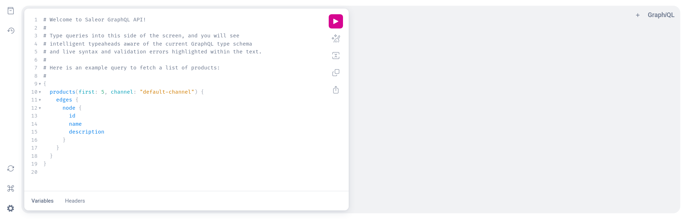

## Playground

Saleor includes a GraphQL Playground, an interactive GraphQL editor, allowing access to your Saleor instance's API through the web browser. The Playground lets you quickly familiarize yourself with the API, perform example operations, and send your first queries and mutations.

#### Admin authenticated playgrounds

In the admin dashboard use `CMD+'` this would open playground that would have admin rights of your respective user.

#### Front-end playgrounds

Each Saleor server comes with `/graphql/` endpoint.

To authenticate shoppers or admins via public playground check [instructions](./authentication#authentication-with-playground) to explore non-public APIs.

#### Share your queries

Use the share button in the playground to get a shareable link; always be mindful about sharing secrets in headers!

## Inspectors for browsers

You can learn about Saleor API by interacting with [Dashboard](https://github.com/saleor/saleor-dashboard) or [Storefront example](https://github.com/saleor/storefront) and observing requests using browser extensions:

[Chrome: GraphQL Inspector](https://chrome.google.com/webstore/detail/graphql-network-inspector/ndlbedplllcgconngcnfmkadhokfaaln)

[Firefox: GraphQL DevTools](https://addons.mozilla.org/en-US/firefox/addon/graphql-developer-tools/)

## Codegen

[GraphQL Code Generation](https://www.graphql-code-generator.com/) can automate the creation of GraphQL requests, typings and more. You can use [Storefront example](https://github.com/saleor/storefront) for reference on how to configure codegen in a Typescript project, but a similar setup can be achieved in [other languages](https://the-guild.dev/graphql/codegen/plugins).

## GraphQL clients

- [Apollo Client](https://www.apollographql.com/docs/)
- [Relay](https://relay.dev/docs/en/experimental/a-guided-tour-of-relay)
- [urql](https://formidable.com/open-source/urql/docs/) (JS only)

## Explore more tools

- [Awesome GraphQL](https://github.com/chentsulin/awesome-graphql)
- [The Guild](https://the-guild.dev/)
