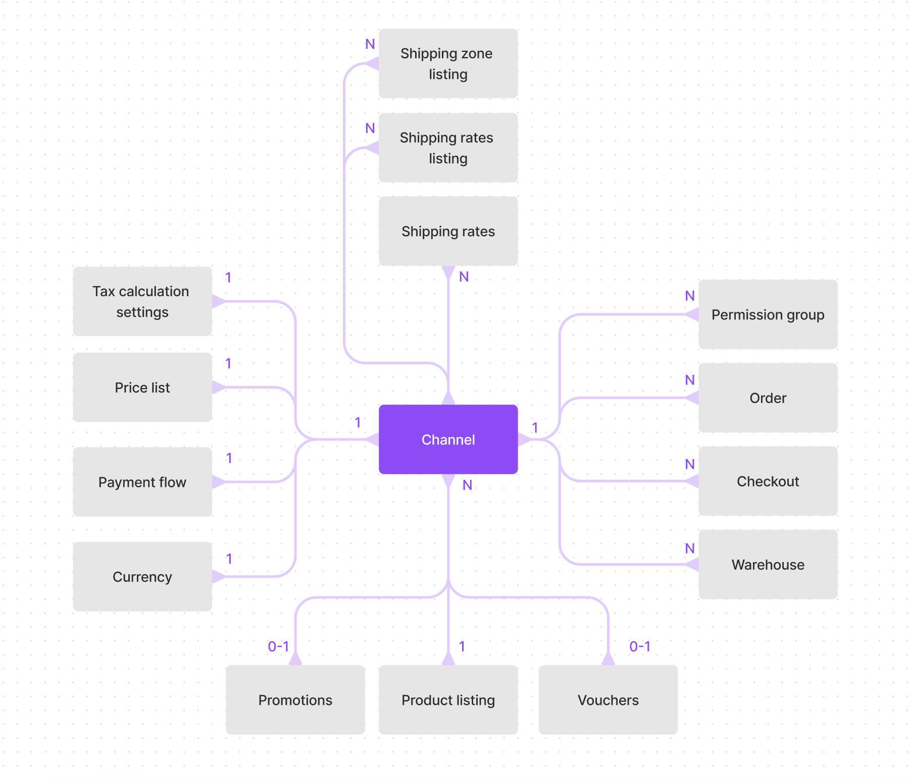

Sales channels allow you to model your data across different regions, brands, and business models where data can be customized and shared across different channels. Another way to describe channels is the ability to serve customers and markets differently from a **single backend** instance.

### Relationships and scope

Adding a channel creates a wide scope of customization options; below is the degree of customization per entity:

| Entity               | Degree of customization per channel                                               |
| :------------------- | :-------------------------------------------------------------------------------- |
| **Checkout**         | Contextualized to a channel to display the appropriate stock, prices, taxes, etc. |
| **Product**          | Control visibility, availability, search, publication date                        |
| **Variants**         | Control availability and price                                                    |
| **Taxes**            | Control calculation methods, gross or net, country exceptions                     |
| **Vouchers**         | Control availability, discount values, rules                                      |
| **Orders**           | Contextualized to the channel and required channel permission for access.         |
| **Promotions**       | Control availability, rules, and pricing                                          |
| **Payment flow**     | Settings for authorization, payment conditions, expiration, etc.                  |
| **Currency**         | Channel belongs to a single currency.                                             |
| **Warehouses**       | Availability                                                                      |
| **Permission group** | Assigned to channels to control access to sensitive data                          |
| **Shipping rates**   | Availability, price, order total conditions                                       |
| **Shipping zones**   | Availability                                                                      |

### How Channels are used

- **Multiple geographical markets:**. Each market has different prices, taxes, shipping options, stock availability, back-office integrations, etc.

- **B2B and B2C:** Customer types can map Channels to grant exclusivity of prices and services.

- **Different Legal Entities:** Businesses that have different legal entities can restrict access to customer and order data per entity

- **Distribution channels:** Serving physical and online channels

- **Multi-brand:** Businesses that wish to share customer data, loyalty programs, and products but want separate order data.

- **A/B testing:** Testing different pricing strategies for product and fulfillment.

- **External channels:** Create dedicated channels for marketplaces or other sales platforms.

### Not ideal for

- Dynamic Currency conversion. Each channel can have a different currency; however, `Checkout` belongs to a single channel, so converting to another channel would not be straightforward. That is because each channel can have different stock, prices, taxes, etc.

- Customer-specific pricing. Potentially, you could serve customers differently using channels, but note that each channel also adds configuration complexity. See [relationships and scope](#relationships-and-scope) for more details.;

- Supplier-specific pricing. If you wish to sell a single product at a different price depending on the supplier, using channels would not work because each checkout is scoped to a single channel; you would have to implement price list functionality instead. See [example repository](https://github.com/saleor/saleor-app-checkout-prices).

### Channel access control

Admin access to order data can be configured on a channel level, this is useful for businesses that have different legal entities that should not have access to each other's data.
Other objects such as products, vouchers, shipping, can belong to multiple channels at once so their permissions are not scoped per channel to avoid complexity.

### Data model

