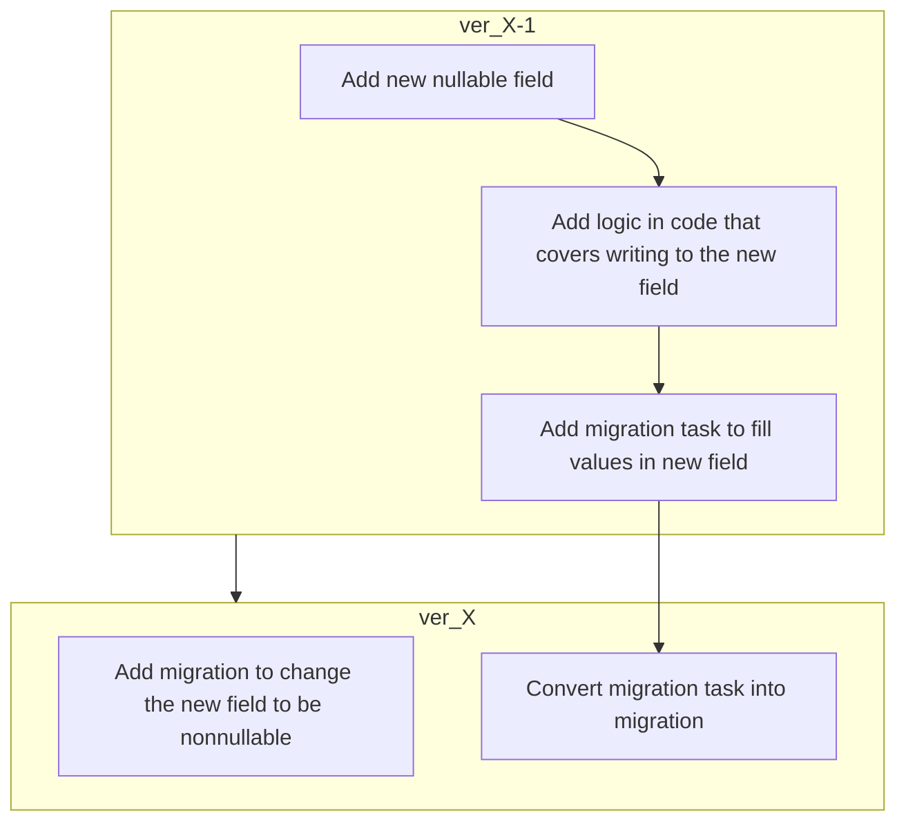
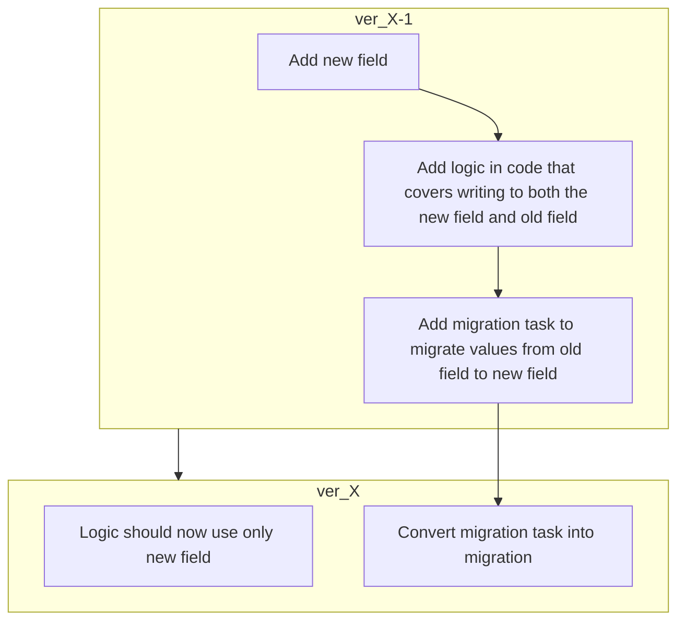
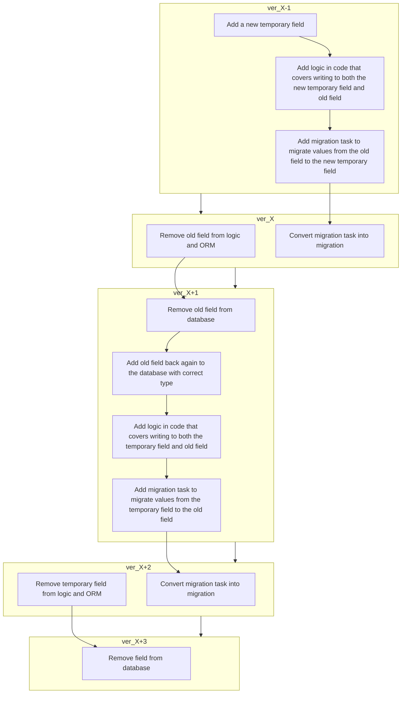
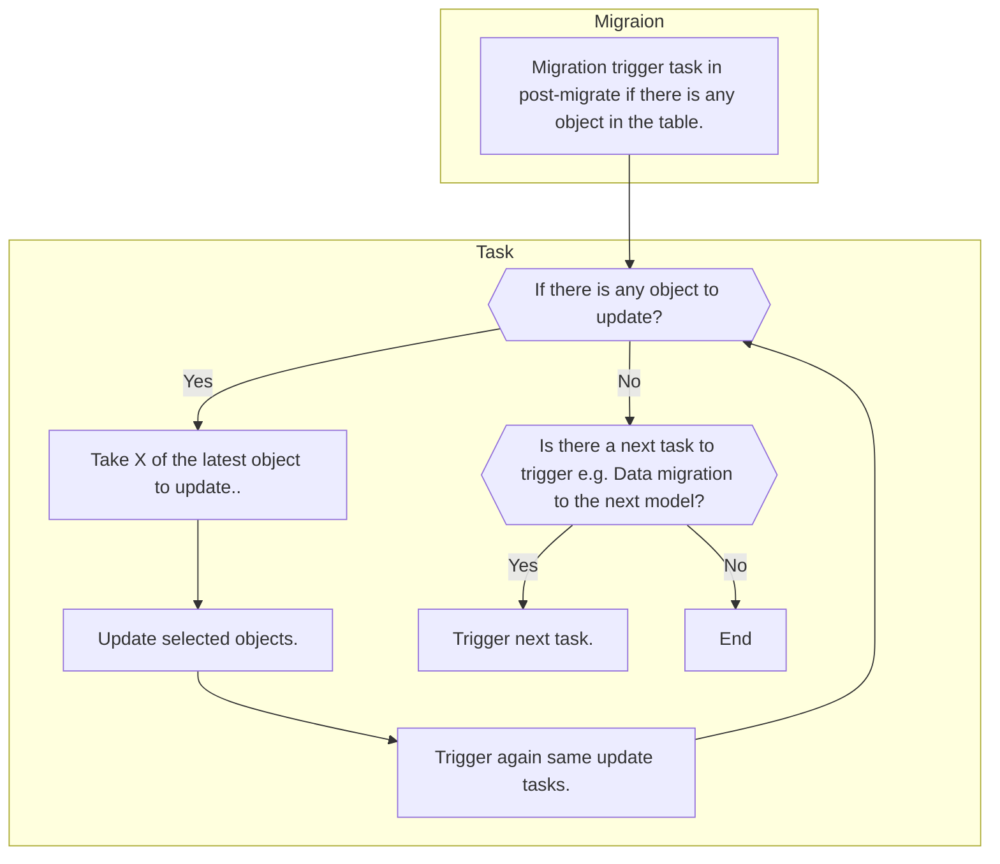

Following page contains information about writing zero-downtime migrations. If you are interested in section about upgrading Saleor, please visit [upgrading guide](setup/upgrading.mdx).

## The problem

From Saleor 3.13 version forward, we provide a way to ensure we can safely migrate the database without interrupting the work of already running web workers.

## Solution

To achieve the goal we need to ensure that:

- Old code is compatible with new database schema or new database schema is compatible with old code.
- Migrations don't lock tables, rows etc. for no longer than one second.

## Writing migrations

This paragraph covers the most common cases you can encounter while writing migrations. Please remember that shown examples are only to give you an idea of how specific migration should be written.

### Adding a new table to the schema

Adding a new table to the schema is backward compatible with the old code. No additional steps are needed.

### Adding a new field to the schema

To add a new field to the database, we must at least ensure one of the following:

- field is nullable
- field has a default value

Please note that Django doesn't propagate default values onto the database; that's why you need to add an SQL statement that would manually set the default value on existing rows:

```python
operations = [
    migrations.AddField(
        model_name="transactionevent",
        name="psp_reference",
        field=models.CharField(blank=True, default="", max_length=512),
    )

    migrations.RunSQL(
        """
        ALTER TABLE payment_transactionevent
        ALTER COLUMN psp_reference
        SET DEFAULT '';
        """,
        migrations.RunSQL.noop,
    ),
]
```

Adding a field that cannot be nullable and a default value cannot be added manually, needs additional steps.
To add a new field in Saleor version X follow the diagram:



e.g. **Adding `new_field` to Saleor version 3.14:**

- In version 3.13 add `new_field` with `null=True`.
- In version 3.13 add logic in code that covers writing to `new_field`.
- In version 3.13 add migration that will fill nullable values. Please check [data migration](#data-migration)
- In version 3.14 change `new_field` to be nonnullable.

### Renaming field

To rename a field you need to first add a new field with a new name and then migrate data between.



e.g. **Rename field `old_field_name` to `new_field_name` in Saleor version 3.14:**

- In version 3.13 add a new field `new_field_name`.
- In version 3.13 add logic in code that covers writing to both `new_field_name` and `old_field_name`.
- In version 3.13 migrate data from `old_field_name` to `new_field_name`. Please check [data migration](#data-migration)
- In version 3.14 update logic to use only `new_field_name`.
- From version 3.14 remove `old_field_name`. Please check [removing field](#removing-field).

### Change field type without renaming

Similarly to [renaming field](#renaming-field) you need to first add a new field, but there are differences.



e.g. **Change field type of `number` from `int` to `string` in Saleor version 3.14:**

- In version 3.13 add a new field `number_string`.
- In version 3.13 add logic in code that covers writing to both `number` and `number_string`.
- In version 3.13 migrate data from `number` to `number_string`. Please check [data migration](#data-migration)
- From version 3.14 remove `number`. Please check [removing field](#removing-field)
- In version 3.15 add a new field `number` back.
- In version 3.15 add logic in code that covers writing to both `number` and `number_string`.
- In version 3.15 migrate data from `number_string` to `number`. Please check [data migration](#data-migration)
- From version 3.16 remove `number_string`. Please check [removing field](#removing-field)

Please note, that the process can be simplified if we can stay with a new name for the field, in this example that would be `number_string`.

### Removing field

To remove a field from the schema, you first need to remove it from ORM and then you can proceed with removal from the database.

e.g. **Removing field `old_field` in Saleor version 3.14:**

- In version 3.14 drop the field from ORM and ensure that the field is nullable or has a default value:

```python
operations = [
    migrations.SeparateDatabaseAndState(
        database_operations=[
            migrations.AlterField(
                model_name="example",
                name="old_field",
                field=models.CharField(
                    blank=True, null=True
                ),
            ),
        ],
        state_operations=[
            migrations.RemoveField(
                model_name="example",
                name="old_field",
            ),
        ],
    )
]
```

- In version 3.15 drop the field from the database:

```python
operations = [
    migrations.SeparateDatabaseAndState(
        database_operations=[
            migrations.RunSQL(
                sql="""
                ALTER TABLE app_example
                DROP COLUMN old_field;
                """,
                reverse_sql="""
                ALTER TABLE app_example
                ADD COLUMN old_field
                VARCHAR(512);
                """
            ),
        ],
    )
]
```

### Adding index to the database

Creating an index can lock the table for several hours. To avoid such a scenario you need to create an index using the `concurrently` option.
Example:

```python
from django.db import migrations
from django.db.models import Index
from django.contrib.postgres.operations import AddIndexConcurrently

class Migration(migrations.Migration):
    atomic=False

    operations = [
        AddIndexConcurrently(
            model_name="user",
            index=Index(fields=["city_id"], name="account_user_city_id_index")
        )
    ]
```

Please note that line `atomic=False` is needed to proceed with concurrent index creation.

### Data migration

Data migration can lock the table for several hours. To avoid such a scenario you need to delegate logic to Celery worker.
Celery task should be placed in `saleor/<module_name>/migrations/tasks/saleor<X>.py` where X means Saleor version,
e.g. task to migrate data between orders in Saleor version 3.13 should be placed in `saleor/order/migrations/tasks/saleor3_13.py`

To call a task inside migration use `post_migrate` signal, e.g:

```python
from django.db import migrations
from django.db.models.signals import post_migrate
from django.apps import apps as registry
from .tasks.saleor3_13 import migration_task


def migration(apps, _schema_editor):
    def on_migrations_complete(sender=None, **kwargs):
        migration_task.delay()

    sender = registry.get_app_config("order")
    post_migrate.connect(on_migrations_complete, weak=False, sender=sender)


class Migration(migrations.Migration):
    dependencies = []

    operations = [
        migrations.RunPython(migration, migrations.RunPython.noop)
    ]
```

The following conditions must be met regarding the migration task:

- single task execution should not take longer than one second
- task should be idempotent
- task should check if there is data to be migrated (e.g. do not start calculations if the table is empty)
- task should be concurrently safe (e.g. execution of the same task by multiple workers should not end in deadlock)
- task should que yourself if there is still data to be processed
- task should proceed with data from newest to oldest



e.g. from Saleor core code, task to change `type` in `OrderEvent` from `transaction_void_requested` to `transaction_cancel_requested`.

```python
from ....celeryconf import app
from ...models import OrderEvent

from django.db import transaction
from django.db.models import QuerySet

# batch size to make sure that task is completed in 1 second and as well we don't use too much memory
BATCH_SIZE = 5000


def update_type_to_transaction_cancel_requested(qs: QuerySet[OrderEvent]):
    with transaction.atomic():
        # lock the batch of objects, to avoid deadlocks
        _events = list(qs.select_for_update(of=(["self"])))
        qs.update(type="transaction_cancel_requested")


@app.task
def order_events_rename_transaction_void_events_task():
    # Order events proceed from the newest to the oldest
    events = OrderEvent.objects.filter(type="transaction_void_requested").order_by(
        "-pk"
    )
    ids = events.values_list("pk", flat=True)[:BATCH_SIZE]
    qs = OrderEvent.objects.filter(pk__in=ids)

    # If we found data, queue next execution of the task
    if ids:
        update_type_to_transaction_cancel_requested(qs)
        order_events_rename_transaction_void_events_task.delay()
```
