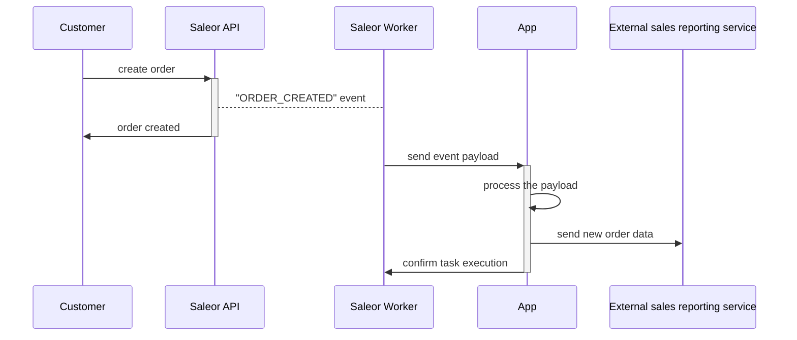
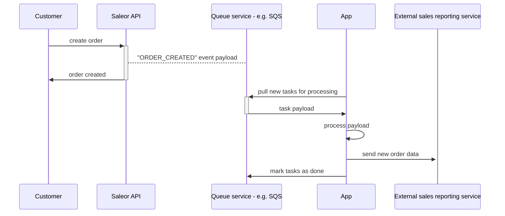
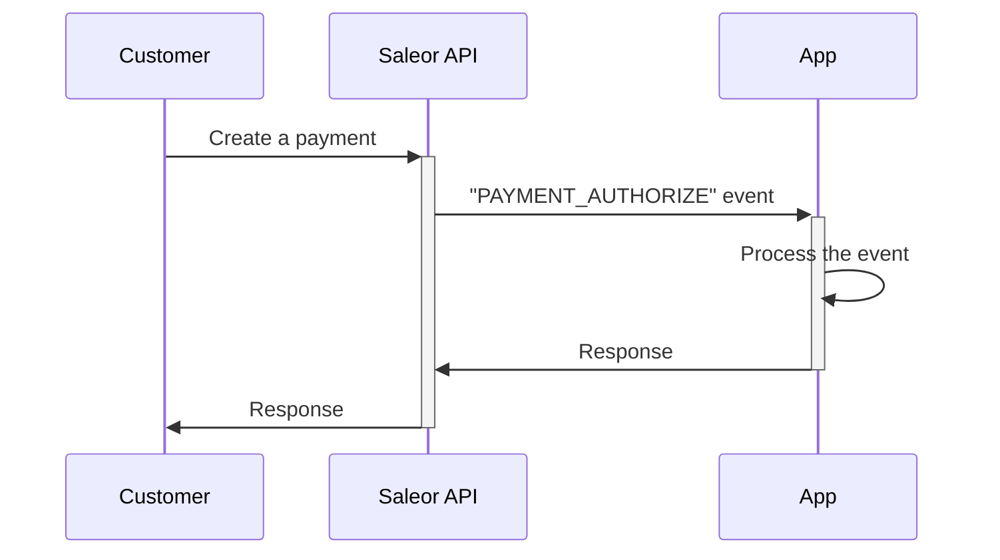
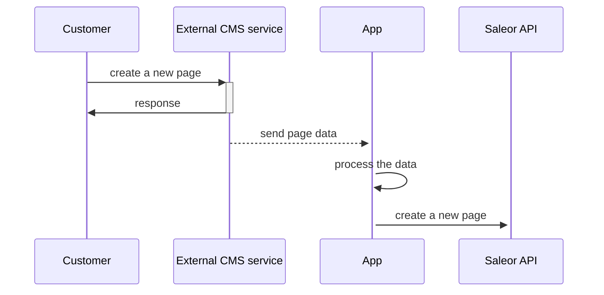
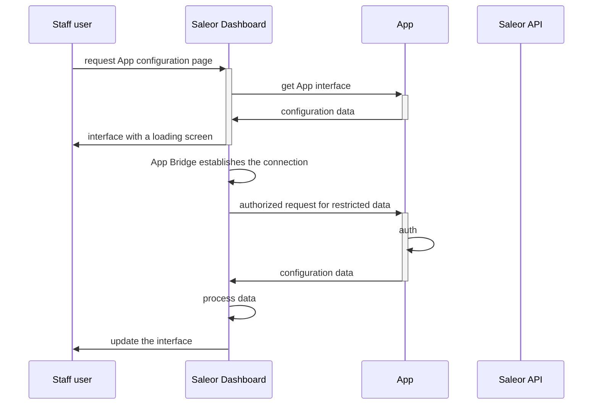

While building an app, you may involve many subjects in the exchange of data. Their number and relations will vary given the problem you are trying to solve. In this article, we present different variants of communication between Saleor and apps.

## Saleor Asynchronous Events

When communicating through asynchronous events, the request comes from a Saleor worker. Unlike in the case of synchronous events, Saleor does not expect an immediate response from the app.

You can find more details about the asynchronous webhooks in their [documentation](developer/extending/webhooks/asynchronous-events.mdx).

### Webhooks (HTTP requests)

To accept webhooks, your app must include public endpoints listening for HTTP POST requests. You have to also ensure the app [subscribes to the right events](developer/extending/webhooks/asynchronous-events.mdx).

#### Time limits

Webhook endpoints must respond within 20 seconds, including the network latency.

If your application performs long-running operations, consider using a [task queue](#task-queue) instead.

#### Fault tolerance

Event delivery will be retried up to 5 times with exponential backoff if:

- the endpoint cannot be reached
- the endpoint does not respond in time
- the endpoint responds with a transient HTTP error code (5xx)

Event delivery will not be reattempted if:

- the endpoint responds with an HTTP redirect (3xx)
- the endpoint responds with a non-transient HTTP error code (4xx)

### Task queue

Example flow of an application sending data to a reporting service:

Instead of sending requests, the worker will put events in the queue. This approach allows you to:

- Perform long-running tasks.
- Offload the app so it does not get overwhelmed with requests.
- Scale easily: in case of emergency, add more workers to the queue.
- Ensure all the tasks will be processed.

To read more about queues, check [Google Cloud Pub/Sub documentation](developer/extending/webhooks/asynchronous-events.mdx#google-cloud-pubsub).

## Saleor synchronous events

You can use synchronous events to implement payments, shipment and tax processing. When using synchronous events, response time is crucial - any delay in the app can impact your customers.

To read more about synchronous events, check [documentation](developer/extending/webhooks/synchronous-events/overview.mdx).

## App to Saleor API

Apps can also communicate with Saleor GraphQL API. You can declare the access scope with the app's [permissions](developer/extending/apps/installing-apps.mdx#permissions).

An example data flow for an application synchronizing CMS (e.g. Strapi) data with Saleor:

## Dashboard interface

The Dashboard can display app views in two scenarios:

- user navigates to the app configuration page
<!-- Question: What is a "Dashboard extension"? -->
- user utilizes the Dashboard extension

The diagram looks the same for either:

We recommend using the [App Bridge](https://github.com/saleor/saleor-app-sdk/blob/main/docs/app-bridge.md) in the app interface. It authenticates the app, as well as connects it with the dashboard. That allows utilizing features such as notifications or theming.

To read more about using apps in the dashboard, read the [extending dashboard documentation](developer/extending/apps/extending-dashboard-with-apps.mdx).
