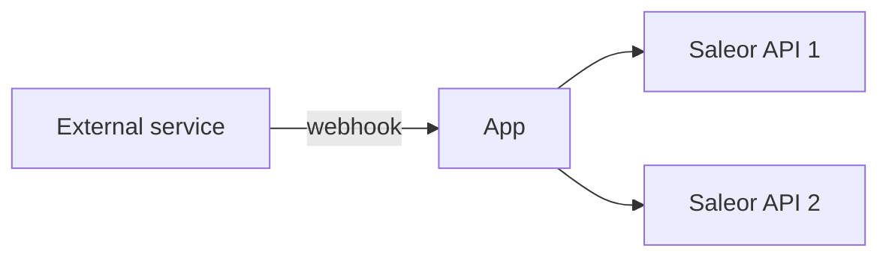
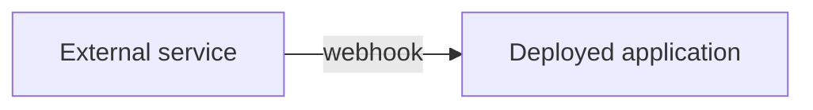
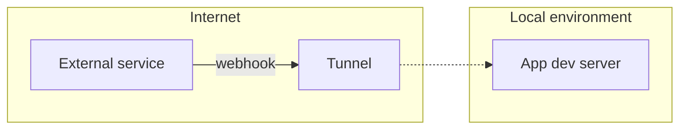

## What is an external webhook?

Saleor may not be the only source of webhooks sent to your application. Some popular use cases include:

- a status update of payment from a provider like Stripe
- new information about a delivery of a package
- CMS changed a product description

If the application is multi-tenant, then the flow of the data is as below:

## Exposing an endpoint

The first step will be creating an HTTP endpoint that will receive events. In our example, it's going to be: `/api/webhooks/status-update`.

Since external services require a URL that is accessible from the internet, you are going to need a tunnel to expose your local environment. You can read more about it in the [tunneling article](/developer/extending/apps/developing-with-tunnels.mdx).

When subscribing for webhooks in an external service, use the URL of the tunneled endpoint or a deployed app.

## Multi-tenancy

Some applications can deal with more than one Saleor instance. In that case, you are going to need a way to distinguish which one is the target of the webhook payload. One way of doing that is to add a Saleor API URL or unique ID to the endpoint, for example `/api/webhooks/status-update?saleorApiUrl=https://example.saleor.cloud/graphql/`.

## Securing your endpoint

Before deploying your application, you'll need to make sure unauthorized clients won't use endpoints to send malicious data. Here are a few ways to ensure that:

### Domain allowlist

If possible, the endpoint should reject connections from unknown domains. Services often publish lists of known domains that they use to send webhooks. For example, here is [a list of domains used by Stripe](https://stripe.com/docs/ips). Knowing the domains of the parties you communicate with, you can introduce an allowlist for your API.

### Secrets

Common practice is to generate a unique secret key for each webhook and attach it to the payload body or headers. The details should be provided in the documentation of the service you are integrating with.

You can use app metadata to store the secret value. Check [MetadataManager docs](./persistence-with-metadata-manager.mdx) to learn more about helper functions available in Saleor App SDK.

### Checking the payload checksum - HMAC

Calculating the checksum of a webhook payload enables you to verify if it has not been tampered with by a third party.

Here are some examples of how you can do that:

- [Adyen docs](https://docs.adyen.com/development-resources/webhooks/verify-hmac-signatures)
- [Stripe docs](https://stripe.com/docs/webhooks/signatures)
