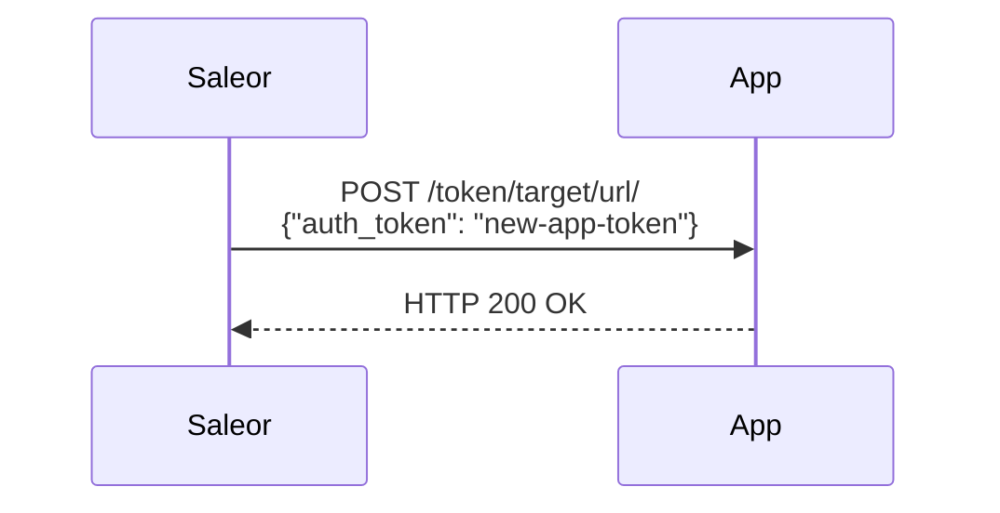
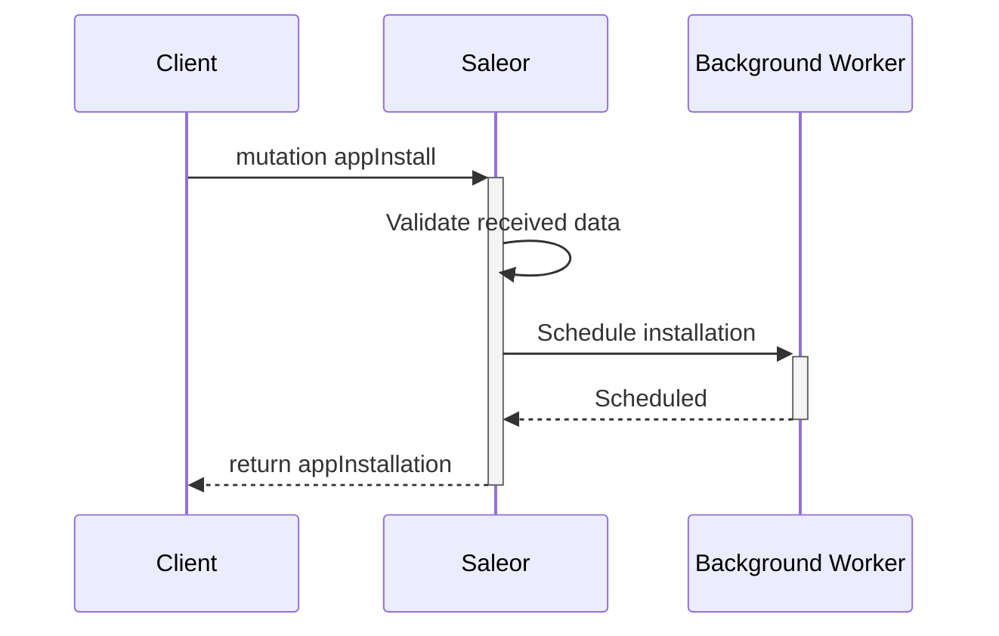
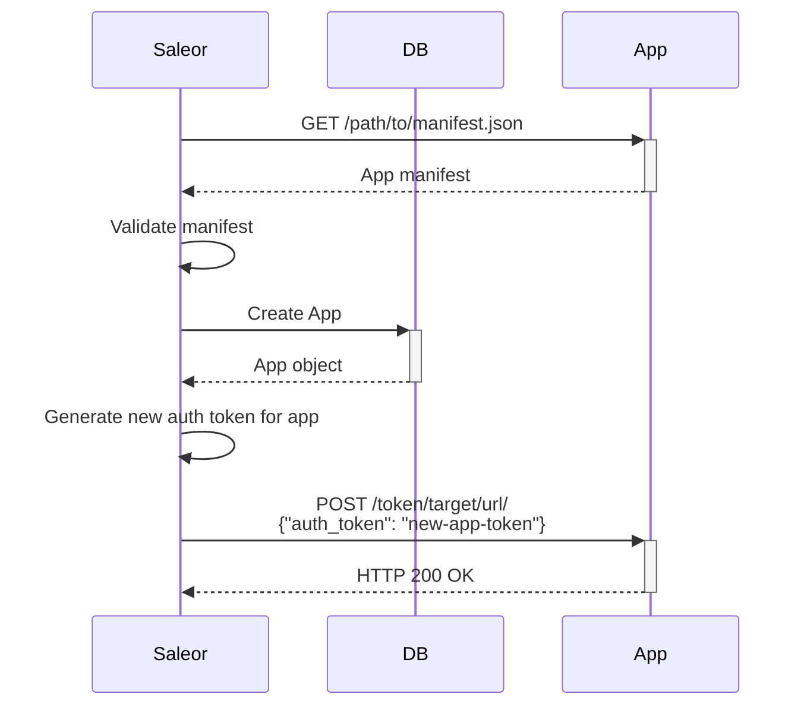

## Installation flow

Apps can be installed in three ways:

- From the command line.
- Using the GraphQL API.
- Using the Saleor Dashboard.

The first option can be helpful during App development and can only be used if you have access to the server CLI.
The second option is a default flow used during installation from Saleor Marketplace.
The third uses the same GraphQL mutations as the previous one but can be done using the UI.
No matter which way of installing you choose, your App has to expose the registration endpoint. Saleor Core will contact such endpoint during registration and send tokens for App auth. If your application returns an HTTP status 200, installation is marked as successful, and staff users will be able to interact with it.

## Permissions

:::info

App permissions are described in the [App permissions](developer/extending/apps/architecture/app-permissions.mdx) article.

:::

## Installation using command line

### Creating local Apps

To create a local App with explicitly provided permissions, use the `create_app` command.

Arguments:

- `<name>`: the name of the App, required.
- `--permission <PERM>`: assign permission `PERM` to the App. This argument can be repeated to specify multiple permissions.
- `--identifier`: canonical App ID.
- `--activate`: immediately activate the new App.
- `--target-url <URL>`: a URL to send the API auth token to once installation is complete. [Optional]

> **Example:** The following command will create an App named "Order App" that can access users and orders:
>
> ```shell
> python manage.py create_app "Order App" \
>    --permission MANAGE_USERS \
>    --permission MANAGE_ORDERS \
>    --target-url https://your-order-app/your-register-endpoint/
> ```

If the target URL is provided, Saleor will POST the API auth token, in the same JSON format, to the provided URL:



If the target URL is not specified, the command will output the API auth token in the following format:

```
{"auth_token": "new-app-token"}
```

## Installing third-party Apps

To install a `third-party` App based on its manifest URL, use the `install_app` command.

Arguments:

- `<manifest URL>`: URL of the manifest file, required.
- `--activate`: immediately activate the new App.

> **Example:** The following command will download given manifest and install the app:
>
> ```shell
> python manage.py install_app https://www.url.to.manifest
> ```

App installation is confirmed by sending the API token to the specified token target URL.
To see workflow details check - [install app workflow](developer/extending/apps/installing-apps.mdx#install-an-app).

## Installation using GraphQL API

### Installing an App

Installing an App with `appInstall` mutation creates an App based on its manifest URL.

The mutation takes the following input fields:

- `appName`: the name of the App, required.
- `manifestUrl`: the URL of the manifest file, required.
- `permissions`: a list of permissions the App should be granted.
- `activateAfterInstallation`: immediately activate the new App. Defaults to `true`.

The mutation response contains the `appInstallation`, which includes all information about the installation process.

```graphql {2-8}
mutation {
  appInstall(
    input: {
      appName: "External Order App"
      manifestUrl: "http://localhost:3001/manifest"
      permissions: [MANAGE_ORDERS]
    }
  ) {
    appInstallation {
      id
      status
      appName
      manifestUrl
    }
    appErrors {
      field
      message
      code
      permissions
    }
  }
}
```

If there are no errors in the response, a new App installation process is created:

```json
{
  "data": {
    "appInstall": {
      "appInstallation": {
        "id": "QXBwT25nb2luZ0luc3RhbGxhdGlvbjoz",
        "status": "PENDING",
        "appName": "Order App",
        "manifestUrl": "http://localhost:3001/manifest"
      },
      "appErrors": []
    }
  }
}
```

The chart below explains the workflow of the installation process:

#### Schedule installation



#### Install an App



### Retrieving ongoing installations

To fetch all ongoing and failed installations, use the `appsInstallations` query.
This query is only available to staff users with the `MANAGE_APPS` permission.
The query returns a list of `AppInstallation` objects.

```graphql {2}
{
  appsInstallations {
    id
    status
    appName
  }
}
```

The query returns a similar response:

```json
{
  "data": {
    "appsInstallations": [
      {
        "id": "QXBwT25nb2luZ0luc3RhbGxhdGlvbjoy",
        "status": "FAILED",
        "appName": "Shipping App"
      },
      {
        "id": "QXBwT25nb2luZ0luc3RhbGxhdGlvbjoz",
        "status": "PENDING",
        "appName": "Order App"
      }
    ]
  }
}
```

### Retrying failed installation

If the `appsInstallations` query returns an App with failed status, there is a possibility to retry the installation process.
Staff users can't retry the App installation if the App requires more permissions they actually have.
The `appRetryInstall` mutation will run the installation process for a given App.

The mutation takes the following fields:

- `id`: the id of the `AppInstallation`, required.
- `activateAfterInstallation`: immediately activate the new App. Defaults to `true`.

Here's an example of retrying the installation of an App with the `id` of `QXBwT25nb2luZ0luc3RhbGxhdGlvbjoy`:

```graphql {2}
mutation {
  appRetryInstall(id: "QXBwT25nb2luZ0luc3RhbGxhdGlvbjoy") {
    appErrors {
      field
      message
      code
    }
    appInstallation {
      id
      status
    }
  }
}
```

### Deleting failed installation

If the `appsInstallations` query returns the App with failed status, there is a possibility to delete failed installation.
The `appDeleteFailedInstallation` mutation will delete failed installation.

The mutation takes the following fields:

- `id`: the id of the `AppInstallation`, required.

### Local Apps

#### Creating the App

To create a new App, use the `appCreate` mutation. The mutation takes the following input fields:

- `name`: the name of the App.
- `isActive`: whether to activate the App, defaults to `true`.
- `permissions`: a list of permissions the App should be granted.

Let's assume we want to create an order processing service that can fetch and manage orders in Saleor. To do so, we make a new App with the `MANAGE_ORDERS` permission:

```graphql {2-4}
mutation {
  appCreate(
    input: { name: "Order processing service", permissions: [MANAGE_ORDERS] }
  ) {
    authToken
    app {
      id
      name
    }
    appErrors {
      field
      code
    }
  }
}
```

If there are no errors in the response, a new App is created:

```json
{
  "data": {
    "appCreate": {
      "authToken": "Es1O0oB2O3PTeG9A4IVYUcaMoru3Ls",
      "app": {
        "id": "QXBwOjk=",
        "name": "Order processing service"
      },
      "appErrors": []
    }
  }
}
```

The response contains the `authToken` field - this is the token that the App needs to include in the requests to the Saleor API to authorize itself and access queries or mutations it needs.

:::note
The `authToken` field is only available in the mutation response and cannot be fetched later, except for the last four digits.
:::

#### Creating authorization keys

Creating an App with `appCreate` mutation generates the default authorization token (`authToken`). You can make more authorization keys with the `appTokenCreate`. The mutation takes the following fields:

- `app`: ID of the App.
- `name`: (optional) name of the key.

```graphql {2}
mutation {
  appTokenCreate(input: { app: "QXBwOjk=" }) {
    authToken
    appErrors {
      field
      code
    }
    appToken {
      id
    }
  }
}
```

#### Revoking authorization keys

To revoke an authorization key, use the `appTokenDelete`:

```graphql {2}
mutation {
  appTokenDelete(id: "QXBwOjk=") {
    appErrors {
      field
      code
  }
}
```

## App management

### Retrieving all Apps

To list Apps, use `apps` query:

```graphql {2}
{
  apps(first: 5) {
    edges {
      node {
        id
        permissions {
          code
        }
        name
        isActive
        webhooks {
          name
        }
      }
    }
  }
}
```

The query returns a similar response:

```json
{
  "data": {
    "apps": {
      "edges": [
        {
          "node": {
            "id": "QXBwOjE=",
            "permissions": [
              {
                "code": "MANAGE_ORDERS"
              }
            ],
            "name": "Order App",
            "isActive": true,
            "webhooks": []
          }
        }
      ]
    }
  }
}
```

### Activating an App

To activate an App, use the `appActivate` mutation, which takes the following fields:

- `id`: the id of the `App`, required.

```graphql {2}
mutation {
  appActivate(id: "QXBwOjE=") {
    app {
      id
      isActive
    }
    appErrors {
      field
      message
      code
    }
  }
}
```

The query returns a similar response:

```json
{
  "data": {
    "appActivate": {
      "app": {
        "id": "QXBwOjE=",
        "isActive": true
      },
      "appErrors": []
    }
  }
}
```

### Deactivating an App

:::note
Deactivating an App will disable all auth-tokens generated for that App.
The App won't receive any webhook payloads.
:::

The mutation takes the following fields:

- `id`: the id of the `App`, required.

```graphql {2}
mutation {
  appDeactivate(id: "QXBwOjE=") {
    app {
      id
      isActive
    }
    appErrors {
      field
      message
      code
    }
  }
}
```

The query returns a similar response:

```json
{
  "data": {
    "appDeactivate": {
      "app": {
        "id": "QXBwOjE=",
        "isActive": false
      },
      "appErrors": []
    }
  }
}
```
