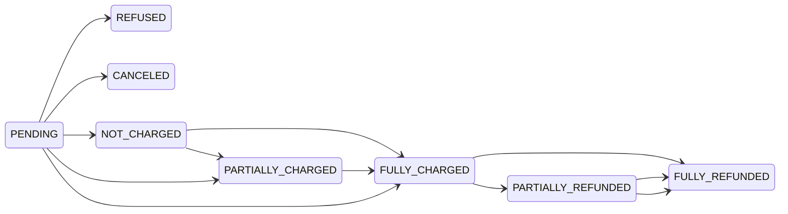
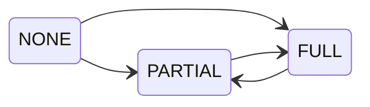
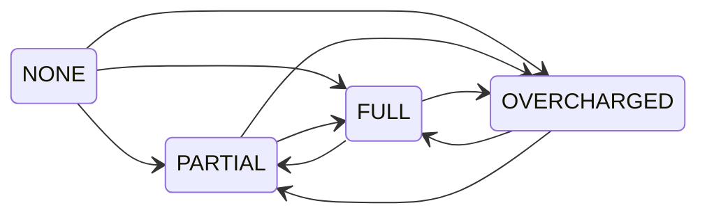

## Payment status

[Payment status](api-reference/orders/objects/order.mdx#orderpaymentstatuspaymentchargestatusenum--) represents the combined payment and refund status of the order. It's calculated based on:

- `order.total` value
- status of the payments
- refunds granted for the order

When no refunds is created, the status is one of the following:

- `PENDING`: waiting for the response from the payment gateway
- `REFUSED`: payment refused by the payment gateway
- `CANCELED`: payment has been canceled
- `NOT_CHARGED`: the amount is authorized but not charged
- `PARTIALLY_CHARGED`: the charged amount does not cover the order total
- `FULLY_CHARGED`: charged funds fully cover the order total

Creating the refund will change the status to:

- `PARTIALLY_REFUNDED`: the refunded amount does not cover the order total
- `FULLY_REFUNDED`: refunded funds fully cover the order total

## Authorize status

TODO: explain what it is

Charge status depends on:

- the sum of **charged** transactions
- the sum of **authorized** transactions
- the `order.totalGrantedRefund` value
- the `order.total` value

The difference between `total` and `totalGrantedRefund` is compared with the sum of **charged** and **authorized** transactions. The result is one of the statuses: `PARTIAL`, `FULL`. If no transaction has been charged, the status is `NONE`.

### Available transitions

- Status is updated on operations that change the order's `total`, `totalGrantedRefund` or transactions

## Charge status

TODO: explain what it is

Charge status depends on:

- the sum of **charged** transactions
- the `order.totalGrantedRefund` value
- the `order.total` value

The difference between `total` and `totalGrantedRefund` is compared with **charged** transactions and the result is one of the statuses: `PARTIAL`, `FULL`, `OVERCHARGED`. If no transaction has been charged, the status is `NONE`.

### Available transitions

- Status is updated on operations that change the order's `total`, `totalGrantedRefund` or transactions
