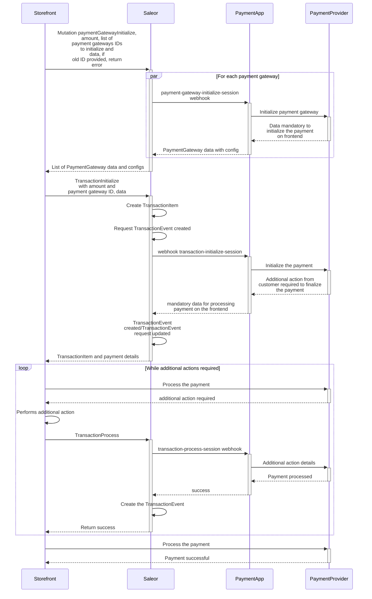
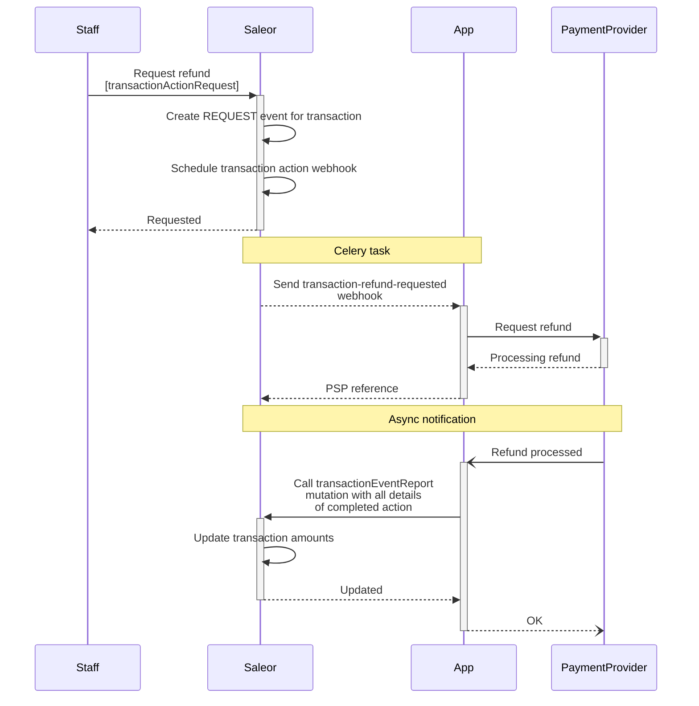
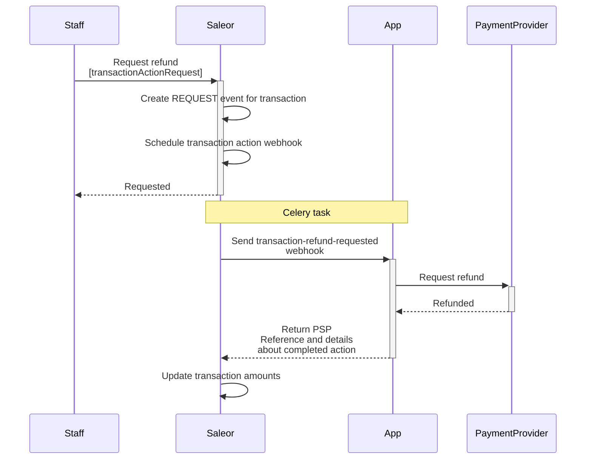
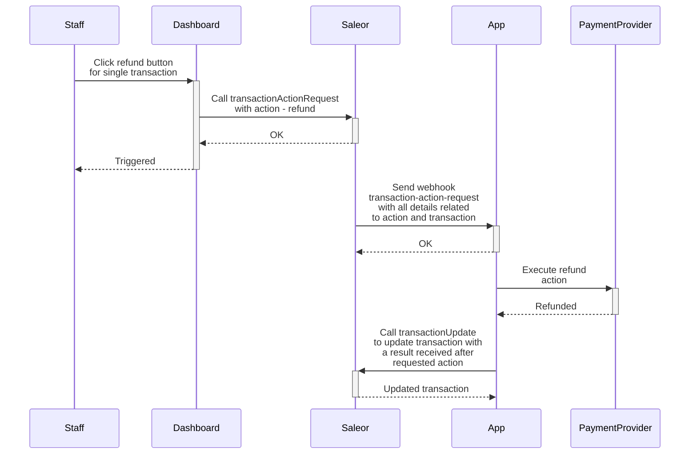
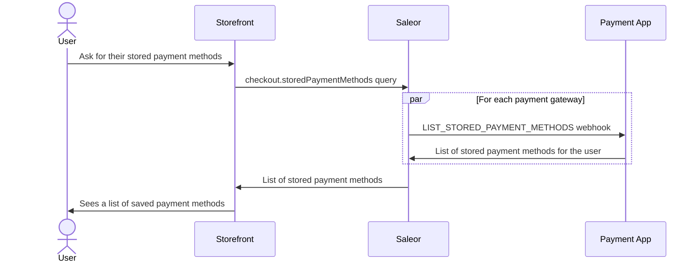
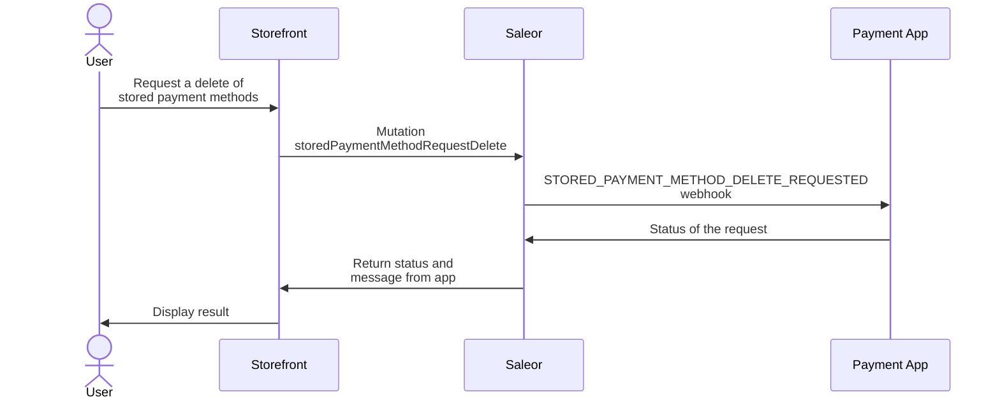
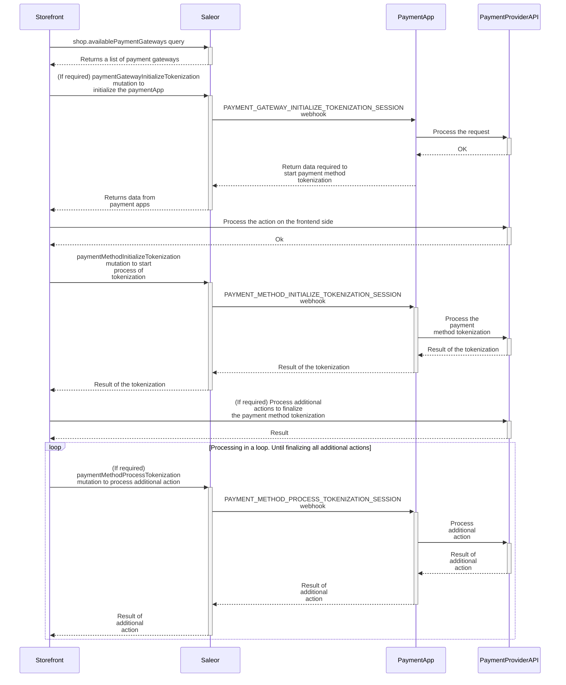

## Introduction

The process below describes the key milestones in the Saleor payment flow.
Additional steps may also occur along the way; however, the purpose of this instruction is to
deliver a base reference for the user to work with.

Saleor distinguishes two different approaches to processing payments:

- By using a [Payment App](#payment-app).
- By using a [Custom App](#custom-app).
- By using a [Plugin](developer/extending/plugins/overview.mdx) embedded in the Saleor code (legacy).

:::note

If you're considering building a custom payment integration, please check if the payment provider you're interested in isn't already available [Saleor App Store](developer/app-store/apps/overview.mdx#built-in-apps-catalog).

:::

## Payment App

### What is a Payment App

Payment App is a Saleor App that handles the payment process for a specific payment provider.
End users are unaware of the payment app's existence as they communicate only with Saleor via GraphQL API.
Saleor then communicates with the app using synchronous webhooks, automatically [updates statuses and balances](developer/payments.mdx#recalculations-of-transaction-amounts), and returns the response to the storefront. Checkout is finalized with the [`checkoutComplete`](api-reference/checkout/mutations/checkout-complete.mdx) mutation.

Payment apps are responsible for handling the implementation details of payments with a certain payment gateway (i.e. Adyen, Stripe) while Saleor hides the complexity of the payment process from the storefront under a consistent set of GraphQL queries and mutations.

:::tip

In this guide, we use the terms **Payment App** and **Payment Gateway** interchangeably.

:::

### Processing payments with the Payment App

:::info

This feature was introduced in **Saleor 3.13**.

:::

:::caution

This feature is in the **Feature Preview** stage, which means that it is available for experimentation and
feedback. However, it is still undergoing development and is subject to modifications.

:::

This section describes the flow for processing payments using Payment Apps. The communication between the storefront and the Payment App
goes through Saleor. Based on the Payment App's response, Saleor creates or updates the transactions with the appropriate [statuses and balances](developer/payments.mdx#recalculations-of-transaction-amounts).

The following diagram shows the flow of processing a payment with a Payment App:



### Creating orders

Payment Apps support two distinct ways of processing checkouts:

- first payments, then order
- first order, then payments

The first approach is used by default. It means that the order can be only created after the checkout is fully paid. See [`allowUnpaidOrders`](api-reference/miscellaneous/objects/order-settings.mdx#ordersettingsallowunpaidordersboolean--) setting for more details.

In both cases, the order is created by calling the [`checkoutComplete`](api-reference/checkout/mutations/checkout-complete.mdx) mutation.

### Initialize payment gateway

To initialize the payment app, call the [`paymentGatewayInitialize`](api-reference/payments/mutations/payment-gateway-initialize.mdx) mutation.
The [`data`](api-reference/payments/inputs/payment-gateway-to-initialize.mdx#paymentgatewaytoinitializedatajson-) provided in the
[`paymentGateways`](api-reference/payments/inputs/payment-gateway-to-initialize.mdx) will be sent to the payment app. Saleor will then return the [`data`](api-reference/payments/objects/payment-gateway-initialize.mdx#paymentgatewayinitializegatewayconfigspaymentgatewayconfig--) received from each app as a response.

This step is useful when information needs to be obtained from the Payment App even before initializing the payment process. Typically used for getting the available payment methods for a specific checkout, or for fetching the payment form configuration to be rendered on the frontend. Multiple Payment Apps can be initialized with a single mutation call.

The [`paymentGatewayInitialize`](api-reference/payments/mutations/payment-gateway-initialize.mdx) mutation requires the following arguments:

- `id` - ID of the `Checkout` or `Order`
- `amount` - The amount requested for initializing the payment gateway. If not provided, the difference between `checkout.total` and transactions that are already processed will be sent to the apps.
- `paymentGateways` - A list of Payment Apps to initialize. If not provided, all apps subscribed to the webhook [`PAYMENT_GATEWAY_INITIALIZE_SESSION`](api-reference/webhooks/enums/webhook-event-type-sync-enum.mdx#webhookeventtypesyncenumpayment_gateway_initialize_session) will be used.
- `paymentGateways.id` - The identifier of the Payment App to initialize.
- `paymentGateways.data` - The data to be passed to the Payment App.

The [`paymentGatewayInitialize`](api-reference/payments/mutations/payment-gateway-initialize.mdx) mutation returns the following response:

- `gatewayConfigs` - A list of Payment Apps that were initialized.
- `gatewayConfigs.id` - The app identifier.
- `gatewayConfigs.data` - The data required to initialize the Payment App.
- `gatewayConfigs.errors` - A list of errors related to the specific payment gateway app.
- `errors` - Errors related to the mutation call.

The following example shows how to use the [`paymentGatewayInitialize`](api-reference/payments/mutations/payment-gateway-initialize.mdx) mutation to initialize the payment gateways:

```graphql
mutation {
  paymentGatewayInitialize(
    id: "Q2hlY2tvdXQ6ZmIxMzljMjgtYWY4OS00Mzk2LWEyMjgtZmM2ZDg0NGFhOWY3"
    amount: 100
    paymentGateways: [
      { id: "app.saleor.payment", data: { details: { passed: "to-app" } } }
    ]
  ) {
    gatewayConfigs {
      id
      data
      errors {
        field
        message
        code
      }
    }
    errors {
      field
      message
      code
    }
  }
}
```

The response:

```json
{
  "data": {
    "paymentGatewayInitialize": {
      "gatewayConfigs": [
        {
          "id": "app.saleor.payment",
          "data": {
            "json": "data-returned-by-app"
          },
          "errors": []
        }
      ],
      "errors": []
    }
  }
}
```

The mutation will trigger the [`PAYMENT_GATEWAY_INITIALIZE_SESSION`](api-reference/webhooks/enums/webhook-event-type-sync-enum.mdx#webhookeventtypesyncenumpayment_gateway_initialize_session) webhook.
For more details about this webhook, please refer to the [Transaction events guide](developer/extending/webhooks/synchronous-events/transaction.mdx#initialize-payment-gateway-session).

### Initialize transaction

To initiate payment processing, call the [`transactionInitialize`](api-reference/payments/mutations/transaction-initialize.mdx) mutation.
The [`data`](api-reference/payments/inputs/payment-gateway-to-initialize.mdx#paymentgatewaytoinitializedatajson-) provided in the
[`paymentGateways`](api-reference/payments/inputs/payment-gateway-to-initialize.mdx) field will be sent to the payment app, and Saleor will return the
[`data`](api-reference/payments/objects/transaction-initialize.mdx#transactioninitializedatajson-) received from the app as a response.
Based on the Payment App's response, Saleor will create or update the transaction with the appropriate status and balance.

Depending on the implementation of the Payment App, the `transactionInitialize` may charge or authorize the customer.

The [`transactionInitialize`](api-reference/payments/mutations/transaction-initialize.mdx) mutation accepts the following arguments:

- `id` - ID of the `Checkout` or `Order`.
- `paymentGateway` - The payment gateway used to initiate payment processing.
- `paymentGateway.id` - The identifier of the payment gateway app.
- `paymentGateway.data` - The data to be passed to the payment gateway.
- `amount` - The amount requested for the payment. If not provided, the difference between `checkout.total` and transactions that are already processed will be sent.
- `action` - The expected action (charge or authorization). By default, the `channel.defaultTransactionFlowStrategy` will be used and can be configured from the Saleor Dashboard. The default value can be overridden only by an app that has `HANDLE_PAYMENTS` permission.
- `idempotencyKey` - Idempotency key which will be passed to the payment app. The key needs to be unique for the pair - `idempotencyKey` and `paymentGateway.id`. This field was introduced in **Saleor 3.14**.
- `customerIpAddress` - The customer's IP address. If not provided, Saleor will try to determine the customer's IP address on its own. The customer's IP address will be passed to the payment app. The IP should be in ipv4 or ipv6 format. The field can be used only by an app that has `HANDLE_PAYMENTS` permission. This field was introduced in **Saleor 3.16**.

Depending on the provided `idempotencyKey` value, the below results will happen:

- If `idempotencyKey` key is not provided, a new one will be generated automatically.
- If `idempotencyKey` is provided as an empty string, the error with the INVALID code will be raised.
- If provided pair: `idempotencyKey` and `paymentGateway.id` is already assigned to the existing transaction that belongs to a different order/checkout, the error with the UNIQUE code will be raised.

- If provided pair: `idempotencyKey` and `paymentGateway.id` is used more than once for a single order/checkout but with different `amount`, `action` input, the error with UNIQUE code will be raised.
- If provided pair: `idempotencyKey` and `paymentGateway.id` is used more than once for a single order/checkout, with the same input for `amount`, `action`, the existing `TransactionItem` will be used to send the request to the payment app.

The idempotency is used to detect the same payment request made by `transactionInitialize`. The idempotency key should be generated by the storefront and passed as a mutation input. Any retries made with `transactionInitialize` mutation should provide the same idempotency key.

In Web, UUID can be generated by using Crytpo Web API:

```js
const idempotencyKey = window.crypto.randomUUID();
```

The key should be also stored in the form of persistent storage. This way it can be re-used even if the user leaves the page/app. On the Web, this can be done with `localStorage`:

```js
// set
localStorage.setItem("idempotencyKey", idempotencyKey);
// get
const idempotencyKey = localStorage.getItem("idempotencyKey");
```

The [`transactionInitialize`](api-reference/payments/mutations/transaction-initialize.mdx) mutation returns the following response:

- `transaction` - The initialized transaction.
- `transactionEvent` - The event created based on the response received from the payment app.
- `data` - The data returned by the app.
- `errors` - Errors related to the mutation call.

The mutation will trigger the [`TRANSACTION_INITIALIZE_SESSION`](api-reference/webhooks/enums/webhook-event-type-sync-enum.mdx#webhookeventtypesyncenumtransaction_initialize_session) webhook.
For more details about this webhook, please refer to the [Transaction events guide](developer/extending/webhooks/synchronous-events/transaction.mdx#initialize-transaction-session).

The following example demonstrates how to use the [`transactionInitialize`](api-reference/payments/mutations/transaction-initialize.mdx) mutation to initiate payment processing:

```graphql
mutation TransactionInitialize {
  transactionInitialize(
    amount: 100
    id: "Q2hlY2tvdXQ6MzE3NDk5MjgtZDFkMC00NjdjLTgxNjktMGRiZGM4ZGJhMGZh"
    paymentGateway: {
      id: "app.saleor.payment"
      data: { details: "passed-to-app" }
    }
  ) {
    transaction {
      id
    }
    transactionEvent {
      type
      pspReference
    }
    errors {
      field
      message
      code
    }
  }
}
```

The response:

```json
{
  "data": {
    "transactionInitialize": {
      "data": {
        "some-json": "data"
      },
      "transaction": {
        "id": "VHJhbnNhY3Rpb25JdGVtOjhhMzE1ODVlLWE1MTktNDVkMS1hNTFmLTYwZGZlNGRkM2FkNg"
      },
      "transactionEvent": {
        "type": "CHARGE_SUCCESS",
        "pspReference": "ppp-123"
      },
      "errors": []
    }
  }
}
```

The current status of payment can be determined based on the value of [`transactionEvent.type`](api-reference/payments/enums/transaction-event-type-enum.mdx):

- `AUTHORIZATION_ACTION_REQUIRED` or `CHARGE_ACTION_REQUIRED` indicates that additional action is required from the
  customer to finalize the payment (e.g. 3D Secure, mobile app confirmation, redirect to the payment provider page, etc.) Calling the [`transactionProcess`](api-reference/payments/mutations/transaction-process.mdx) mutation is required in order to proceed.
- `AUTHORIZATION_SUCCESS` indicates that funds have been authorized.
- `AUTHORIZATION_FAILURE` indicates that authorization has failed.
- `AUTHORIZATION_REQUEST` indicates that authorization is pending.
- `CHARGE_SUCCESS` indicates that funds have been charged.
- `CHARGE_FAILURE` indicates that charging has failed.
- `CHARGE_REQUEST` indicates that charging is pending.

Pending statuses are used when the Payment App requires additional time or a manual action on the payment provider side to process the payment.
Depending on the implementation, the Payment App may report the final status of the payment later using the [`transactionEventReport`](developer/payments.mdx#reporting-actions-for-transactions) mutation.

### Process transaction

If [`transactionInitialize`](api-reference/payments/mutations/transaction-initialize.mdx) or [`transactionProcess`](api-reference/payments/mutations/transaction-process.mdx)
returns `transactionEvent.type` equal to [`AUTHORIZATION_ACTION_REQUIRED`](api-reference/payments/enums/transaction-event-type-enum.mdx#transactioneventtypeenumauthorization_action_required)
or [`CHARGE_ACTION_REQUIRED`](api-reference/payments/enums/transaction-event-type-enum.mdx#transactioneventtypeenumcharge_action_required), additional steps from the customer are required. After completing those steps, pass the results to the [`transactionProcess`](api-reference/payments/mutations/transaction-process.mdx) mutation.

The [`transactionProcess`](api-reference/payments/mutations/transaction-process.mdx) mutation accepts the following arguments:

- `id` - The ID of the transaction returned by [`transactionInitialize`](api-reference/payments/mutations/transaction-initialize.mdx).
- `data` - The data to be passed to the payment gateway.
- `customerIpAddress` - The customer's IP address. If not provided, Saleor will try to determine the customer's IP address on its own. The customer's IP address will be passed to the payment app. The IP should be in ipv4 or ipv6 format. The field can be used only by an app that has `HANDLE_PAYMENTS` permission. This field was introduced in **Saleor 3.16**.

The [`transactionProcess`](api-reference/payments/mutations/transaction-process.mdx) mutation returns:

- `transaction` - The processed transaction.
- `transactionEvent` - The event created based on the response received from the payment app.
- `data` - The data returned by the app.
- `errors` - Errors related to the mutation call.

The mutation triggers the [`TRANSACTION_PROCESS_SESSION`](api-reference/webhooks/enums/webhook-event-type-sync-enum.mdx#webhookeventtypesyncenumtransaction_process_session) webhook.
For more details about this webhook, refer to the [Transaction events guide](developer/extending/webhooks/synchronous-events/transaction.mdx#process-transaction-session).

The following example demonstrates how to use the [`transactionProcess`](api-reference/payments/mutations/transaction-process.mdx) mutation to process the payment:

```graphql
mutation TransactionInitialize {
  transactionProcess(
    id: "VHJhbnNhY3Rpb25JdGVtOjhhMzE1ODVlLWE1MTktNDVkMS1hNTFmLTYwZGZlNGRkM2FkNg"
    data: { additional: { actions: "details" } }
  ) {
    transaction {
      id
    }
    transactionEvent {
      type
      pspReference
    }
    errors {
      field
      message
      code
    }
  }
}
```

The response:

```json
{
  "data": {
    "transactionProcess": {
      "data": {
        "some-json": "data"
      },
      "transaction": {
        "id": "VHJhbnNhY3Rpb25JdGVtOjhhMzE1ODVlLWE1MTktNDVkMS1hNTFmLTYwZGZlNGRkM2FkNg"
      },
      "transactionEvent": {
        "type": "CHARGE_SUCCESS",
        "pspReference": "ppp-123"
      },
      "errors": []
    }
  }
}
```

The current status of payment can be determined based on the value of [`transactionEvent.type`](api-reference/payments/enums/transaction-event-type-enum.mdx).
On some occasions, multiple calls to [`transactionProcess`](api-reference/payments/mutations/transaction-process.mdx) may be required to proceed with the payment.

### Community resources

- [witoszekdev/dummy-payment-server](https://github.com/witoszekdev/dummy-payment-server) - App for testing Transactions API without a real payment provider

## Custom App

### What is a Custom App

In this guide, "Custom App" means a [Saleor App](developer/extending/apps/overview.mdx) that uses a custom logic for handling payments instead of listening for `PAYMENT_GATEWAY_INITIALIZE_SESSION`, `TRANSACTION_INITIALIZE_SESSION` and `TRANSACTION_PROCESS_SESSION` webhooks like Payment Apps do. End users need to communicate with the app directly and it's the app's responsibility to report back to Saleor.

Custom apps handle the payment process and call Saleor mutations on their backend to report any changes that happen for a specific `transactionItem`.
Orders can be created by a protected mutation [`orderCreateFromCheckout`](api-reference/orders/mutations/order-create-from-checkout.mdx).

:::note

Building a Custom App is only recommended if Saleor Payment Apps don't fit your needs and for more complex use cases. **For most of the payment providers, Saleor Payment Apps should be used instead.**
When the custom app uses the `transactionUpdate` mutation, Saleor won't be able to automatically update the status and balance of the payment and the app will be responsible for doing it.

:::

### Creating transactions

:::info

This feature was introduced in **Saleor 3.4**.

:::

:::caution

This feature is in the **Feature Preview** stage, which means that it is available for experimentation and
feedback. However, it is still undergoing development and is subject to modifications.

:::

Transaction stores details of a payment transaction attached to an order or a checkout:

The [`transactionCreate`](api-reference/payments/mutations/transaction-create.mdx) mutation takes the following arguments:

- `id`: The ID of the checkout or order.
- `transaction`: Input data required to create a new transaction object.
- `transactionEvent`: Data that defines a transaction event. It can be used to provide more context about the current state of the transaction.

:::info

The [`transactionCreate`](api-reference/payments/mutations/transaction-create.mdx) can only be called by staff users or apps with the [`HANDLE_PAYMENTS`](api-reference/users/enums/permission-enum.mdx#permissionenumhandle_payments) permission.

:::

The following example shows how you can use the [`transactionCreate`](../api-reference/payments/mutations/transaction-create) mutation to create a new transaction.

The transaction was authorized, and the payment was made with a credit card. The actions that can be called from Saleor are: `CANCEL` and `CHARGE`.
The authorized amount is **$99**.

##### Saleor 3.13+

```graphql
mutation {
  transactionCreate(
    id: "Q2hlY2tvdXQ6MWQzNmU5YzctYWEwYS00NzM5LTk0MGQtNzdjNmU4Mjc5YmQ0"
    transaction: {
      name: "Credit card"
      message: "Authorized"
      pspReference: "PSP-ref123"
      availableActions: [CANCEL, CHARGE]
      amountAuthorized: { currency: "USD", amount: 99 }
      externalUrl: "https://saleor.io/payment-id/123"
    }
  ) {
    transaction {
      id
    }
  }
}
```

The response:

```json
{
  "data": {
    "transactionCreate": {
      "transaction": {
        "id": "VHJhbnNhY3Rpb25JdGVtOjE="
      }
    }
  },
  "extensions": {
    "cost": {
      "requestedQueryCost": 0,
      "maximumAvailable": 50000
    }
  }
}
```

##### Saleor 3.4 (deprecated)

```graphql
mutation {
  transactionCreate(
    id: "Q2hlY2tvdXQ6MWQzNmU5YzctYWEwYS00NzM5LTk0MGQtNzdjNmU4Mjc5YmQ0"
    transaction: {
      status: "Authorized"
      type: "Credit card"
      reference: "PSP-ref123"
      availableActions: [CANCEL, CHARGE]
      amountAuthorized: { currency: "USD", amount: 99 }
    }
    transactionEvent: {
      status: SUCCESS
      name: "Authorized credit card"
      reference: "PSP-ref123"
    }
  ) {
    transaction {
      id
    }
  }
}
```

The response:

```json
{
  "data": {
    "transactionCreate": {
      "transaction": {
        "id": "VHJhbnNhY3Rpb25JdGVtOjE="
      }
    }
  },
  "extensions": {
    "cost": {
      "requestedQueryCost": 0,
      "maximumAvailable": 50000
    }
  }
}
```

:::info

- Transactions attached to checkout are accessible via the [`checkout.transactions`](../api-reference/checkout/objects/checkout#checkouttransactionstransactionitem--) field.
- Transactions attached to order are accessible via the [`order.transactions`](../api-reference/orders/objects/order#ordertransactionstransactionitem--) field.

:::

### Updating transactions

:::info

This feature was introduced in **Saleor 3.4**.

:::

:::caution

This feature is in the **Feature Preview** stage, which means that it is available for experimentation and
feedback. However, it is still undergoing development and is subject to modifications.

:::

The [`transactionUpdate`](api-reference/payments/mutations/transaction-update.mdx) mutation allows updating the transaction details.
It takes the following arguments:

- `id`: The ID of the transaction.
- `transaction`: Input data that will be used to update the transaction object.
- `transactionEvent`: Data that defines a transaction event. It can be used to provide more context about the current state of the transaction.

:::info

The [`transactionUpdate`](api-reference/payments/mutations/transaction-update.mdx) can only be called by staff users with the
[HANDLE_PAYMENTS](api-reference/users/enums/permission-enum.mdx#permissionenumhandle_payments) permission
or by the App that created the the transaction and has [`HANDLE_PAYMENTS`](api-reference/users/enums/permission-enum.mdx#permissionenumhandle_payments) permission.

:::

The following example shows how you can use the [`transactionUpdate`](api-reference/payments/mutations/transaction-update.mdx) mutation to update the transaction.

The available action is `REFUND`. The authorized funds are charged, so `amountAuthorized` is **$0** and `amountCharged` is **$99**.

```graphql
mutation {
  transactionUpdate(
    id: "VHJhbnNhY3Rpb25JdGVtOjE="
    transaction: {
      name: "Credit card"
      message: "Authorized"
      pspReference: "PSP-ref123"
      availableActions: [REFUND]
      amountAuthorized: { currency: "USD", amount: 0 }
      amountCharged: { currency: "USD", amount: 99 }
    }
    transactionEvent: {
      message: "Payment charged"
      pspReference: "PSP-ref123.charge"
    }
  ) {
    transaction {
      id
    }
  }
}
```

The response:

```json
{
  "data": {
    "transactionUpdate": {
      "transaction": {
        "id": "VHJhbnNhY3Rpb25JdGVtOjE="
      }
    }
  },
  "extensions": {
    "cost": {
      "requestedQueryCost": 0,
      "maximumAvailable": 50000
    }
  }
}
```

:::note

During the update of transactions, all funds that go to a new state should be subtracted from the previous state.
Assuming we have a transaction with `authorizedAmount` equal to 100 USD. Moving the `authorizedAmount` to `chargedAmount` requires setting the `authorizedAmount` to 0.

This complexity is handled automatically when Payment Apps are used instead of a custom app.

```graphql
mutation {
  transactionUpdate(
    id: "VHJhbnNhY3Rpb25JdGVtOjE="
    transaction: {
      status: "Charged"
      availableActions: [REFUND]
      amountAuthorized: { currency: "USD", amount: 0 }
      amountCharged: { currency: "USD", amount: 100 }
    }
    transactionEvent: {
      status: SUCCESS
      name: "Charged credit card"
      reference: "PSP-ref123.charge"
    }
  ) {
    transaction {
      id
    }
  }
}
```

:::

## Comparison of Payment Apps and Custom Apps

|                        | Payment Apps                                                                                          | Custom Apps                                                                   |
| ---------------------- | ----------------------------------------------------------------------------------------------------- | ----------------------------------------------------------------------------- |
| Users communicate with | Saleor GraphQL API                                                                                    | The app directly                                                              |
| Consistency            | The same set of queries and mutations for each Payment App                                            | Different APIs depending on the custom app implementation                     |
| Transactions           | Created automatically by Saleor based on requests to payment apps and their responses                 | Need to be created manually by custom apps; depends on the app implementation |
| Balances               | Always automatically calculated by Saleor                                                             | In some cases the balances need to be manually calculated by the custom app   |
| Flexibility            | Limited by the set of predefined actions and mutations; designed to handle most of business scenarios | Almost anything is possible                                                   |

## Additional steps

:::note

This section applies to both Payment Apps and Custom Apps.

:::

This section describes additional steps that can be performed at different stages of the payment process.

### Reporting actions for transactions

:::info

This feature was introduced in **Saleor 3.13**.

:::

:::caution

This feature is in the **Feature Preview** stage, which means that it is available for experimentation and
feedback. However, it is still undergoing development and is subject to modifications.

:::

The [`transactionEventReport`](../api-reference/payments/mutations/transaction-event-report) is used to
report a new transaction event. The newly created event will be used to [recalculate](#recalculations-of-transaction-amounts) the transaction's amounts.
The mutation should be used for handling [action requests](#handling-action-requests-for-transactions) or reporting any
changes that happened on the payment provider side (eg. asynchronous webhooks for delayed payment methods, chargebacks, disputes etc.).

It takes the following arguments:

- `id`: The id of the transaction.
- `type`: Type of the reported action.
- `amount`: The amount of the reported action.
- `pspReference`: The reference assigned to the action.
- `time`: The time of the action.
- `externalUrl`: The URL for the staff user to check the details of the action on the payment provider's page. This URL will be available in the Saleor Dashboard.
- `message`: Message related to the action.
- `availableActions`: Current list of actions available for the transaction.

:::info

The [`transactionEventReport`](../api-reference/payments/mutations/transaction-event-report) can only be called by staff users with
[`HANDLE_PAYMENTS`](api-reference/users/enums/permission-enum.mdx#permissionenumhandle_payments) permission
or by the App that created the transaction and has [`HANDLE_PAYMENTS`](api-reference/users/enums/permission-enum.mdx#permissionenumhandle_payments) permission.

:::

The following example shows how the [transactionEventReport](../api-reference/payments/mutations/transaction-event-report) mutation is used to report an event
that happened for a given transaction.
The report is a success charge action, with 20 as an amount. The currency is the same as declared
for the transaction. Available action that can proceed for a transaction is `REFUND`.
The provided data will be used to create a new [TransactionEvent](../api-reference/payments/objects/transaction-event) object that will be included in the
[recalculation](#recalculations-of-transaction-amounts) process.

```graphql
mutation TransactionEventReport {
  transactionEventReport(
    id: "VHJhbnNhY3Rpb25JdGVtOjE="
    type: CHARGE_SUCCESS
    amount: 20
    pspReference: "psp-123"
    time: "2022-01-01"
    externalUrl: "https://saleor.io/event-details/123"
    message: "Charge completed"
    availableActions: [REFUND]
  ) {
    errors {
      field
      code
    }
    alreadyProcessed
    transaction {
      id
    }
    transactionEvent {
      id
    }
  }
}
```

In the response, Saleor returns:

- `alreadyProcessed` - Defines if the reported event hasn't been processed earlier.
  If there is an event with the same `pspReference`, `amount`, and `type` as the ones provided in the input
  mutation, Saleor will return it instead of creating a new one, and the flag will be set
  to `true`. If the event with provided `pspReference` and `type` was already reported but with a
  different amount, the error with code [INCORRECT_DETAILS](../api-reference/payments/enums/transaction-event-report-error-code#transactioneventreporterrorcodeincorrect_details)
  will be raised.
- `transaction` - Transaction that has been updated based on the received report.
- `transactionEvent` - [TransactionEvent](../api-reference/payments/objects/transaction-event) that has been created based on the received report.

### Handling action requests for transactions

:::info

This feature was introduced in **Saleor 3.4**.

:::

:::caution

This feature is in the **Feature Preview** stage, which means that it is available for experimentation and
feedback. However, it is still undergoing development and is subject to modifications.

:::

An action request is called when a staff user or an app requests an action for a given transaction.

#### Saleor 3.13+

Two mutations can trigger the action on the app side:

- [`transactionRequestAction`](../api-reference/payments/mutations/transaction-request-action): will also create a new
  [`TransactionEvent`](../api-reference/payments/objects/transaction-event) with one of the request type ([`AUTHORIZATION_REQUEST`](../api-reference/payments/enums/transaction-event-type-enum#transactioneventtypeenumauthorization_request),
  [`CHARGE_REQUEST`](../api-reference/payments/enums/transaction-event-type-enum#transactioneventtypeenumcharge_request),
  [`REFUND_REQUEST`](../api-reference/payments/enums/transaction-event-type-enum#transactioneventtypeenumrefund_request),
  [`CANCEL_REQUEST`](../api-reference/payments/enums/transaction-event-type-enum#transactioneventtypeenumcancel_request)),
  `amount` and the `owner` (User or App). Saleor will send a synchronous webhook dedicated to the action
  [`TRANSACTION_CHARGE_REQUESTED`](../api-reference/webhooks/enums/webhook-event-type-sync-enum.mdx#webhookeventtypesyncenumtransaction_charge_requested),
  [`TRANSACTION_CANCELATION_REQUESTED`](../api-reference/webhooks/enums/webhook-event-type-sync-enum.mdx#webhookeventtypesyncenumtransaction_cancelation_requested),
  [`TRANSACTION_REFUND_REQUESTED`](../api-reference/webhooks/enums/webhook-event-type-sync-enum.mdx#webhookeventtypesyncenumtransaction_refund_requested)

- [`transactionRequestRefundForGrantedRefund`](../api-reference/payments/mutations/transaction-request-refund-for-granted-refund): will create a new [`TransactionEvent`](../api-reference/payments/objects/transaction-event) with
  [`REFUND_REQUEST`](../api-reference/payments/enums/transaction-event-type-enum#transactioneventtypeenumrefund_request) type, `amount` and the `owner` (User or App).
  Saleor will send a synchronous webhook [`TRANSACTION_REFUND_REQUESTED`](../api-reference/webhooks/enums/webhook-event-type-sync-enum.mdx#webhookeventtypesyncenumtransaction_refund_requested).
  [`OrderGrantedRefund`](api-reference/orders/objects/order-granted-refund.mdx) will be included in the webhook payload (if requested in a [subscription query](developer/extending/webhooks/subscription-webhook-payloads.mdx#custom-payloads) for the webhook).
  This mutation is useful when the payment provider requires details about lines that are related to refund action.

The response should contain at least `pspReference` of the action. The `pspReference` will be placed in the previously created event of `…_REQUEST` type.
Optionally the response can contain the details of the completed action.

More information about request webhooks can be found [in the synchronous webhooks for transactions guide](extending/webhooks/synchronous-events/transaction).

:::note

The webhook will be sent only to the app that created the transaction.

:::

#### Asynchronously processing actions

When action is processed asynchronously on the payment provider side, the app should call the [`transactionActionRequest`](../api-reference/payments/mutations/transaction-request-action)
mutation once it receives a webhook notification from the payment provider.

The diagram below shows an example of processing asynchronous refund action.



#### Synchronously processing the action

The app immediately receives the status of the requested action. It can provide the details of the action in response to the received Saleor webhook. The following webhook events
can accept action details in the response: [`TRANSACTION_CHARGE_REQUESTED`](../api-reference/webhooks/enums/webhook-event-type-sync-enum.mdx#webhookeventtypesyncenumtransaction_charge_requested),
[`TRANSACTION_CANCELATION_REQUESTED`](../api-reference/webhooks/enums/webhook-event-type-sync-enum.mdx#webhookeventtypesyncenumtransaction_cancelation_requested),
[`TRANSACTION_REFUND_REQUESTED`](../api-reference/webhooks/enums/webhook-event-type-sync-enum.mdx#webhookeventtypesyncenumtransaction_refund_requested).

The below diagram shows an example of processing synchronous refund action.



#### Saleor 3.4 (Deprecated)

If your app should also process payment request actions (like charge, refund, or CANCEL) triggered by staff users on the Saleor dashboard side or by the app,
make sure that your app subscribes to the [`transaction-action-request`](developer/extending/webhooks/sample-webhook-payloads.mdx#transaction-action-request) webhook.

The chart below shows a workflow for handling a `refund` request.



## Recalculations of transaction amounts

The recalculation will differ based on the value of the [`TransactionEventTypeEnum`](../api-reference/payments/enums/transaction-event-type-enum) provided as the field `type`
used in the [`transactionEventReport`](#reporting-actions-for-transactions), [`transactionInitialize`](#initialize-transaction), and [`transactionProcess`](#process-transaction) mutations, or [optionally in the webhook response](extending/webhooks/synchronous-events/transaction):

### Event types explanation

#### AUTHORIZATION_SUCCESS

Saleor assigns provided `amount` to `transaction.authorizedAmount`. If an `AUTHORIZATION_SUCCESS` event is related to an `AUTHORIZATION_REQUEST` event by `pspReference`, then the `transactionItem.authorizePendingAmount`
will be reduced by the amount reported in the `AUTHORIZATION_SUCCESS` event.
You can’t have two successful authorizations for a single transaction.
Each successful request after the first one will raise an exception. `AUTHORIZATION_ADJUSTMENT` should be used to change the `transaction.authorizedAmount`.

:::info

In the case of finding `AUTHORIZATION_SUCCESS` and `AUTHORIZATION_FAILURE` with the same `pspReference`,
the recalculation for `transaction.authorizedAmount` will not take into account the amount from
`AUTHORIZATION_SUCCESS`, when `AUTHORIZATION_SUCCESS` is the older one.

:::

#### AUTHORIZATION_FAILURE

If an `AUTHORIZATION_FAILURE` event is related to an `AUTHORIZATION_REQUEST` event by `pspReference`, then the `transactionItem.authorizePendingAmount`
will be reduced by the amount reported in the `AUTHORIZATION_FAILURE` event. If there is no related `AUTHORIZATION_REQUEST`, the failure event will only
be used to provide the history of `transactionItem` actions.

#### AUTHORIZATION_ADJUSTMENT

Saleor assigns the provided `amount` to the `transaction.authorizedAmount`.

#### CHARGE_SUCCESS

Adds the provided `amount` to the `transaction.chargedAmount`. Each next call will add the `amount` to the existing
`transaction.chargedAmount` (`transaction.chargedAmount += amount`). If a `CHARGE_SUCCESS` event is related to a `CHARGE_REQUEST` event by `pspReference`, then the `transactionItem.chargePendingAmount`
will be reduced by the amount reported in the `CHARGE_SUCCESS` event. If there is no related `CHARGE_REQUEST` event, the provided `amount` will reduce `transaction.authorizedAmount`.

:::info
In the case of finding `CHARGE_SUCCESS` and `CHARGE_FAILURE` with the same `pspReference`, the recalculation
for `transaction.chargedAmount` will not take into account the amount from `CHARGE_SUCCESS`, when
`CHARGE_SUCCESS` is the older one.
:::

#### CHARGE_FAILURE

If an `CHARGE_FAILURE` event is related to an `CHARGE_REQUEST` event by `pspReference`, then the `transactionItem.chargePendingAmount`
will be reduced by the amount reported in the `CHARGE_FAILURE` event. If there is no related `CHARGE_REQUEST`, the failure event will only
be used to provide the history of `transactionItem` actions.

#### CHARGE_BACK

The provided `amount` will be used to reduce `transaction.chargedAmount`
(`transaction.chargedAmount -= amount`).

#### REFUND_SUCCESS

Adds provided `amount` to `transaction.refundedAmount`. Each next call will add the `amount` to the existing
`transaction.refundedAmount` (`transaction.refundedAmount += amount`). If a `REFUND_SUCCESS` event is related to a `REFUND_REQUEST` event by `pspReference`, then the `transactionItem.refundPendingAmount`
will be reduced by the amount reported in the `REFUND_SUCCESS` event. If there is no related `REFUND_REQUEST` event, the provided `amount` will reduce `transaction.chargedAmount`.

:::info
In the case of finding `REFUND_SUCCESS` and `REFUND_FAILURE` with the same `pspReference`, the recalculation
for `transaction.refundedAmount` will not take into account the amount from `REFUND_SUCCESS`, when
`REFUND_SUCCESS` is the older one.
:::

#### REFUND_FAILURE

If an `REFUND_FAILURE` event is related to an `REFUND_REQUEST` event by `pspReference`, then the `transactionItem.refundPendingAmount`
will be reduced by the amount reported in the `REFUND_FAILURE` event. If there is no related `REFUND_REQUEST`, the failure event will only
be used to provide the history of `transactionItem` actions.

#### REFUND_REVERSE

The provided `amount` will be used to reduce `transaction.refundedAmount` (`transaction.refundedAmount -= amount`).
The provided `amount` will increase `transaction.chargedAmount`.

#### CANCEL_SUCCESS

The provided `amount` will be added to `transaction.canceledAmount`
(`transaction.canceledAmount += amount`). If a `CANCEL_SUCCESS` event is related to a `CANCEL_REQUEST` event by `pspReference`, then the `transactionItem.cancelPendingAmount`
will be reduced by the amount reported in the `CANCEL_SUCCESS` event. If there is no related `CANCEL_REQUEST` event, the provided `amount` will reduce `transaction.authorizedAmount`.

:::info
In the case of finding `CANCEL_SUCCESS` and `CANCEL_FAILURE` with the same `pspReference`, the recalculation
for `transaction.canceledAmount` will not take into account the amount from `CANCEL_SUCCESS`, when
`CANCEL_SUCCESS` is the older one.
:::

#### CANCEL_FAILURE

If an `CANCEL_FAILURE` event is related to an `CANCEL_REQUEST` event by `pspReference`, then the `transactionItem.cancelPendingAmount`
will be reduced by the amount reported in the `CANCEL_FAILURE` event. If there is no related `CANCEL_REQUEST`, the failure event will only
be used to provide the history of `transactionItem` actions.

### Example of recalculations

The tables below show examples of transactions and their amounts when a given event is attached to the transaction.
Depending on the event type, the amounts may change. The last columns show the current amounts assigned to the transaction after
processing the events defined in a given row and in the rows above it.

| Event |         Type          | pspReference |           Time            | Amount | `transaction.authorizedAmount` | `transaction.authorizePendingAmount` |
| :---: | :-------------------: | :----------: | :-----------------------: | :----: | :----------------------------: | :----------------------------------: |
|   1   | AUTHORIZATION_REQUEST |     AB12     | 2022-03-28T12:50:33+00:00 |   10   |               0                |                  10                  |
|   2   | AUTHORIZATION_SUCCESS |     AB12     | 2022-03-28T12:51:33+00:00 |   10   |               10               |                  0                   |
|   3   | AUTHORIZATION_FAILURE |     YZ13     | 2022-03-28T12:52:33+00:00 |   10   |               10               |                  0                   |

After receiving an `AUTHORIZATION_REQUEST` event, the amount defined in the event is attached to `transaction.authorizePendingAmount`.
Then, an `AUTHORIZATION_SUCCESS` event is attached to the transaction. Since the `AUTHORIZATION_SUCCESS` event has the same `pspReference` as
the `AUTHORIZATION_REQUEST` event, the `transaction.authorizePendingAmount` is reduced by the event amount, and added to the `transaction.authorizedAmount`.
An `AUTHORIZATION_FAILURE` event doesn’t change anything, as there isn’t an `AUTHORIZATION_REQUEST` event related to it.

---

| Event |           Type           | pspReference |           Time            | Amount | `transaction.authorizedAmount` | `transaction.authorizePendingAmount` |
| :---: | :----------------------: | :----------: | :-----------------------: | :----: | :----------------------------: | :----------------------------------: |
|   1   |  AUTHORIZATION_REQUEST   |     AB12     | 2022-03-28T12:50:33+00:00 |   10   |               0                |                  10                  |
|   2   |  AUTHORIZATION_SUCCESS   |     AB12     | 2022-03-28T12:51:33+00:00 |   10   |               10               |                  0                   |
|   3   | AUTHORIZATION_ADJUSTMENT |     YZ13     | 2022-03-28T12:52:33+00:00 |  100   |              100               |                  0                   |

Upon receiving an `AUTHORIZATION_REQUEST` event, the corresponding amount is attached to `transaction.authorizePendingAmount`. An `AUTHORIZATION_SUCCESS` event
is then attached to the transaction, with the same `pspReference` as the `AUTHORIZATION_REQUEST` event. The `transaction.authorizePendingAmount` is reduced
by the event amount, and the result is added to the `transaction.authorizedAmount`.
Note that an `AUTHORIZATION_ADJUSTMENT` event will overwrite the previous `transaction.authorizedAmount` and cause the
previous `AUTHORIZATION_SUCCESS` event to be ignored.

---

| Event |         Type          | pspReference |           Time            | Amount | `transaction.authorizedAmount` | `transaction.authorizePendingAmount` |
| :---: | :-------------------: | :----------: | :-----------------------: | :----: | :----------------------------: | :----------------------------------: |
|   1   | AUTHORIZATION_SUCCESS |     AB12     | 2022-03-28T12:51:33+00:00 |   10   |               10               |                  0                   |

---

The transaction receives an `AUTHORIZATION_SUCCESS` event. Since there is no `AUTHORIZATION_REQUEST` with the same pspReference, the value of `transaction.authorizePendingAmount`
will not be changed. The amount from the event is assigned to `transaction.authorizedAmount`.

| Event |         Type          | pspReference |           Time            | Amount | `transaction.chargedAmount` | `transaction.chargePendingAmount` | `transaction.authorizedAmount` |
| :---: | :-------------------: | :----------: | :-----------------------: | :----: | :-------------------------: | :-------------------------------: | :----------------------------: |
|   1   | AUTHORIZATION_SUCCESS |     AB12     | 2022-03-28T12:50:33+00:00 |   10   |              0              |                 0                 |               10               |
|   2   |    CHARGE_REQUEST     |     YZ13     | 2022-03-28T12:51:33+00:00 |   3    |              0              |                 3                 |               7                |
|   3   |    CHARGE_SUCCESS     |     YZ13     | 2022-03-28T12:52:33+00:00 |   3    |              3              |                 0                 |               7                |

When the transaction receives an `AUTHORIZATION_SUCCESS` event, if there is no `AUTHORIZATION_REQUEST` with the same pspReference, the value of `transaction.authorizePendingAmount`
will not change. The amount from the event is then assigned to `transaction.authorizedAmount`. Additionally, a `CHARGE_REQUEST` event is added to the transaction, and the amount
from the event is added to `transaction.chargePendingAmount`. The amount also reduces `transaction.authorizedAmount`. Finally, when a `CHARGE_SUCCESS` event occurs, the `transaction.chargePendingAmount`
is reduced by the event’s amount and added to `transaction.chargedAmount`.

---

| Event |         Type          | pspReference |           Time            | Amount | `transaction.chargedAmount` | `transaction.chargePendingAmount` | `transaction.authorizedAmount` |
| :---: | :-------------------: | :----------: | :-----------------------: | :----: | :-------------------------: | :-------------------------------: | :----------------------------: |
|   1   | AUTHORIZATION_SUCCESS |     AB12     | 2022-03-28T12:50:33+00:00 |   10   |              0              |                 0                 |               10               |
|   2   |    CHARGE_REQUEST     |     YZ13     | 2022-03-28T12:51:33+00:00 |   3    |              0              |                 3                 |               7                |
|   3   |    CHARGE_SUCCESS     |     YZ13     | 2022-03-28T12:51:33+00:00 |   3    |              3              |                 0                 |               7                |
|   4   |    CHARGE_FAILURE     |     YZ13     | 2022-03-28T12:55:33+00:00 |   3    |              0              |                 0                 |               10               |

When an `AUTHORIZATION_SUCCESS` event is attached to the transaction, the `transaction.authorizedAmount` is updated with the amount from the event.
If there is no `AUTHORIZATION_REQUEST` with the same `pspReference`, the `transaction.authorizePendingAmount` remains unchanged.
Additionally, a `CHARGE_REQUEST` event is added to the transaction, and its amount is added to `transaction.chargePendingAmount`.
The `transaction.authorizedAmount` is reduced by the amount from the `CHARGE_REQUEST` event.
Finally, when a `CHARGE_SUCCESS` event occurs, the `transaction.chargedAmount` is updated with the event's amount, and the
`transaction.chargePendingAmount` is reduced by the same amount. A `CHARGE_FAILURE` event with the same `pspReference` as `CHARGE_SUCCESS` is
also attached to the transaction, `time` indicating that it is newer than the `CHARGE_SUCCESS`. The previous `CHARGE_SUCCESS` event is ignored during the recalculation process.

---

| Event |         Type          | pspReference |           Time            | Amount | `transaction.chargedAmount` | `transaction.chargePendingAmount` | `transaction.authorizedAmount` |
| :---: | :-------------------: | :----------: | :-----------------------: | :----: | :-------------------------: | :-------------------------------: | :----------------------------: |
|   1   | AUTHORIZATION_SUCCESS |     AB12     | 2022-03-28T12:50:33+00:00 |   10   |              0              |                 0                 |               10               |
|   2   |    CHARGE_REQUEST     |     YZ13     | 2022-03-28T12:51:33+00:00 |   3    |              0              |                 3                 |               7                |
|   3   |    CHARGE_SUCCESS     |     YZ13     | 2022-03-28T12:51:33+00:00 |   3    |              3              |                 0                 |               7                |
|   4   |    CHARGE_FAILURE     |     YZ13     | 2022-03-28T12:50:45+00:00 |   3    |              3              |                 0                 |               7                |

When an `AUTHORIZATION_SUCCESS` event is attached to a transaction, the `transaction.authorizedAmount` is updated with the event's amount. If there is no `AUTHORIZATION_REQUEST` with the
same `pspReference`, the `transaction.authorizePendingAmount` remains unchanged. In addition, a `CHARGE_REQUEST` event is added to the transaction, and its amount is added to
`transaction.chargePendingAmount`. The `transaction.authorizedAmount` is reduced by the amount from the `CHARGE_REQUEST` event. Finally, when a `CHARGE_SUCCESS` event occurs, the
`transaction.chargedAmount` is updated with the event's amount, and the `transaction.chargePendingAmount` is reduced by the same amount. A `CHARGE_FAILURE` event with
the same `pspReference` as `CHARGE_SUCCESS` is also attached to the transaction. The `time` field indicates that it is older than the `CHARGE_SUCCESS` event. This means
that the `CHARGE_FAILURE` event will be ignored, and the `CHARGE_SUCCESS` event will be included in the calculations.

---

| Event |      Type      | pspReference |           Time            | Amount | `transaction.chargedAmount` | `transaction.chargePendingAmount` | `transaction.authorizedAmount` |
| :---: | :------------: | :----------: | :-----------------------: | :----: | :-------------------------: | :-------------------------------: | :----------------------------: |
|   1   | CHARGE_SUCCESS |     AB12     | 2022-03-28T12:50:33+00:00 |   10   |             10              |                 0                 |               0                |

---

| Event |         Type          | pspReference |           Time            | Amount | `transaction.chargedAmount` | `transaction.chargePendingAmount` | `transaction.authorizedAmount` |
| :---: | :-------------------: | :----------: | :-----------------------: | :----: | :-------------------------: | :-------------------------------: | :----------------------------: |
|   1   | AUTHORIZATION_SUCCESS |     AB12     | 2022-03-28T12:50:33+00:00 |   10   |              0              |                 0                 |               10               |
|   2   |    CHARGE_SUCCESS     |     YZ13     | 2022-03-28T12:51:33+00:00 |   3    |              3              |                 0                 |               7                |

The `AUTHORIZATION_SUCCESS` event is attached to the transaction, and its amount is added to `transaction.authorizedAmount`. Similarly, the `CHARGE_SUCCESS` event is attached to the transaction,
and its amount is added to `transaction.chargedAmount`. Finally, the amount of the `AUTHORIZATION_SUCCESS` event is subtracted from the `transaction.authorizedAmount`.

---

## Stored payment methods

A stored payment method is a payment method saved by a customer for later use. It allows the user to use it without the need to provide all payment details again.
Saleor uses synchronous webhooks to notify the Payment App about actions related to stored payment methods (such as [`LIST_STORED_PAYMENT_METHODS`](developer/extending/webhooks/synchronous-events/stored-payment-method.mdx#list-stored-payment-methods)) requested by the customer.

### Listing user's stored payment methods

:::info

This feature was introduced in **Saleor 3.15**.

:::

:::caution

This feature is in the **Feature Preview** stage, which means that it is available for experimentation and
feedback. However, it is still undergoing development and is subject to modifications.

:::

:::info

This feature is dedicated to [third-party](api-reference/apps/enums/app-type-enum.mdx#apptypeenumthirdparty) apps.

:::

Requesting [`checkout.storedPaymentMethods`](api-reference/checkout/objects/checkout.mdx#checkoutstoredpaymentmethodsstoredpaymentmethod--) or [`User.storedPaymentMethods`](api-reference/users/objects/user.mdx#userstoredpaymentmethodsstoredpaymentmethod--) field triggers synchronous requests to each app subscribed to [`LIST_STORED_PAYMENT_METHODS`](api-reference/webhooks/enums/webhook-event-type-sync-enum.mdx#webhookeventtypesyncenumlist_stored_payment_methods)
webhook. In response, Saleor returns a list of payment methods from the subscribed apps. Stored payment methods can be used in further steps of payment processing.

All details related to [`LIST_STORED_PAYMENT_METHODS`](api-reference/webhooks/enums/webhook-event-type-sync-enum.mdx#webhookeventtypesyncenumlist_stored_payment_methods)
webhook can be found [in the Stored Payment Methods guide](developer/extending/webhooks/synchronous-events/stored-payment-method.mdx#list-stored-payment-methods).

The diagram below shows the workflow of fetching stored payment methods with a Payment App:



### Requesting deletion of stored payment method

:::info

This feature was introduced in **Saleor 3.16**.

:::

:::caution

This feature is in the **Feature Preview** stage, which means that it is available for experimentation and
feedback. However, it is still undergoing development and is subject to modifications.

:::

:::info
This feature is dedicated to [third-party](api-reference/apps/enums/app-type-enum.mdx#apptypeenumthirdparty) apps.
:::

The user can request a deletion of their stored payment methods. Saleor doesn't store directly a user's payment methods or transmit payment method details.
It is a part of the responsibility of the payment app. The request deletion will be sent to the payment app which owns the
specific stored payment method.
Saleor will also invalidate the cache of stored-payment-methods. Fetching [checkout.storedPaymentMethods](api-reference/checkout/objects/checkout.mdx#checkoutstoredpaymentmethodsstoredpaymentmethod--)
or [User.storedPaymentMethods](api-reference/users/objects/user.mdx#userstoredpaymentmethodsstoredpaymentmethod--)
will trigger the request to the payment app which was the owner of the
payment method.



The following example shows how to use the [storedPaymentMethodRequestDelete](api-reference/payments/mutations/payment-gateway-initialize.mdx) mutation to request deletion of stored payment method:

```graphql
mutation {
  storedPaymentMethodRequestDelete(
    id: "YXBwOmR1bW15LnBheW1lbnQ6cGF5bWVudC1tZXRob2Qx"
    channel: "default-channel"
  ) {
    result
    message
    errors {
      field
      message
      code
    }
  }
}
```

As a response, the mutation will return a [result](api-reference/payments/enums/stored-payment-method-request-delete-result.mdx) field which determines the status of the requested action.
In case of a failure result, the [errors](api-reference/payments/objects/payment-method-request-delete-error.mdx) list will contain details of the failed action.

The mutation will trigger the [STORED_PAYMENT_METHOD_DELETE_REQUESTED](api-reference/webhooks/enums/webhook-event-type-sync-enum.mdx#webhookeventtypesyncenumstored_payment_method_delete_requested) webhook.
For more details about this webhook, please refer to its [documentation](developer/extending/webhooks/synchronous-events/stored-payment-method.mdx#delete-stored-payment-method-requested).

### Tokenizing a new payment method

:::info

This feature was introduced in **Saleor 3.16**.

:::

:::caution

This feature is in the **Feature Preview** stage, which means that it is available for experimentation and
feedback. However, it is still undergoing development and is subject to modifications.

:::

:::info
This feature is dedicated to [third-party](api-reference/apps/enums/app-type-enum.mdx#apptypeenumthirdparty) apps.
:::

:::info

Tokenizing a payment method can also be done during the checkout process. Please refer to your payment app's documentation for details.

:::

Customers can request to store their payment method for later use. The tokenization process is handled by the payment app subscribed to synchronous webhooks. The process consists of three steps: initialization of the payment gateway (if required), tokenizing the payment method, and handling additional actions (if required). Each step has its dedicated mutation and webhook, which are described below.

The diagram illustrates the general flow of tokenizing a payment method. The process may vary slightly for specific payment providers; for example, some payment providers may not require the initialization of the payment gateway.



#### Initializing the payment gateway for tokenizing a payment method

The [paymentGatewayInitializeTokenization](api-reference/payments/mutations/payment-gateway-initialize-tokenization.mdx) mutation should be used when the payment gateway needs to be initialized first. For example, when retrieving the data required to initialize the drop-in on the storefront side.

This mutation triggers the synchronous webhook [PAYMENT_GATEWAY_INITIALIZE_TOKENIZATION_SESSION](api-reference/webhooks/enums/webhook-event-type-sync-enum.mdx#webhookeventtypesyncenumpayment_gateway_initialize_tokenization_session). The webhook is sent to the app with the provided [id](api-reference/payments/mutations/payment-gateway-initialize-tokenization.mdx#paymentgatewayinitializetokenizationidstring--).

The `id` is the ID of the payment app received from [checkout.availablePaymentGateways](api-reference/checkout/objects/checkout.mdx#checkoutavailablepaymentgatewayspaymentgateway--) or `shop.availablePaymentGateways`. The JSON `data` is passed to the payment app via the synchronous webhook.

```graphql
mutation PaymentGatewayInitializeTokenization(
  $id: String!
  $channel: String!
  $data: JSON
) {
  paymentGatewayInitializeTokenization(
    id: $id
    channel: $channel
    data: $data
  ) {
    result
    data
    errors {
      field
      code
      message
    }
  }
}
```

In the response, Saleor returns:

- `result`: The enum value of [PaymentGatewayInitializeTokenizationResult](api-reference/payments/enums/payment-gateway-initialize-tokenization-result.mdx).
- `data`: The JSON `data` returned by the payment app.
- `id`: The ID of the payment method.

More details about the triggered webhook [PAYMENT_GATEWAY_INITIALIZE_TOKENIZATION_SESSION](api-reference/webhooks/enums/webhook-event-type-sync-enum.mdx#webhookeventtypesyncenumpayment_gateway_initialize_tokenization_session) can be found [here](developer/extending/webhooks/synchronous-events/stored-payment-method.mdx#initialize-payment-gateway-session).

#### Initializing payment method tokenization

The [paymentMethodInitializeTokenization](api-reference/payments/mutations/payment-method-initialize-tokenization.mdx) mutation starts the process of tokenizing the payment method. This mutation triggers the synchronous webhook [PAYMENT_METHOD_INITIALIZE_TOKENIZATION_SESSION](api-reference/webhooks/enums/webhook-event-type-sync-enum.mdx#webhookeventtypesyncenumpayment_method_initialize_tokenization_session), which is sent to the app with the provided [id](api-reference/payments/mutations/payment-method-initialize-tokenization.mdx#paymentmethodinitializetokenizationidstring--).

The `id` is the ID of the payment app received from [checkout.availablePaymentGateways](api-reference/checkout/objects/checkout.mdx#checkoutavailablepaymentgatewayspaymentgateway--) or [shop.availablePaymentGateways](api-reference/miscellaneous/objects/shop.mdx#shopavailablepaymentgatewayspaymentgateway--). The JSON [data](api-reference/payments/mutations/payment-method-initialize-tokenization.mdx#paymentmethodinitializetokenizationdatajson-) is passed to the payment app via the synchronous webhook. The `paymentFlowToSupport` is a value from the [TokenizedPaymentFlowEnum](api-reference/payments/enums/tokenized-payment-flow-enum.mdx). It represents the requested payment flow that the payment method should follow.

```graphql
mutation {
  paymentMethodInitializeTokenization(
    id: "YXBwOmR1bW15LnBheW1lbnQ="
    channel: "default-channel"
    data: {"foo": "bar"}
    paymentFlowToSupport: INTERACTIVE
  ) {
    result
    data
    id
    errors {
      field
      code
      message
    }
  }
}
```

In the response, Saleor returns:

- `result`: The enum value of [PaymentMethodTokenizationResult](api-reference/payments/enums/payment-method-tokenization-result.mdx), which determines the status of the tokenization.
- `data`: The JSON `data` returned by the payment app.
- `id`: The ID of the payment method.

More details about the triggered [PAYMENT_METHOD_INITIALIZE_TOKENIZATION_SESSION](api-reference/webhooks/enums/webhook-event-type-sync-enum.mdx#webhookeventtypesyncenumpayment_method_initialize_tokenization_session) webhook can be found [here](developer/extending/webhooks/synchronous-events/stored-payment-method.mdx#initialize-payment-method-tokenization).

#### Processing additional actions required to tokenize the payment method

The [paymentMethodProcessTokenization](api-reference/payments/mutations/payment-method-process-tokenization.mdx) mutation should be called when the payment app returns the `result` [PaymentMethodTokenizationResult.ADDITIONAL_ACTION_REQUIRED](api-reference/payments/enums/payment-method-tokenization-result.mdx#paymentmethodtokenizationresultadditional_action_required). This mutation is dedicated to processing additional actions required to finalize the tokenization of the payment method.

This mutation triggers the synchronous webhook [PAYMENT_METHOD_PROCESS_TOKENIZATION_SESSION](api-reference/webhooks/enums/webhook-event-type-sync-enum.mdx#webhookeventtypesyncenumpayment_method_process_tokenization_session).

The `id` is the ID received as a response from [paymentMethodInitializeTokenization](api-reference/payments/mutations/payment-method-initialize-tokenization.mdx) or previous [paymentMethodProcessTokenization](api-reference/payments/mutations/payment-method-process-tokenization.mdx) calls. The JSON `data` is passed to the payment app via the synchronous webhook.

```graphql
mutation PaymentMethodProcessTokenization(
  $id: String!
  $channel: String!
  $data: JSON
) {
  paymentMethodProcessTokenization(id: $id, channel: $channel, data: $data) {
    result
    data
    id
    errors {
      field
      code
      message
    }
  }
}
```

In the response, Saleor returns:

- `result`: The enum value of [PaymentMethodTokenizationResult](api-reference/payments/enums/payment-method-tokenization-result.mdx), which determines the status of the tokenization.
- `data`: The JSON `data` returned by the payment app.
- `id`: The ID of the payment method.

More details about the triggered [PAYMENT_METHOD_PROCESS_TOKENIZATION_SESSION](api-reference/webhooks/enums/webhook-event-type-sync-enum.mdx#webhookeventtypesyncenumpayment_method_process_tokenization_session) webhook can be found [here](developer/extending/webhooks/synchronous-events/stored-payment-method.mdx#process-additional-actions-for-payment-method-tokenization).

## Payment Plugin (legacy)

Using PaymentPlugin is explained in [Checkout](checkout/finalizing) section.
