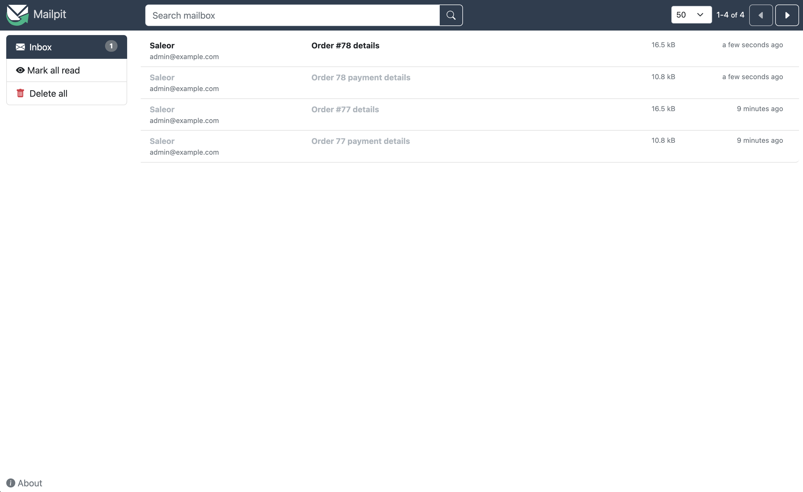

[Saleor Platform](https://github.com/saleor/saleor-platform) uses [Mailpit](https://github.com/axllent/mailpit) to catch all the emails sent by the Saleor.

Pros of using Mailpit during development:

- Live preview of rendered emails.
- No need to send emails to external services.
- Test emails will be caught in the local environment, so there is no possibility of sending test data to actual customers.
- It eliminates the possibility of sending emails to non-existing addresses, hurting email reputation.

## Configuration

- When using the Saleor Platform, Mailpit should already be running on `localhost:8025`. When running Mailpit locally, follow the installation guide from [Mailpit repository](https://github.com/axllent/mailpit#installation).
- Set the following required fields at the plugin configuration page for [AdminEmails](developer/app-store/legacy-plugins/admin-emails.mdx) and [UserEmails](developer/app-store/legacy-plugins/user-emails.mdx) (sender name and email are examples, you can adjust it to your needs):
  - SMTP host: `0.0.0.0`
  - SMTP port: `1025`
  - Sender name: `Saleor`
  - Sender email: `hello@example.com`

## Access to the interface

Visit [http://localhost:8025](http://localhost:8025) to view the Mailpit interface.
