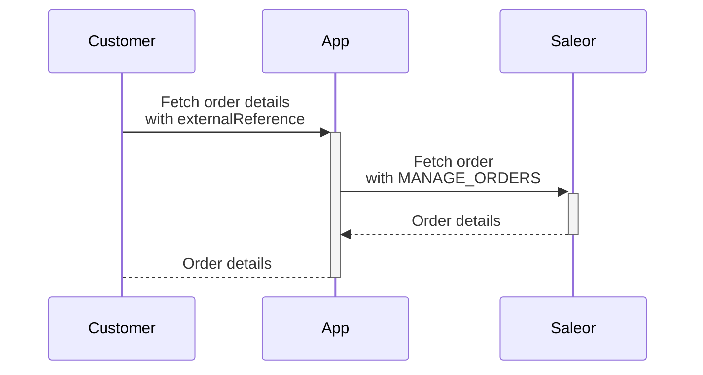

:::info
To follow the zero-downtime strategy when upgrading to 3.19, **It is recommended to first migrate to latest 3.18.X** and turn on the Celery worker to process all data migrations asynchronously.
Otherwise, you will need to downtime your solution to ensure correct data migration.
:::

## Promotions

When multiple promotions apply to one product, only the discount from the promotion rule that provides the maximum savings for the customer is applied. Previously the discounts from rules within the single promotion were summed up.
In the case of having multiple promotion rules within the single promotion applicable to the same product, the promotion rules should be converted into one.

The below example shows the promotion with multiple rules applicable to the same variants:

```json
{
  "data": {
    "promotion": {
      "rules": [
        {
          "id": "UHJvbW90aW9uUnVsZTo2NGFhYjYxOC02YmVlLTQxOTgtYWQ0YS1jNmEzZThkNzY5NWI=",
          "cataloguePredicate": {
            "variantPredicate": {
              "ids": ["UHJvZHVjdFZhcmlhbnQ6MzQ4", "UHJvZHVjdFZhcmlhbnQ6MzQ5"]
            }
          },
          "rewardValue": 1.0,
          "rewardValueType": "FIXED"
        },
        {
          "id": "UHJvbW90aW9uUnVsZTo4MDkwNzc3OC03OGQyLTRkYjUtYjliNS1hMmU4ZDc5MmRjZTg=",
          "cataloguePredicate": {
            "variantPredicate": {
              "ids": ["UHJvZHVjdFZhcmlhbnQ6MzQ4", "UHJvZHVjdFZhcmlhbnQ6MzQ5"]
            }
          },
          "rewardValue": 1.0,
          "rewardValueType": "FIXED"
        }
      ]
    }
  },
  "extensions": {
    "cost": {
      "requestedQueryCost": 0,
      "maximumAvailable": 50000
    }
  }
}
```

To achieve the same discount, the multiple rules should be converted into one rule:

```json
{
  "data": {
    "promotion": {
      "rules": [
        {
          "id": "UHJvbW90aW9uUnVsZToxZjhiMWY1MC0yMjdiLTRmOGQtODBmOS04ZmM1YmJiNzU3OWE=",
          "cataloguePredicate": {
            "variantPredicate": {
              "ids": ["UHJvZHVjdFZhcmlhbnQ6MzQ4", "UHJvZHVjdFZhcmlhbnQ6MzQ5"]
            }
          },
          "rewardValue": 2.0,
          "rewardValueType": "FIXED"
        }
      ]
    }
  },
  "extensions": {
    "cost": {
      "requestedQueryCost": 0,
      "maximumAvailable": 50000
    }
  }
}
```

## External reference

To retrieve order details using the `order` query with `externalReference` as input, you need the `MANAGE_ORDERS` permission:

- Ensure that apps or staff users, who utilize the `order` query with `externalReference` as input, have the `MANAGE_ORDERS` permission assigned.
- If customers use the `query` with `externalReference`, the GraphQL query must be processed via the custom app that
  has the appropriate permissions.

The chart below provides an example of fetching an order with `externalReference` as a user without any permissions.


